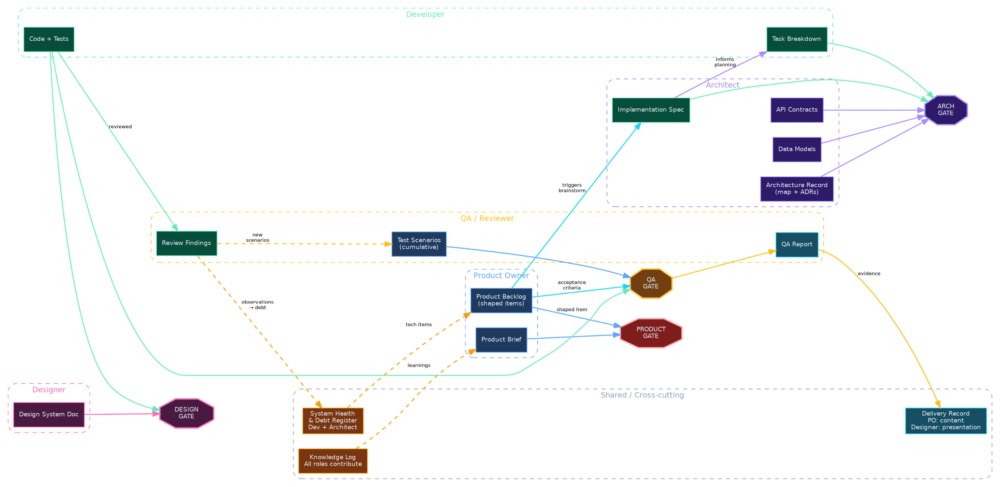

# Squad Artifacts

Status: draft v3
Date: 2026-04-07

## Overview

14 artifacts across 4 layers supporting the squad process model.
Artifacts align with Superpowers at the inner cycle boundary — the
inner cycle artifacts (Implementation Spec, Task Breakdown, Code +
Tests, Review Findings) map 1:1 to existing Superpowers outputs
(design spec, implementation plan, git commits, code review report).

Our framework adds artifacts for the durable layer, outer cycle, and
continuous layer — everything Superpowers doesn't cover.

## Artifact Catalog

### Durable (7 artifacts, human-approved)

| Artifact | Produced by | Consumed by | Gate |
|----------|------------|-------------|------|
| Product Brief | Product Owner | QA, PO | Product Gate |
| Product Backlog (shaped items) | Product Owner | QA, Architect | Product Gate |
| Architecture Record (map + ADRs) | Architect | Architect, Dev, PO | Arch Gate |
| API Contracts | Architect | Dev, Architect, QA | Arch Gate |
| Data Models | Architect | Dev, Architect, QA | Arch Gate |
| Design System Doc | Designer | Dev, Designer | Design Gate |
| Test Scenarios (cumulative) | QA | QA, Dev | QA Gate |

**Product Brief** — vision, goals, success criteria, target users. The
north star that persists across many cycles.

**Product Backlog** — prioritized collection of shaped items. Each item
contains: problem statement, scope boundary (in/out), acceptance
criteria, priority, dependencies, size estimate (S/M/L). The shaped
backlog item is what the Product Gate validates — no separate feature
proposal needed.

**Architecture Record** — component map (what components exist, their
boundaries) combined with Architecture Decision Records (why we chose
what). Two sections, one artifact. Updated when components emerge,
boundaries shift, or gates escalate new ADRs.

**API Contracts** — interface definitions between components. Separate
from the Architecture Record because they change on a different cadence
and are consumed directly by implementers writing code.

**Data Models** — schemas and entity relationships. Same rationale as
API Contracts — reference material during implementation, separate
cadence.

**Design System Doc** — visual standards, component patterns, interaction
rules. The source of truth for the Design Gate.

**Test Scenarios** — cumulative regression and acceptance test suite.
Grows over time as QA discovers new edge cases and Review Findings feed
back new scenarios. Persistent — not reinvented each cycle.

### Outer Cycle (2 artifacts, per product increment)

| Artifact | Produced by | Consumed by | Gate |
|----------|------------|-------------|------|
| QA Report | QA | Dev, PO | QA Gate |
| Delivery Record | PO (content) + Designer (presentation) | CPTO, Users | — |

**QA Report** — regression and scenario test results. Produced at the
QA Gate. Evidence that existing functionality still works and new
functionality meets acceptance criteria.

**Delivery Record** — single artifact, two sections:
- *Approval section* — acceptance criteria checklist, screenshots,
  walkthrough, technical notes. The CPTO reviews this for sign-off.
- *Release note section* — user-facing text, written as it will appear
  to customers. Extractable verbatim into the changelog.

Product Owner writes the content. Designer crafts the visual
presentation — the "Apple show" quality package. One artifact, one
review pass, no drift between internal proof and external announcement.

### Inner Cycle (3 artifacts, per execution loop)

| Artifact | Produced by | Consumed by | Gate |
|----------|------------|-------------|------|
| Implementation Spec | Architect | Dev, Architect, QA | Arch Gate |
| Task Breakdown | Developer | Architect, Dev | Arch Gate |
| Review Findings | QA | Dev, Architect | — |

**Implementation Spec** — produced during Brainstorm. Contains: which
components are touched, which APIs are created or modified, which data
models change, which ADRs constrain the approach, boundary the
implementation must not cross. No code-level detail.

Maps to Superpowers: `docs/superpowers/specs/YYYY-MM-DD-<topic>-design.md`

**Task Breakdown** — produced during Plan. Each task contains:
description, affected file paths, acceptance criteria (testable),
dependencies on other tasks, size estimate.

Maps to Superpowers: `docs/superpowers/plans/YYYY-MM-DD-<feature>.md`

**Review Findings** — produced during Code Review. Three sections:
spec conformance (line-item pass/fail), defects (severity, location,
required fix), observations (non-blocking items feeding Tech Debt
Register and Test Scenarios).

Maps to Superpowers: code-reviewer subagent output (currently not
persisted — opportunity to persist).

### Continuous (2 artifacts, cadence-based)

| Artifact | Produced by | Consumed by | Gate |
|----------|------------|-------------|------|
| Knowledge Log | All roles | All roles | — |
| System Health & Debt Register | Dev + Architect | PO, Architect | — |

**Knowledge Log** — cross-cutting. All roles contribute learnings,
observations, and non-architectural decisions. Feeds back into the
Product Brief when learnings affect product direction.

**System Health & Debt Register** — automated metrics (CI pass rate,
test coverage, build time, deploy frequency) combined with identified
technical debt (shortcuts, missing tests, coupling violations,
deprecated patterns). Each debt item gets severity and suggested ADR
if it requires an architectural decision. Feeds back into Product
Backlog as tech items.

## Superpowers Alignment

| Superpowers Artifact | Path Pattern | Our Equivalent |
|---------------------|-------------|----------------|
| Design spec | `docs/superpowers/specs/YYYY-MM-DD-*.md` | Implementation Spec |
| Implementation plan | `docs/superpowers/plans/YYYY-MM-DD-*.md` | Task Breakdown |
| Code + tests | git commits on branch | Code + Tests |
| Code review report | in-session (not persisted) | Review Findings |

The inner cycle is Superpowers' territory — we reuse it as-is. Our
framework extends above (durable + outer cycle) and below (continuous).

## Gate × Artifact Matrix

What each gate reads to make its decision:

| Gate | Durable artifacts | Cycle artifacts | Decision |
|------|------------------|----------------|----------|
| Product Gate | Product Brief, Backlog | Shaped backlog item | Scope approved? |
| Arch Gate | Architecture Record, API Contracts, Data Models | Implementation Spec, Task Breakdown | Respects structure? |
| Design Gate | Design System Doc | Code + Tests (UI parts) | Follows patterns? |
| QA Gate | Test Scenarios, Backlog (acceptance criteria) | Code + Tests, QA Report | User scenarios pass? |

## Artifact Flow Diagram

Artifacts grouped by producing role, showing flows to gates and
cross-role handoffs. Render with Graphviz or viz.js.

## Open Questions

- What file format for each artifact? (markdown, JSON, YAML frontmatter)
- Where do artifacts live? ($PRODUCT_HOME path structure)
- How do artifacts version? (delta-based per OpenSpec, or full rewrites)
- Concurrency: multiple agents reading/writing shared artifacts
- Which continuous artifacts need automated collection vs manual entry?
