# Squad Artifacts

Status: draft v4
Date: 2026-04-21

## Overview

15 named artifacts across 5 layers supporting the squad process model.
The Durable layer hosts the four foundations (Product, Architecture,
Design System, Product Identity) plus Test Scenarios as a QA support
artifact. Artifacts align with Superpowers at the inner cycle
boundary — the inner cycle artifacts (Implementation Spec, Task
Breakdown, Code + Tests, Review Findings) map 1:1 to existing
Superpowers outputs (design spec, implementation plan, git commits,
code review report).

Our framework adds artifacts for the durable layer, outer cycle,
continuous layer, and the Reference layer — everything Superpowers
doesn't cover. The Reference layer is **ad-hoc only by naming**:
agents produce reference artifacts as feature work surfaces new
findings (handoff memos, coordination notes, peer-product scans),
without any pre-planned named inventory. The layer itself remains a
first-class part of the model.

## Artifact Catalog

### Durable (8 artifacts across 4 foundations, human-approved)

The durable layer groups into **four foundations** (see
`squad-process-model.md`): Product, Architecture, Design System,
and Product Identity. Each foundation is owned by a single role and
requires human approval on changes. Test Scenarios is a QA support
artifact that doesn't belong to a foundation — it's a cumulative
regression asset that feeds the QA Gate.

| Artifact | Foundation | Produced by | Consumed by | Gate |
|----------|-----------|------------|-------------|------|
| Product Brief | Product | Product Owner | QA, PO | Product Gate |
| Product Backlog (shaped items) | Product | Product Owner | QA, Architect | Product Gate |
| Architecture Record (map + ADRs) | Architecture | Architect | Architect, Dev, PO | Arch Gate |
| API Contracts | Architecture | Architect | Dev, Architect, QA | Arch Gate |
| Data Models | Architecture | Architect | Dev, Architect, QA | Arch Gate |
| Design System Doc | Design System | Designer | Dev, Designer | Design Gate |
| Product Naming | Product Identity | Designer | PO, Designer, Dev, docs, marketing | — (QA Gate covers drift) |
| Test Scenarios (cumulative) | — (QA support) | QA | QA, Dev | QA Gate |

**Product Brief** — vision, goals, success criteria, target users. The
north star that persists across many cycles.

**Product Backlog** — prioritized collection of shaped items. Each item
contains: problem statement, scope boundary (in/out), acceptance
criteria, priority, dependencies, size estimate (S/M/L). The shaped
backlog item is what the Product Gate validates — no separate feature
proposal needed.

**Architecture Record** — component map (what components exist, their
boundaries) combined with Architecture Decision Records (why we chose
what). Two sections, one artifact. Updated when components emerge,
boundaries shift, or gates escalate new ADRs.

**API Contracts** — interface definitions between components. Separate
from the Architecture Record because they change on a different cadence
and are consumed directly by implementers writing code.

**Data Models** — schemas and entity relationships. Same rationale as
API Contracts — reference material during implementation, separate
cadence.

**Design System Doc** — the durable standard covering seven content
categories: principles, voice and tone, terminology and language,
information architecture, interaction patterns, visual language (GUI
and/or CLI — mandatory whenever the product has any human-facing
surface; omitted only for pure API or headless services), and surface
conventions (per declared surface: CLI output and exit codes, GUI
component rules, docs style, API error voice, etc.). The source of
truth for the Design Gate. Produced by the shipped `design-system`
produce/validate pair. Research (peer-product lookups, platform and
domain standards, audience trace from the brief's JTBD) happens
**inline** inside the produce skill via WebFetch/WebSearch plus
built-in knowledge, with sources cited in the doc — there are no
separate research helper skills. The produce skill invokes
`product-naming` as a cross-foundation sub-skill when the brief has
no name. Lives at `${user_config.product_home}/design/system.md`;
companion HTML preview at `${user_config.product_home}/design/preview/<date>.html`.
See `docs/superpowers/specs/2026-04-19-design-phase-skills-design.md`
for the shipped design (Decision 4 explains why research is inline,
not helper skills).

**Product Naming** — the sole artifact of the **Product Identity**
foundation. Contains the chosen product name plus its supporting
system: naming philosophy (why this name, what it expresses),
approved short forms and nicknames, forbidden misspellings, how the
name appears in sentences (capitalization, pronunciation,
stylization rules), what the product is NOT called, usage rules for
product contexts vs marketing materials, and the validation record.
The validation record covers three automated filters (linguistic /
phonetic SCRATCH check, well-known brand collision search, primary
TLD active-site probe) and the optional human-run trademark check
across USPTO / WIPO / EUIPO. See
`docs/superpowers/specs/2026-04-11-product-naming-design.md` for
the full validation scope and rationale for what was excluded
(social and package handle availability were considered and cut as
noisy / non-discriminative).

Product Identity is a **separate foundation**, not a sub-concern of
Design System. The name has broader consumers (PO, Designer, Dev,
QA, docs, marketing, legal) and a different lifecycle (near-static,
changes only on rebrand) than Design System's continuously-evolving
standards. Owned by the Designer role on craft grounds (advanced
naming techniques, phonetic and cross-linguistic sensitivity,
creative generation) with all legal and IP authority absorbed by
the CPTO at approval time.

No dedicated gate — the inner cycle's QA Gate covers naming
consistency as part of its terminology checks (catches drift in
capitalization, short forms, forbidden variants). Produced by the
`product-naming` skill, which can run standalone for rebrands or be
invoked as a dependency by `design-system` when the brief has no
name. Lives at `${user_config.product_home}/identity/naming.md`.

**Test Scenarios** — cumulative regression and acceptance test suite.
Grows over time as QA discovers new edge cases and Review Findings feed
back new scenarios. Persistent — not reinvented each cycle.

### Outer Cycle (2 artifacts, per product increment)

| Artifact | Produced by | Consumed by | Gate |
|----------|------------|-------------|------|
| QA Report | QA | Dev, PO | QA Gate |
| Delivery Record | PO (content) + Designer (presentation) | CPTO, Users | — |

**QA Report** — regression and scenario test results. Produced at the
QA Gate. Evidence that existing functionality still works and new
functionality meets acceptance criteria.

**Delivery Record** — single artifact, two sections:
- *Approval section* — acceptance criteria checklist, screenshots,
  walkthrough, technical notes. The CPTO reviews this for sign-off.
- *Release note section* — user-facing text, written as it will appear
  to customers. Extractable verbatim into the changelog.

Product Owner writes the content. Designer crafts the visual
presentation — the "Apple show" quality package. One artifact, one
review pass, no drift between internal proof and external announcement.

### Inner Cycle (3 artifacts, per execution loop)

| Artifact | Produced by | Consumed by | Gate |
|----------|------------|-------------|------|
| Implementation Spec | Architect | Dev, Architect, QA | Arch Gate |
| Task Breakdown | Developer | Architect, Dev | Arch Gate |
| Review Findings | QA | Dev, Architect | — |

**Implementation Spec** — produced during Brainstorm. Contains: which
components are touched, which APIs are created or modified, which data
models change, which ADRs constrain the approach, boundary the
implementation must not cross. No code-level detail.

Maps to Superpowers: `docs/superpowers/specs/YYYY-MM-DD-<topic>-design.md`

**Task Breakdown** — produced during Plan. Each task contains:
description, affected file paths, acceptance criteria (testable),
dependencies on other tasks, size estimate.

Maps to Superpowers: `docs/superpowers/plans/YYYY-MM-DD-<feature>.md`

**Review Findings** — produced during Code Review. Three sections:
spec conformance (line-item pass/fail), defects (severity, location,
required fix), observations (non-blocking items feeding Tech Debt
Register and Test Scenarios).

Maps to Superpowers: code-reviewer subagent output (currently not
persisted — opportunity to persist).

### Continuous (2 artifacts, cadence-based)

| Artifact | Produced by | Consumed by | Gate |
|----------|------------|-------------|------|
| Knowledge Log | All roles | All roles | — |
| System Health & Debt Register | Dev + Architect | PO, Architect | — |

**Knowledge Log** — cross-cutting. All roles contribute learnings,
observations, and non-architectural decisions. Feeds back into the
Product Brief when learnings affect product direction.

**System Health & Debt Register** — automated metrics (CI pass rate,
test coverage, build time, deploy frequency) combined with identified
technical debt (shortcuts, missing tests, coupling violations,
deprecated patterns). Each debt item gets severity and suggested ADR
if it requires an architectural decision. Feeds back into Product
Backlog as tech items.

### Reference (ad-hoc only — no named artifacts)

The Reference layer has no pre-planned named artifacts. It is an
extensible bucket for **emergent** material: feature-work findings,
handoff memos, coordination notes between agents, peer-product scans,
standards checks that weren't worth promoting into a durable doc.
Earlier drafts of this document named three `Design Research — *`
briefs here; those were removed when the design-skills family was
consolidated to a single produce/validate pair (research now happens
inline inside `design-system` — see
`docs/superpowers/specs/2026-04-19-design-phase-skills-design.md`
Decision 4).

**Reference** artifacts are persistent shared material that informs
work without committing to any outcome. Lifespans range from minutes
(a single agent handoff) to months (a peer-product scan reused
across multiple iterations).

Defining properties:
- Persists on disk, reusable across sessions, branches, and agents
- Not human-approved; self-validated only (producer checks that
  sources are cited and coverage is complete)
- Non-committing — evidence that *feeds* decisions, never *is* a
  decision
- First landing zone for discoveries made during feature work;
  findings can later be promoted to the Product Backlog, System
  Health & Debt Register, Knowledge Log, or trigger updates to a
  durable foundation

**Self-regulated structure.** The producing agent picks a filename
inside its role's directory without framework ceremony (e.g.,
`${user_config.product_home}/architecture/notes/<slug>.md`,
`${user_config.product_home}/product/research/<slug>.md`).
Classification is by property, not by location — Reference artifacts
always live inside the producing role's directory, never in a
centralized `references/` folder.

Reference artifacts do **not** have fork-context review skills.
Self-validation is sufficient: the producing skill or agent checks
its own output for source citation and coverage completeness. This
is a pragmatic deviation from the produce/validate pattern that
applies to Durable artifacts — Reference material is inputs to
approved artifacts, not commitments in its own right, so downstream
durable approvals implicitly cover the references they cite.

## Superpowers Alignment

| Superpowers Artifact | Path Pattern | Our Equivalent |
|---------------------|-------------|----------------|
| Design spec | `docs/superpowers/specs/YYYY-MM-DD-*.md` | Implementation Spec |
| Implementation plan | `docs/superpowers/plans/YYYY-MM-DD-*.md` | Task Breakdown |
| Code + tests | git commits on branch | Code + Tests |
| Code review report | in-session (not persisted) | Review Findings |

The inner cycle is Superpowers' territory — we reuse it as-is. Our
framework extends above (durable + outer cycle) and below (continuous).

## Gate × Artifact Matrix

What each gate reads to make its decision:

| Gate | Durable artifacts | Cycle artifacts | Decision |
|------|------------------|----------------|----------|
| Product Gate | Product Brief, Backlog | Shaped backlog item | Scope approved? |
| Arch Gate | Architecture Record, API Contracts, Data Models | Implementation Spec, Task Breakdown | Respects structure? |
| Design Gate | Design System Doc | Code + Tests (UI parts) | Follows patterns? |
| QA Gate | Test Scenarios, Backlog (acceptance criteria) | Code + Tests, QA Report | User scenarios pass? |

## Artifact Flow Diagram

Artifacts grouped by producing role, showing flows to gates and
cross-role handoffs. Render with Graphviz or viz.js.

```dot
digraph artifacts {
  rankdir=LR
  bgcolor="transparent"
  fontname="Helvetica"
  node [fontname="Helvetica" fontsize=9 style="filled" shape=box]
  edge [fontname="Helvetica" fontsize=7]
  newrank=true
  nodesep=0.3
  ranksep=1.0

  // ── ROLES as swimlanes ──
  subgraph cluster_po {
    label="Product Owner"
    style="rounded,dashed"
    color="#60a5fa"
    fontcolor="#60a5fa"
    fontsize=11

    po_brief [label="Product Brief" fillcolor="#1e3a5f" color="#60a5fa" fontcolor="#e2e8f0"]
    po_backlog [label="Product Backlog\n(shaped items)" fillcolor="#1e3a5f" color="#60a5fa" fontcolor="#e2e8f0"]
  }

  subgraph cluster_arch {
    label="Architect"
    style="rounded,dashed"
    color="#a78bfa"
    fontcolor="#a78bfa"
    fontsize=11

    ar_record [label="Architecture Record\n(map + ADRs)" fillcolor="#2d1b69" color="#a78bfa" fontcolor="#e2e8f0"]
    ar_api [label="API Contracts" fillcolor="#2d1b69" color="#a78bfa" fontcolor="#e2e8f0"]
    ar_data [label="Data Models" fillcolor="#2d1b69" color="#a78bfa" fontcolor="#e2e8f0"]
    ar_spec [label="Implementation Spec" fillcolor="#064e3b" color="#6ee7b7" fontcolor="#e2e8f0"]
  }

  subgraph cluster_designer {
    label="Designer"
    style="rounded,dashed"
    color="#f472b6"
    fontcolor="#f472b6"
    fontsize=11

    // Durable foundation artifacts (solid border): Design System + Product Identity.
    // Research for the Design System Doc happens inline inside the produce skill
    // (WebFetch/WebSearch + built-in knowledge); no separate Reference-layer
    // helper artifacts. See 2026-04-19 design-phase-skills spec, Decision 4.
    ds_system [label="Design System Doc" fillcolor="#4a1942" color="#f472b6" fontcolor="#e2e8f0"]
    ds_naming [label="Product Naming" fillcolor="#4a1942" color="#f472b6" fontcolor="#e2e8f0"]
  }

  subgraph cluster_dev {
    label="Developer"
    style="rounded,dashed"
    color="#6ee7b7"
    fontcolor="#6ee7b7"
    fontsize=11

    dv_tasks [label="Task Breakdown" fillcolor="#064e3b" color="#6ee7b7" fontcolor="#e2e8f0"]
    dv_code [label="Code + Tests" fillcolor="#064e3b" color="#6ee7b7" fontcolor="#e2e8f0"]
  }

  subgraph cluster_qa {
    label="QA / Reviewer"
    style="rounded,dashed"
    color="#fbbf24"
    fontcolor="#fbbf24"
    fontsize=11

    qa_scenarios [label="Test Scenarios\n(cumulative)" fillcolor="#1e3a5f" color="#60a5fa" fontcolor="#e2e8f0"]
    qa_findings [label="Review Findings" fillcolor="#064e3b" color="#6ee7b7" fontcolor="#e2e8f0"]
    qa_report [label="QA Report" fillcolor="#164e63" color="#22d3ee" fontcolor="#e2e8f0"]
  }

  // ── SHARED ARTIFACTS ──
  subgraph cluster_shared {
    label="Shared / Cross-cutting"
    style="rounded,dashed"
    color="#94a3b8"
    fontcolor="#94a3b8"
    fontsize=11

    delivery [label="Delivery Record\nPO: content\nDesigner: presentation" fillcolor="#164e63" color="#22d3ee" fontcolor="#e2e8f0"]
    knowledge [label="Knowledge Log\nAll roles contribute" fillcolor="#78350f" color="#f59e0b" fontcolor="#e2e8f0"]
    health [label="System Health\n& Debt Register\nDev + Architect" fillcolor="#78350f" color="#f59e0b" fontcolor="#e2e8f0"]
  }

  // ── GATES ──
  gate_product [label="PRODUCT\nGATE" shape=octagon fillcolor="#7f1d1d" color="#fca5a5" fontcolor="#e2e8f0" penwidth=2]
  gate_arch [label="ARCH\nGATE" shape=octagon fillcolor="#2d1b69" color="#a78bfa" fontcolor="#e2e8f0" penwidth=2]
  gate_design [label="DESIGN\nGATE" shape=octagon fillcolor="#4a1942" color="#f472b6" fontcolor="#e2e8f0" penwidth=2]
  gate_qa [label="QA\nGATE" shape=octagon fillcolor="#713f12" color="#fbbf24" fontcolor="#e2e8f0" penwidth=2]

  // ── ARTIFACTS → GATES ──
  po_brief -> gate_product [color="#60a5fa" penwidth=1.5]
  po_backlog -> gate_product [color="#60a5fa" penwidth=1.5 label="shaped item"]

  ar_record -> gate_arch [color="#a78bfa" penwidth=1.5]
  ar_api -> gate_arch [color="#a78bfa" penwidth=1.5]
  ar_data -> gate_arch [color="#a78bfa" penwidth=1.5]
  ar_spec -> gate_arch [color="#6ee7b7" penwidth=1.5]
  dv_tasks -> gate_arch [color="#6ee7b7" penwidth=1.5]

  ds_system -> gate_design [color="#f472b6" penwidth=1.5]
  dv_code -> gate_design [color="#6ee7b7" penwidth=1.5]

  // ── DESIGNER INTERNAL DEPENDENCIES ──
  // Product Naming feeds the Design System produce skill (invoked as sub-skill
  // when the brief has no name) and is referenced by the brief.
  // No cycle gate for naming — QA Gate covers drift via terminology checks.
  ds_naming -> ds_system [color="#f472b6" penwidth=1.5 label="name\n(sub-skill)"]
  ds_naming -> po_brief [color="#f472b6" penwidth=1.5 style=dashed label="referenced"]

  qa_scenarios -> gate_qa [color="#60a5fa" penwidth=1.5]
  dv_code -> gate_qa [color="#6ee7b7" penwidth=1.5]
  po_backlog -> gate_qa [color="#22d3ee" penwidth=1.5 label="acceptance\ncriteria"]

  // ── GATE OUTPUT ──
  gate_qa -> qa_report [color="#fbbf24" penwidth=1.5]

  // ── HANDOFF CHAIN ──
  po_backlog -> ar_spec [color="#22d3ee" penwidth=1.5 label="triggers\nbrainstorm"]
  ar_spec -> dv_tasks [color="#a78bfa" penwidth=1.5 label="informs\nplanning"]
  dv_code -> qa_findings [color="#6ee7b7" penwidth=1.5 label="reviewed"]
  qa_report -> delivery [color="#fbbf24" penwidth=1.5 label="evidence"]

  // ── CONTINUOUS FEEDBACK ──
  health -> po_backlog [color="#f59e0b" penwidth=1.5 style=dashed label="tech items"]
  knowledge -> po_brief [color="#f59e0b" penwidth=1.5 style=dashed label="learnings"]
  qa_findings -> health [color="#f59e0b" penwidth=1.5 style=dashed label="observations\n→ debt"]
  qa_findings -> qa_scenarios [color="#fbbf24" penwidth=1.5 style=dashed label="new\nscenarios"]
}
```

## Open Questions

- What file format for each artifact? (markdown, JSON, YAML frontmatter)
- How do artifacts version? Per-skill decision; expect a mix of delta
  (ADR-style append-only) and full rewrite depending on the artifact's
  natural lifecycle. Design System Doc is a likely delta candidate;
  Product Brief is a likely full-rewrite candidate.
- Concurrency: multiple agents reading/writing shared artifacts
- Which continuous artifacts need automated collection vs manual entry?
- How does the Reference layer get pruned? Emergent reference artifacts
  accumulate; some go stale. Need a staleness heuristic (file age,
  referenced files still existing, explicit expiry in frontmatter).
