# Squad Methodologies

Status: research reference
Date: 2026-04-07

## Overview

Methodology map for each artifact and activity in the squad process.
Techniques mined from 5 analyzed frameworks (Gstack, Superpowers,
GSD-2, PM Skills, OpenSpec) and contemporary industry practices.

This document is a **menu, not a checklist**. When designing each
skill, pick the leanest technique that fits. Layer more later.

## Product Owner

### Product Brief

- **Primary:** Lean Canvas (9-box, 20 min pre-filter) → Shape Up pitch
  (5 fields: problem, appetite, solution, rabbit holes, no-gos)
- **Supporting:** JTBD job stories for problem framing
- **Source:** Ash Maurya, Basecamp, Christensen

### Product Backlog (shaped items)

- **Primary:** Epic hypothesis ("If we [action] for [persona] then
  [outcome]") + Given/When/Then acceptance criteria
- **Supporting:** ICE scoring (default) → RICE when data exists;
  Opportunity Solution Tree for discovery
- **Source:** PM Skills patterns (learn from, not copy), Teresa Torres,
  Sean Ellis, BDD

### Pick Feature

- **Primary:** Context-aware prioritization — select framework
  (ICE/RICE/Value-Effort) based on product stage and data availability
- **Supporting:** Tech debt ratio (e.g., 1 tech item per 3 features)
- **Source:** PM Skills prioritization-advisor pattern

### Shape & Scope

- **Primary:** MITRE 3-phase canvas: Look Inward (assumptions) → Look
  Outward (who has problem) → Reframe (HMW)
- **Supporting:** Shape Up appetite-as-constraint (fix time, shape scope)
- **Source:** PM Skills problem-framing-canvas, Basecamp

### Delivery Record (content)

- **Primary:** Delta changelog (OpenSpec proposal pattern) +
  Given/When/Then proof against acceptance criteria
- **Supporting:** Demo narrative arc: problem first, then solution,
  90-second rule per feature
- **Source:** OpenSpec, BDD

## Architect

### Architecture Record (map + ADRs)

- **Primary:** C4 Model L1+L2 (Context + Container as text diagrams) +
  Nygard ADR (Title, Status, Context, Decision, Consequences)
- **Supporting:** Arc42 lightweight (sections 1-5); ADRs immutable once
  accepted (superseded, not edited)
- **Source:** Simon Brown, Michael Nygard, Arc42

### API Contracts

- **Primary:** API-first design — contract exists and validates before
  implementation begins
- **Supporting:** Consumer-driven contract testing; OpenAPI/JSON Schema
- **Source:** Industry standard

### Data Models

- **Primary:** Schema-first with migration-safety check
- **Supporting:** Entity-relationship as text diagrams in Architecture
  Record
- **Source:** Standard practice

### Implementation Spec (Brainstorm)

- **Primary:** Calibrated-depth research (deep/targeted/light based on
  complexity) + Superpowers design-for-isolation
- **Supporting:** OpenSpec delta model (ADDED/MODIFIED/REMOVED); spec
  self-review checklist (placeholders, contradictions, ambiguity, scope)
- **Source:** GSD-2 research-slice, Superpowers brainstorming, OpenSpec

### Architecture Gate

- **Primary:** Fitness functions — 2-3 automated checks (no circular
  deps, API backward compat, boundary respect)
- **Supporting:** Checklist: components touched vs allowed, API changes
  versioned, data migration safe
- **Source:** Neal Ford, Building Evolutionary Architecture

### System Health & Debt Register

- **Primary:** Impact/effort scoring (1-5 each) + auto-detect signals
  (TODO count, coverage gaps, dep age)
- **Supporting:** Debt items graduate to ADRs when fix requires boundary
  change; Gstack health weighted score
- **Source:** Pragmatic debt register, Gstack health skill

## Designer

### Design System Doc

- **Primary:** Design tokens (~20 named values) + pattern catalog
  (component compositions as what-to-use-when rules)
- **Supporting:** Gstack DESIGN.md template (Product Context, Aesthetic
  Direction, Typography, Color, Spacing, Layout, Motion, Decisions Log);
  SAFE/RISK proposal pattern
- **Source:** Gstack design-consultation (MIT), Brad Frost Atomic Design

### Design Gate

- **Primary:** Confidence-tier checklist (HIGH=grep-able,
  MEDIUM=heuristic, LOW=visual verify) with 20 items across AI Slop,
  Typography, Spacing, Interaction States
- **Supporting:** WCAG essentials (5 checks: contrast 4.5:1, touch 44px,
  focus-visible, no color-only, heading hierarchy)
- **Source:** Gstack design-checklist, WCAG

### Delivery Record (presentation)

- **Primary:** Narrative arc demo: show problem → show solution →
  before/after screenshots with annotations. 90-second rule.
- **Supporting:** HTML presentation with embedded screenshots
- **Source:** Industry demo practice

## Developer

### Task Breakdown (Plan)

- **Primary:** Superpowers plan format — bite-sized tasks with file
  paths, failing tests first, implementation code, verification commands
- **Supporting:** GSD-2 scope/plan/implement/verify loop
- **Source:** Superpowers writing-plans, GSD-2

### Verify (CI)

- **Primary:** Iron Law gate: identify command → run → read output →
  verify claim matches output
- **Supporting:** Rationalization-prevention table
- **Source:** Superpowers verification-before-completion

### Operations monitoring

- **Primary:** DORA 4 metrics from git: deploy frequency, lead time,
  change failure rate (revert commits), MTTR
- **Supporting:** Gstack health weighted score; trend tracking over time
- **Source:** DORA, Gstack health

### Knowledge Log entries

- **Primary:** Typed entries with IDs (patterns/pitfalls/preferences/
  architecture) + prune-by-staleness (check if referenced files exist)
- **Supporting:** Size budget (4KB cap); "only non-obvious" filter;
  two-tier global/project split
- **Source:** GSD-2 KNOWLEDGE.md, Gstack learn

## QA / Reviewer

### Product Gate

- **Primary:** Risk-based classification (likelihood x impact →
  Quick/Standard/Exhaustive tier) + testable criteria validation
- **Supporting:** Traceability to Product Brief; Shape Up appetite check
- **Source:** Risk-based testing, PM Skills

### Test Scenarios (durable)

- **Primary:** BDD Given/When/Then per acceptance criterion + risk-tier
  tagging (critical-path on every commit, full suite on PR)
- **Supporting:** Prioritization by: failure recency, code churn,
  business criticality
- **Source:** BDD, risk-based test prioritization

### Code Review

- **Primary:** Two-pass review: automated (lint, type-check, pattern
  scan) then spec-conformance (requirements checklist, architecture fit)
- **Supporting:** Superpowers categories (Code Quality, Architecture,
  Testing, Requirements, Production Readiness); Critical/Important/Minor
  with file:line references
- **Source:** Superpowers requesting-code-review, Microsoft AI review

### QA Gate

- **Primary:** Exploratory testing charters ("Explore [target] with
  [resources] to discover [information]") generated from risk matrix
- **Supporting:** Gstack QA health score (0-100) across 7 categories;
  ship-readiness gate with before/after delta
- **Source:** Exploratory testing, Gstack QA template

### QA Report

- **Primary:** Gstack QA template: Health Score 0-100, 7 categories,
  severity taxonomy, issue-to-regression traceability
- **Supporting:** Ship Readiness section; issues linked to new Test
  Scenario entries
- **Source:** Gstack QA report template

### Review Findings

- **Primary:** 3-section structured report: spec conformance (pass/fail
  per item), defects (severity + location + fix), observations (→ debt
  register + test scenarios)
- **Supporting:** READ-UNDERSTAND-VERIFY-EVALUATE protocol before
  implementing feedback
- **Source:** Superpowers requesting/receiving-code-review

## Methodology Source Diagram

```dot
digraph methodologies {
  rankdir=LR
  bgcolor="transparent"
  fontname="Helvetica"
  node [fontname="Helvetica" fontsize=9 style="filled" shape=box]
  edge [fontname="Helvetica" fontsize=7]
  newrank=true
  nodesep=0.25
  ranksep=0.8

  subgraph cluster_sources {
    label="Methodology Sources"
    style="rounded,dashed"
    color="#94a3b8"
    fontcolor="#94a3b8"
    fontsize=11

    shape_up [label="Shape Up\npitches · appetite" fillcolor="#374151" color="#94a3b8" fontcolor="#e2e8f0"]
    jtbd [label="JTBD\njob stories" fillcolor="#374151" color="#94a3b8" fontcolor="#e2e8f0"]
    lean_canvas [label="Lean Canvas\n9-box filter" fillcolor="#374151" color="#94a3b8" fontcolor="#e2e8f0"]
    bdd [label="BDD\nGiven/When/Then" fillcolor="#374151" color="#94a3b8" fontcolor="#e2e8f0"]
    c4 [label="C4 Model\nL1+L2 diagrams" fillcolor="#374151" color="#94a3b8" fontcolor="#e2e8f0"]
    adr [label="Nygard ADR\nimmutable records" fillcolor="#374151" color="#94a3b8" fontcolor="#e2e8f0"]
    tokens [label="Design Tokens\n~20 named values" fillcolor="#374151" color="#94a3b8" fontcolor="#e2e8f0"]
    dora [label="DORA\n4 key metrics" fillcolor="#374151" color="#94a3b8" fontcolor="#e2e8f0"]
    fitness [label="Fitness Functions\nautomated arch checks" fillcolor="#374151" color="#94a3b8" fontcolor="#e2e8f0"]
  }

  subgraph cluster_frameworks {
    label="Framework Patterns (reusable)"
    style="rounded,dashed"
    color="#6ee7b7"
    fontcolor="#6ee7b7"
    fontsize=11

    pm_canvas [label="PM Skills\nproblem-framing canvas" fillcolor="#064e3b" color="#6ee7b7" fontcolor="#e2e8f0"]
    gstack_design [label="Gstack\nDESIGN.md template\nSAFE/RISK pattern" fillcolor="#064e3b" color="#6ee7b7" fontcolor="#e2e8f0"]
    gstack_qa [label="Gstack\nQA health score\n80-item checklist" fillcolor="#064e3b" color="#6ee7b7" fontcolor="#e2e8f0"]
    openspec_delta [label="OpenSpec\ndelta-based changes\nADDED/MODIFIED/REMOVED" fillcolor="#064e3b" color="#6ee7b7" fontcolor="#e2e8f0"]
    sp_verify [label="Superpowers\nIron Law gate\nevidence before claims" fillcolor="#064e3b" color="#6ee7b7" fontcolor="#e2e8f0"]
    gsd2_knowledge [label="GSD-2\nKNOWLEDGE.md\ntyped entries + prune" fillcolor="#064e3b" color="#6ee7b7" fontcolor="#e2e8f0"]
  }

  subgraph cluster_artifacts {
    label="Our Artifacts"
    style="rounded,bold"
    color="#f1f5f9"
    fontcolor="#f1f5f9"
    fontsize=11
    penwidth=2

    brief [label="Product Brief" fillcolor="#1e3a5f" color="#60a5fa" fontcolor="#e2e8f0"]
    backlog [label="Product Backlog" fillcolor="#1e3a5f" color="#60a5fa" fontcolor="#e2e8f0"]
    arch_rec [label="Architecture Record" fillcolor="#2d1b69" color="#a78bfa" fontcolor="#e2e8f0"]
    api [label="API Contracts" fillcolor="#2d1b69" color="#a78bfa" fontcolor="#e2e8f0"]
    design_doc [label="Design System Doc" fillcolor="#4a1942" color="#f472b6" fontcolor="#e2e8f0"]
    test_sc [label="Test Scenarios" fillcolor="#713f12" color="#fbbf24" fontcolor="#e2e8f0"]
    impl_spec [label="Implementation Spec" fillcolor="#064e3b" color="#6ee7b7" fontcolor="#e2e8f0"]
    health [label="Health & Debt" fillcolor="#78350f" color="#f59e0b" fontcolor="#e2e8f0"]
    knowledge [label="Knowledge Log" fillcolor="#78350f" color="#f59e0b" fontcolor="#e2e8f0"]
  }

  lean_canvas -> brief [color="#60a5fa" penwidth=1.5]
  shape_up -> brief [color="#60a5fa" penwidth=1.5]
  jtbd -> backlog [color="#60a5fa" penwidth=1.5]
  bdd -> backlog [color="#60a5fa" penwidth=1.5]
  bdd -> test_sc [color="#fbbf24" penwidth=1.5]
  c4 -> arch_rec [color="#a78bfa" penwidth=1.5]
  adr -> arch_rec [color="#a78bfa" penwidth=1.5]
  tokens -> design_doc [color="#f472b6" penwidth=1.5]
  dora -> health [color="#f59e0b" penwidth=1.5]
  fitness -> arch_rec [color="#a78bfa" penwidth=1.5]

  pm_canvas -> backlog [color="#6ee7b7" penwidth=1.5]
  gstack_design -> design_doc [color="#6ee7b7" penwidth=1.5]
  gstack_qa -> test_sc [color="#6ee7b7" penwidth=1.5]
  openspec_delta -> impl_spec [color="#6ee7b7" penwidth=1.5]
  openspec_delta -> arch_rec [color="#6ee7b7" penwidth=1.5]
  sp_verify -> health [color="#6ee7b7" penwidth=1.5]
  gsd2_knowledge -> knowledge [color="#6ee7b7" penwidth=1.5]
}
```

