# Squad Process Model

Status: draft v6
Date: 2026-04-07

## Overview

A process model for small product teams (1–6 people) where AI agents
fill specialist roles under human oversight. The human acts as a CPTO
(Chief Product & Technology Officer) — an observer who asks questions,
challenges choices, and approves decisions. Agents propose and execute.

## Three Temporal Modes

Activities group by how long their outputs live:

### Durable (long-lived constraints)

Artifacts that survive many execution cycles. Revised on pivots or major
shifts. Every automated gate validates against these.

| Concern          | Agent Role     | Artifacts                                    |
|------------------|----------------|----------------------------------------------|
| Product          | Product Owner  | Product brief, backlog, priorities, criteria  |
| Architecture     | Architect      | Component map, ADRs, API contracts, models    |
| Design System    | Designer       | Principles, voice, terminology, IA, interaction, visual language, surface conventions |
| Product Identity | Designer       | Product name, naming philosophy, usage rules, validation record |

All durable changes require **human approval**. Agents draft; CPTO
challenges and approves. These four concerns are the foundation — if
any drifts, all downstream gates validate against wrong standards.

Product Identity is a self-contained foundation, not a sub-concern of
Design System. Its lifecycle (near-static, changes only on rebrand),
consumers (PO, Designer, Dev, QA, docs, marketing — everyone who
references the product by name), and validation concerns (trademark,
domain, handle collision) are distinct from Design System's ongoing
visual and interaction standards.

### Cyclic (per-feature heartbeat)

Two nested cycles consume durable artifacts and produce increments.

**Outer cycle — product increment:**

1. Pick Feature — Product Owner selects from backlog
2. Shape & Scope — Product Owner defines boundaries, acceptance criteria
3. **Product Gate** — QA/Reviewer validates; **human approves** scope
4. [Enter inner cycle]
5. **QA Gate** — QA/Reviewer runs regression, user scenarios (automated)
6. Verify — Developer runs CI, integration tests (automated)
7. **Merge PR** — Developer requests; **human approves**
8. **Demo & Announce** — Product Owner prepares screenshots, changelog,
   product update; **human approves** before external communication

**Inner cycle — execution (fully automated, Superpowers):**

1. Brainstorm — Architect explores implementation approach
2. Plan — Developer breaks work into tasks
3. **Architecture Gate** — Architect validates against ADRs, boundaries
4. Implement — Developer executes task by task
5. **Design Gate** — Designer validates against design system
6. Code Review — QA/Reviewer checks spec conformance and quality
7. → Rework if needed, otherwise exit to outer cycle

### Continuous (cadence-based)

Process-level activities on a regular cadence (daily, weekly). Not tied
to specific features.

| Activity               | Agent Role | Purpose                              |
|------------------------|------------|--------------------------------------|
| Knowledge collection   | Designer   | Collect learnings, update understanding |
| Operations monitoring  | Developer  | Track metrics, monitor health        |
| Technical backlog      | Architect  | Flag debt, refactoring, infra needs  |

## Five Agent Roles

| Role           | Activities | Share | Key responsibility                    |
|----------------|-----------|-------|----------------------------------------|
| Product Owner  | 4         | 19%   | What to build, scope, demo             |
| Architect      | 4         | 19%   | System structure, tech debt, arch gate |
| Designer       | 4         | 19%   | Identity, design system, design gate, knowledge |
| Developer      | 5         | 24%   | Plan, implement, verify, merge, ops    |
| QA / Reviewer  | 4         | 19%   | Product gate, QA gate, code review     |

Key constraints:
- No role exceeds 25% of activities
- No role gates its own output (produce ≠ validate)
- Gates read from durable artifacts maintained by domain owners

## Human Approval Points (7 of 21 activities)

The CPTO touches the process at two boundaries:

**Durable artifacts (4):** Product, Architecture, Design System,
Product Identity. Agents propose changes; human approves. These are
the inputs that everything validates against.

**Outer perimeter (3):** Product Gate (before execution), Merge PR
(before shipping), Demo & Announce (before external communication).
These are the outputs that affect users and stakeholders.

**Fully automated (14 of 21):** The entire inner cycle, QA gate, CI
verification, and all continuous activities run without human
intervention.

## Four Gates

Each gate guards a durable concern:

| Gate              | Guards against         | Owned by     | Type      |
|-------------------|------------------------|--------------|-----------|
| Product Gate      | Building wrong thing   | QA/Reviewer  | Human     |
| Architecture Gate | Structural deviation   | Architect    | Automated |
| Design Gate       | UX inconsistency       | Designer     | Automated |
| QA Gate           | Broken user experience | QA/Reviewer  | Automated |

Gates can reject (loop back) or escalate (update durable artifacts when
the standards themselves need revision).

**Product Identity has no dedicated gate.** Naming consistency
(correct capitalization, canonical short forms, forbidden variants,
usage in marketing vs product contexts) is validated by the **QA
Gate** as part of its terminology and scenario checks. The human
CPTO approval when the Product Identity artifact is created or
revised is the primary compliance check; the QA Gate catches drift
during feature execution. Adding a fifth dedicated gate was
considered and rejected for lightness — naming violations are the
kind of thing a scenario or terminology check catches, and five
gates would overload the inner cycle.

## Escalation Paths

- Architecture Gate → new ADR needed → update Architecture (durable)
- Design Gate → new pattern needed → update Design System (durable)
- Both escalations require human approval on the durable artifact update.

## Process Diagram

Full process model in DOT notation. Render with Graphviz or viz.js.

```dot
digraph full_model {
  rankdir=TB
  bgcolor="transparent"
  fontname="Helvetica"
  node [fontname="Helvetica" fontsize=10]
  edge [fontname="Helvetica" fontsize=8]
  compound=true
  newrank=true
  ranksep=0.6
  nodesep=0.5

  // ══════════════════════════════════════
  // HUMAN — CPTO Observer
  // ══════════════════════════════════════
  subgraph cluster_human {
    label="HUMAN — CPTO Observer"
    style="rounded,bold"
    color="#fca5a5"
    fontcolor="#fca5a5"
    fontsize=12
    penwidth=2

    cpto [
      label="CPTO\nasks questions · challenges · approves\ndoes not produce or decide"
      shape=doubleoctagon style="filled"
      fillcolor="#7f1d1d" color="#fca5a5" fontcolor="#e2e8f0"
      penwidth=2
    ]
  }

  // ══════════════════════════════════════
  // DURABLE LAYER
  // ══════════════════════════════════════
  subgraph cluster_durable {
    label="DURABLE — agent-proposed, HUMAN APPROVED"
    style="rounded,bold"
    color="#fca5a5"
    fontcolor="#fca5a5"
    fontsize=12
    penwidth=2

    product [
      label="Product\n[Product Owner]\nHUMAN APPROVAL"
      shape=box style="rounded,filled"
      fillcolor="#7f1d1d" color="#fca5a5" fontcolor="#e2e8f0"
      penwidth=2
    ]
    arch [
      label="Architecture\n[Architect]\nHUMAN APPROVAL"
      shape=box style="rounded,filled"
      fillcolor="#7f1d1d" color="#fca5a5" fontcolor="#e2e8f0"
      penwidth=2
    ]
    design_sys [
      label="Design System\n[Designer]\nHUMAN APPROVAL"
      shape=box style="rounded,filled"
      fillcolor="#7f1d1d" color="#fca5a5" fontcolor="#e2e8f0"
      penwidth=2
    ]
    identity [
      label="Product Identity\n[Designer]\nHUMAN APPROVAL"
      shape=box style="rounded,filled"
      fillcolor="#7f1d1d" color="#fca5a5" fontcolor="#e2e8f0"
      penwidth=2
    ]
  }

  // ══════════════════════════════════════
  // OUTER CYCLE
  // ══════════════════════════════════════
  subgraph cluster_outer {
    label="OUTER CYCLE — Product Increment"
    style="rounded,bold"
    color="#22d3ee"
    fontcolor="#22d3ee"
    fontsize=12
    penwidth=2

    pick [
      label="Pick Feature\n[Product Owner]"
      shape=box style="rounded,filled"
      fillcolor="#164e63" color="#22d3ee" fontcolor="#e2e8f0"
    ]
    shape_scope [
      label="Shape & Scope\n[Product Owner]"
      shape=box style="rounded,filled"
      fillcolor="#164e63" color="#22d3ee" fontcolor="#e2e8f0"
    ]
    gate_product [
      label="PRODUCT GATE\n[QA/Reviewer]\nHUMAN APPROVAL"
      shape=octagon style="filled"
      fillcolor="#7f1d1d" color="#fca5a5" fontcolor="#e2e8f0"
      penwidth=3
    ]

    // ══════════════════════════════════
    // INNER CYCLE — fully automated
    // ══════════════════════════════════
    subgraph cluster_inner {
      label="INNER CYCLE — Fully Automated"
      style="rounded,bold"
      color="#6ee7b7"
      fontcolor="#6ee7b7"
      fontsize=11
      penwidth=2

      brainstorm [
        label="Brainstorm\n[Architect]"
        shape=box style="rounded,filled"
        fillcolor="#064e3b" color="#6ee7b7" fontcolor="#e2e8f0"
      ]
      plan [
        label="Plan\n[Developer]"
        shape=box style="rounded,filled"
        fillcolor="#064e3b" color="#6ee7b7" fontcolor="#e2e8f0"
      ]
      gate_arch [
        label="ARCH GATE\n[Architect]\nauto"
        shape=octagon style="filled"
        fillcolor="#2d1b69" color="#a78bfa" fontcolor="#e2e8f0"
        penwidth=2
      ]
      implement [
        label="Implement\n[Developer]"
        shape=box style="rounded,filled"
        fillcolor="#064e3b" color="#6ee7b7" fontcolor="#e2e8f0"
      ]
      gate_design [
        label="DESIGN GATE\n[Designer]\nauto"
        shape=octagon style="filled"
        fillcolor="#4a1942" color="#f472b6" fontcolor="#e2e8f0"
        penwidth=2
      ]
      code_review [
        label="Code Review\n[QA/Reviewer]\nauto"
        shape=box style="rounded,filled"
        fillcolor="#064e3b" color="#6ee7b7" fontcolor="#e2e8f0"
      ]

      brainstorm -> plan [color="#6ee7b7" penwidth=2]
      plan -> gate_arch [color="#6ee7b7" penwidth=2]
      gate_arch -> implement [color="#a78bfa" penwidth=2 label="pass"]
      implement -> gate_design [color="#6ee7b7" penwidth=2]
      gate_design -> code_review [color="#f472b6" penwidth=2 label="pass"]
      code_review -> brainstorm [color="#6ee7b7" penwidth=1 style=dashed label="rework"]
    }

    gate_qa [
      label="QA GATE\n[QA/Reviewer]\nauto"
      shape=octagon style="filled"
      fillcolor="#164e63" color="#fbbf24" fontcolor="#e2e8f0"
      penwidth=2
    ]
    verify [
      label="Verify CI\n[Developer]\nauto"
      shape=box style="rounded,filled"
      fillcolor="#164e63" color="#22d3ee" fontcolor="#e2e8f0"
    ]
    merge [
      label="Merge PR\n[Developer]\nHUMAN APPROVAL"
      shape=box style="filled"
      fillcolor="#7f1d1d" color="#fca5a5" fontcolor="#e2e8f0"
      penwidth=3
    ]
    demo [
      label="Demo & Announce\n[Product Owner]\nHUMAN APPROVAL"
      shape=box style="filled"
      fillcolor="#7f1d1d" color="#fca5a5" fontcolor="#e2e8f0"
      penwidth=3
    ]

    pick -> shape_scope [color="#22d3ee" penwidth=2]
    shape_scope -> gate_product [color="#22d3ee" penwidth=2]
    gate_product -> brainstorm [color="#60a5fa" penwidth=2 label="pass" lhead=cluster_inner]
    code_review -> gate_qa [color="#22d3ee" penwidth=2 label="approved" ltail=cluster_inner]
    gate_qa -> verify [color="#fbbf24" penwidth=2 label="pass"]
    verify -> merge [color="#22d3ee" penwidth=2]
    merge -> demo [color="#22d3ee" penwidth=2]
    demo -> pick [color="#22d3ee" penwidth=2 style=dashed label="next feature"]
  }

  // ── HUMAN APPROVAL HOOKS ──
  cpto -> product [color="#fca5a5" penwidth=2 style=bold label="approve"]
  cpto -> arch [color="#fca5a5" penwidth=2 style=bold label="approve"]
  cpto -> design_sys [color="#fca5a5" penwidth=2 style=bold label="approve"]
  cpto -> identity [color="#fca5a5" penwidth=2 style=bold label="approve"]
  cpto -> gate_product [color="#fca5a5" penwidth=2 style=bold label="approve\nscope"]
  cpto -> merge [color="#fca5a5" penwidth=2 style=bold label="approve\nmerge"]
  cpto -> demo [color="#fca5a5" penwidth=2 style=bold label="approve\nannouncement"]

  // ── GATE REJECTIONS ──
  gate_product -> shape_scope [color="#ef4444" penwidth=1.5 style=dashed label="re-shape"]
  gate_arch -> brainstorm [color="#ef4444" penwidth=1.5 style=dashed label="re-think"]
  gate_design -> implement [color="#ef4444" penwidth=1.5 style=dashed label="fix"]
  gate_qa -> code_review [color="#ef4444" penwidth=1.5 style=dashed label="fix issues"]

  // ── ESCALATION ──
  gate_arch -> arch [color="#a78bfa" penwidth=1.5 style=dashed label="new ADR"]
  gate_design -> design_sys [color="#f472b6" penwidth=1.5 style=dashed label="new pattern"]

  // ── DURABLE FEEDS ──
  product -> pick [color="#60a5fa" penwidth=2 label="backlog"]
  product -> gate_product [color="#60a5fa" penwidth=1.5 style=dotted label="criteria"]
  arch -> gate_arch [color="#a78bfa" penwidth=1.5 style=dotted label="constraints"]
  design_sys -> gate_design [color="#f472b6" penwidth=1.5 style=dotted label="standards"]

  // ══════════════════════════════════════
  // CONTINUOUS
  // ══════════════════════════════════════
  subgraph cluster_continuous {
    label="CONTINUOUS — cadence-based, automated"
    style="rounded,dashed"
    color="#f59e0b"
    fontcolor="#f59e0b"
    fontsize=12

    knowledge [
      label="Knowledge\n[Designer]"
      shape=box style="rounded,filled"
      fillcolor="#78350f" color="#f59e0b" fontcolor="#e2e8f0"
    ]
    ops [
      label="Operations\n[Developer]"
      shape=box style="rounded,filled"
      fillcolor="#78350f" color="#f59e0b" fontcolor="#e2e8f0"
    ]
    tech_backlog [
      label="Tech Backlog\n[Architect]"
      shape=box style="rounded,filled"
      fillcolor="#78350f" color="#f59e0b" fontcolor="#e2e8f0"
    ]
    knowledge -> ops [color="#f59e0b" dir=both penwidth=1.5]
    ops -> tech_backlog [color="#f59e0b" penwidth=1.5 label="flags debt"]
  }

  demo -> knowledge [color="#f59e0b" penwidth=1.5 style=dashed label="evidence"]
  knowledge -> product [color="#f59e0b" penwidth=1.5 style=dashed label="update"]
  tech_backlog -> pick [color="#f59e0b" penwidth=1.5 style=dashed label="tech items"]
}
```

## Role × Activity Matrix

| Activity | Layer | Agent Role | Gate Type |
|----------|-------|------------|-----------|
| Maintain product brief, backlog, priorities | Durable | Product Owner | Human approval |
| Maintain architecture (ADRs, APIs, components) | Durable | Architect | Human approval |
| Maintain design system (standards, patterns) | Durable | Designer | Human approval |
| Maintain product identity and naming | Durable | Designer | Human approval |
| Pick Feature from backlog | Outer | Product Owner | Auto |
| Shape & Scope | Outer | Product Owner | Auto |
| Product Gate | Outer | QA / Reviewer | Human approval |
| QA Gate (regression, scenarios) | Outer | QA / Reviewer | Auto |
| Verify (CI, integration) | Outer | Developer | Auto |
| Merge PR | Outer | Developer | Human approval |
| Demo & Announce | Outer | Product Owner | Human approval |
| Brainstorm implementation | Inner | Architect | Auto |
| Plan work breakdown | Inner | Developer | Auto |
| Architecture Gate | Inner | Architect | Auto |
| Implement task by task | Inner | Developer | Auto |
| Design Gate | Inner | Designer | Auto |
| Code Review | Inner | QA / Reviewer | Auto |
| Collect knowledge and learnings | Continuous | Designer | Auto |
| Monitor operations and metrics | Continuous | Developer | Auto |
| Maintain technical backlog | Continuous | Architect | Auto |

## Open Questions

- What specific artifacts does each gate check? (checklist format)
- How does the technical backlog feed into feature picking — priority
  rules, ratio of product vs tech work?
- What triggers durable artifact revisions outside of gate escalations?
- How do multiple agents coordinate on shared artifacts concurrently?
- What is the concrete cadence for continuous activities?
- **Design Gate scope has broadened.** The Design System Doc now spans
  seven content categories (principles, voice and tone, terminology,
  information architecture, interaction patterns, visual language, and
  surface conventions per declared product surface). The Design Gate
  must route checks by category and by the surface(s) a given change
  touches — GUI, CLI, API error voice, docs. This affects the eventual
  `design-gate` skill design; the gate will be heavier than originally
  anticipated when it was scoped as "validate against visual tokens."
  See `squad-skills-architecture.md` for the design-family breakdown
  and `squad-artifacts.md` for the expanded Design System Doc scope.
- **Reference-layer artifacts** (see `squad-artifacts.md`) feed
  decisions but are not gated. Does any gate need to check that its
  durable artifact cited its Reference inputs? Currently no — the
  human approval on the durable artifact implicitly covers the
  references it cites. Worth revisiting if Reference artifacts start
  carrying substantive decisions the durable doesn't re-capture.
