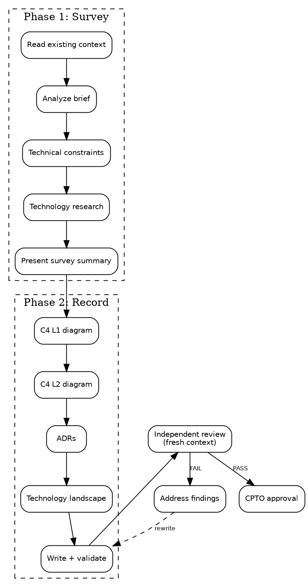
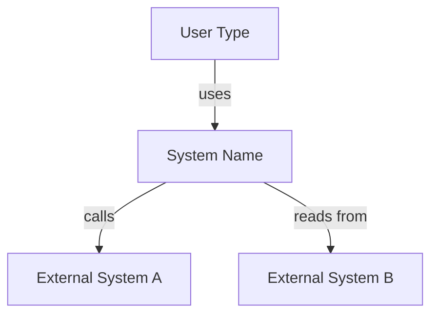
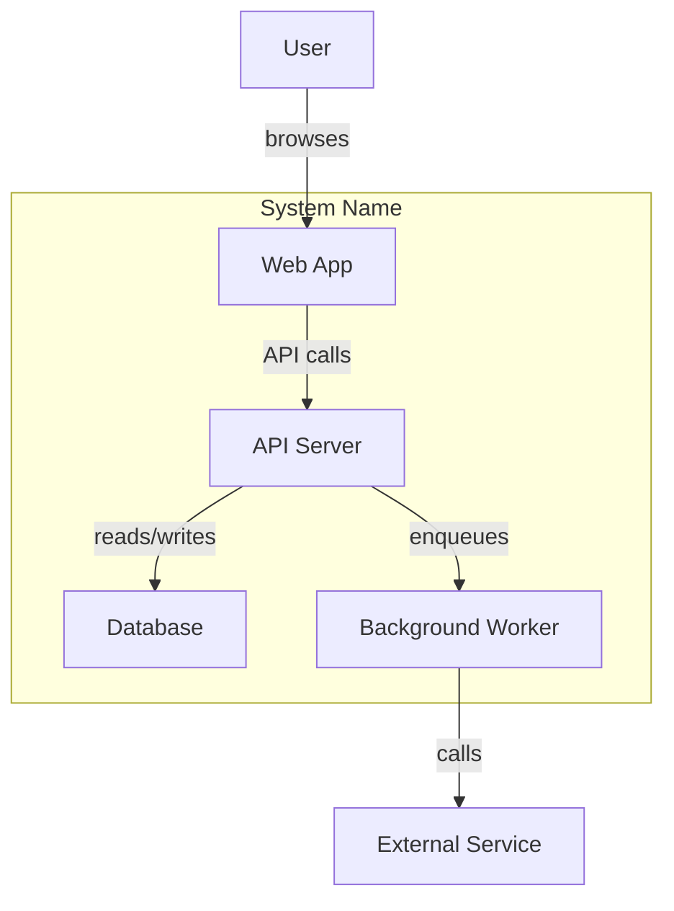

# Architecture Record Skills Implementation Plan

> **For agentic workers:** REQUIRED SUB-SKILL: Use superpowers:subagent-driven-development (recommended) or superpowers:executing-plans to implement this plan task-by-task. Steps use checkbox (`- [ ]`) syntax for tracking.

**Goal:** Implement `architecture-record` (produce) and `architecture-record-review` (validate) skills with three-tier tests.

**Architecture:** Two skill directories under `squad/skills/`, each with SKILL.md plus supporting reference files. Tests follow the established three-tier pattern in `tests/`.

**Tech Stack:** Markdown skills, bash test scripts, `mermaid-validator` via npx for diagram validation.

---

## File Structure

```
squad/skills/
├── architecture-record/
│   ├── SKILL.md              # Main produce skill (~250 lines)
│   ├── survey-guide.md       # Phase 1 methodology reference
│   └── record-guide.md       # Phase 2 C4/ADR templates and Mermaid rules
├── architecture-record-review/
│   ├── SKILL.md              # Review skill (~150 lines)
│   └── review-checklist.md   # Detailed 22-check criteria

tests/
├── skill-knowledge/
│   └── test-architecture-record.sh
├── skill-triggering/
│   ├── prompts/
│   │   ├── architecture-record-explicit.txt
│   │   ├── architecture-record-implicit.txt
│   │   └── architecture-record-negative.txt
│   └── run-all.sh            # MODIFY: add architecture-record entries
└── skill-execution/
    ├── test-architecture-record-execution.sh
    └── fixtures/
        └── architecture-context-brief.md
```

---

### Task 1: Create `architecture-record` SKILL.md

**Files:**
- Create: `squad/skills/architecture-record/SKILL.md`

- [ ] **Step 1: Create the SKILL.md file**

```markdown
---
name: architecture-record
description: Create or update the architecture record — component map (C4 L1+L2) and architectural decision records (ADRs). Use when starting technical design after an approved product brief, or when architecture needs revision.
allowed-tools: WebSearch WebFetch Bash(npx mermaid-validator *)
---

# Architecture Record

You are an Architect for a small team. Your job is to produce a clear,
validated architecture record that maps the system structure and
documents key technology decisions.

The architecture record is a **durable artifact** — it outlives sprints,
branches, and sessions. It gets revised when components emerge or
boundaries shift, not per feature.

<HARD-GATE>
Do NOT start without an approved product brief. The architecture record
translates an approved brief into system structure. If no approved brief
exists at `${user_config.product_home}/product/brief.md`, stop and tell
the user to run `squad:product-brief` first.
</HARD-GATE>

## Checklist

You MUST create a task for each item and complete them in order:

1. **Read existing context** — check for approved brief and existing architecture record
2. **Analyze the brief** — extract requirements that bound the architecture
3. **Technical constraints conversation** — ask user about integrations, expertise, deployment, hard constraints
4. **Technology landscape research** — web search for best practices, APIs, libraries, open source options
5. **Present survey summary** — show requirements-to-tech mapping, recommend choices, get confirmation
6. **Component map (C4 L1)** — system context diagram in Mermaid
7. **Component map (C4 L2)** — container diagram in Mermaid
8. **Architecture Decision Records** — one ADR per non-trivial technology choice
9. **Technology landscape section** — summarize research, what was considered, what was chosen
10. **Write record** — save artifact and validate Mermaid diagrams
11. **Independent review** — invoke `squad:architecture-record-review` (fresh context)
12. **Address findings** — fix FAIL items from review
13. **Request CPTO approval** — present record for human review

## Process



## Step Details

### 1. Read existing context

Check if `${user_config.product_home}/product/brief.md` exists and has
`Status: approved`. If not approved, stop.

Check if `${user_config.product_home}/architecture/record.md` exists.
If it does, this is a revision — read it and identify what triggered
the revision (new component, boundary shift, gate escalation).

Also check for any README, CLAUDE.md, or existing code that provides
technical context.

If `${user_config.product_home}` is not set, ask the user to configure it:
> "Where should product artifacts live? Set `product_home` in the squad
> plugin config, or tell me a path."

### 2. Analyze the brief

Extract from the approved brief and summarize in a table:

| Brief Element | Architecture Implication |
|---|---|
| Success criterion: "X by week Y" | Must support X technically |
| IS: "capability" | Needs a component for this |
| IS NOT: "exclusion" | Do NOT build a component for this |
| Constraint: "limit" | Bounds technology choices |
| Appetite: "N weeks" | Bounds complexity |

This table is your traceability reference for the entire skill.

### 3. Technical constraints conversation

Ask the user open-ended questions, **one at a time, one question per
message**. Do NOT offer predefined categories or multiple-choice.

Topics to explore (ask only what's relevant, skip what the brief
already answers):
- Existing systems to integrate with
- Team expertise and technology preferences
- Deployment environment (cloud, self-hosted, local)
- Hard constraints (budget, licensing, compliance)

If the user has already provided technical context (in the brief,
README, or conversation), acknowledge it and move on. Do not re-ask
what they already told you.

### 4. Technology landscape research

Use WebSearch to actively research:
- Best practices for the problem domain
- Suitable APIs, services, and libraries
- Open source projects that could reduce scope

Summarize each finding with: name, what it does, license, link.

If context7 MCP is available, use it for well-known library
documentation (more efficient than WebSearch for this). context7 is
optional — WebSearch is sufficient.

See [survey-guide.md](survey-guide.md) for research methodology.

### 5. Present survey summary

Show the user:
- Brief requirements mapped to technical needs (from step 2 table)
- Technology options researched (from step 4) with trade-offs
- Your recommended technology choices with reasoning

Get confirmation before proceeding to Phase 2. The user may redirect
your technology choices — that is expected and correct.

### 6. Component map (C4 L1) — System Context

Create a Mermaid flowchart showing:
- The system as a single box
- External actors (users, admins)
- External systems it integrates with (APIs, services)
- Connections labeled with interaction type

Follow [Mermaid rules](#mermaid-diagram-rules). Add a companion table:

| Actor/System | Description | Interaction |
|---|---|---|
| ... | ... | ... |

### 7. Component map (C4 L2) — Containers

Create a Mermaid flowchart showing:
- Containers within the system (web app, API, database, etc.)
- Each container's responsibility (3-4 word label)
- Connections between containers and to external systems

If >10 containers, decompose: one overview diagram showing container
groups, plus separate detail diagrams per group. Propose the split
to the user before drawing.

Follow [Mermaid rules](#mermaid-diagram-rules). Add a companion table:

| Container | Responsibility | Technology | Rationale |
|---|---|---|---|
| ... | ... | ... | ... |

See [record-guide.md](record-guide.md) for C4 format details.

### 8. Architecture Decision Records

One ADR per non-trivial technology choice. Nygard format:

```markdown
### ADR-NNN: [Title]

**Status:** proposed
**Context:** [why this decision is needed]
**Decision:** [what we decided]
**Consequences:** [what follows — good and bad]
```

ADRs are immutable once accepted — superseded, not edited. If revising
an existing record, add new ADRs that supersede old ones.

### 9. Technology landscape section

Summarize the research from step 4 in the artifact:
- What was considered (alternatives evaluated)
- What was chosen and why
- Links to documentation for key technologies

This section grounds the ADRs in evidence.

### 10. Write record and validate

Save to `${user_config.product_home}/architecture/record.md` with
this structure:

```markdown
# Architecture Record: [Product Name]

Status: draft
Date: YYYY-MM-DD
Approved by: pending
Brief: product/brief.md

## System Context (C4 L1)

[Mermaid diagram + companion table]

## Containers (C4 L2)

[Mermaid diagram(s) + companion table]

## Architecture Decision Records

[ADR-001, ADR-002, ...]

## Technology Landscape

[Research summary with links]
```

After writing, validate Mermaid diagrams:

```bash
npx mermaid-validator validate-md ${user_config.product_home}/architecture/record.md --fail-fast
```

If validation fails, fix the diagram syntax and re-validate. Do not
proceed with invalid diagrams.

See [record-guide.md](record-guide.md) for artifact template.

### 11. Independent review

Invoke the `squad:architecture-record-review` skill. It runs in a
**fresh context** (separate subagent) so it reviews the artifact with
no knowledge of how it was produced.

Wait for the review to complete and read the findings.

### 12. Address findings

If **PASS**, proceed directly to CPTO approval.

If **PASS WITH NOTES**, read the suggestions. Fix what you agree with.
You may proceed — these are non-blocking.

If **FAIL**, work through each finding:
- **Clear fix** (one obvious path) — fix it, note what you changed
- **Multiple paths** — present the options to the human, always
  including "Let's discuss this further"
- **Disagree** — state your reasoning and ask the human to weigh in

After all findings are addressed, re-run steps 10-11.

### 13. Request CPTO approval

Present the record to the human with:

> "Architecture record written to
> `${user_config.product_home}/architecture/record.md`. Please review
> and let me know if you want changes before we proceed."

Wait for human response:

- **Approved** → update record status to "approved", set date and
  approver. Proceed to `squad:product-backlog`.
- **Changes requested** → go back to the relevant step. After changes,
  re-run steps 10-11-12-13.

Do not proceed to other skills until the record status is "approved."

## Mermaid Diagram Rules

These rules prevent common failure modes:

1. **Short labels** — node labels max 3-4 words. Full descriptions go
   in the companion table below the diagram, not inside nodes.
2. **No styling** — no color, no CSS classes, no `style` directives.
   Plain default rendering.
3. **No nested subgraphs** — one level of `subgraph` max (system boundary).
4. **Decomposition trigger** — if L2 exceeds 10 containers, split into
   overview + detail diagrams per logical group.
5. **Deterministic validation** — always run
   `npx mermaid-validator validate-md <file> --fail-fast` after writing.

## Chains To

After CPTO approves the record, the next step is the
`squad:product-backlog` skill to decompose the brief into shaped
backlog items informed by this architecture.

## Common Rationalizations

| Excuse | Reality |
|--------|---------|
| "The brief already implies the architecture" | Implicit architecture diverges across agents. Make it explicit. |
| "We don't need ADRs for a small project" | Small projects have fewer decisions — each one matters more. |
| "Let me just start coding" | Code without architecture drifts. 30 minutes of mapping saves days of rework. |
| "The diagram is too simple" | Simple diagrams are good diagrams. Complexity is not value. |
| "I'll research tech during implementation" | Technology choices made under implementation pressure are worse. |
```

- [ ] **Step 2: Verify line count is under 500**

Run: `wc -l squad/skills/architecture-record/SKILL.md`
Expected: under 500 lines (target ~250)

- [ ] **Step 3: Commit**

```bash
git add squad/skills/architecture-record/SKILL.md
git commit -m "feat(squad): add architecture-record produce skill"
```

---

### Task 2: Create `architecture-record` supporting files

**Files:**
- Create: `squad/skills/architecture-record/survey-guide.md`
- Create: `squad/skills/architecture-record/record-guide.md`

- [ ] **Step 1: Create survey-guide.md**

```markdown
# Survey Guide: Technology Landscape Research

Reference material for Phase 1 of the architecture-record skill.
Claude reads this file when entering the survey phase.

## Research Strategy

### Step 1: Domain best practices

Search for: "[problem domain] architecture best practices 2025 2026"

Example for a listening trainer:
- "language learning app architecture"
- "audio processing pipeline best practices"
- "spaced repetition system design"

Look for: established patterns, common architectures, known pitfalls.

### Step 2: Service and API discovery

Search for: "[capability needed] API service"

For each candidate, capture:
- Name and URL
- What it does (one sentence)
- Pricing model (free tier? usage-based?)
- License (if open source)
- Maturity (how long has it existed? who uses it?)

### Step 3: Open source alternatives

Search for: "[capability needed] open source library [language]"

For each candidate, capture:
- Name and repository URL
- Stars / last commit date (proxy for maintenance)
- License (MIT, Apache, GPL — note copyleft)
- Key trade-off vs hosted service (more work, more control, no cost)

### Step 4: Scope reduction opportunities

The most valuable research finding is: "you don't need to build this,
it already exists." For each brief requirement, ask:
- Is there an existing service that does exactly this?
- Is there a library that does 80% of this?
- Can we compose existing tools instead of building from scratch?

## Research Output Format

Present findings to user as:

| Need | Option | Type | License/Cost | Trade-off |
|------|--------|------|-------------|-----------|
| Speech-to-text | Google Speech API | Service | Free tier 60min/mo | Accurate but vendor lock-in |
| Speech-to-text | Whisper | OSS library | MIT | Self-hosted, GPU needed |
| ... | ... | ... | ... | ... |

Follow each table with your recommendation and reasoning.

## When to Stop Researching

- You have 2-3 options per major technical need
- You've found at least one "scope reduction" opportunity
- Research is taking more than 15 minutes total

Do not aim for exhaustive coverage. The goal is informed choices,
not a market survey.
```

- [ ] **Step 2: Create record-guide.md**

```markdown
# Record Guide: C4 Diagrams and ADR Templates

Reference material for Phase 2 of the architecture-record skill.
Claude reads this file when producing the architecture record.

## C4 Level 1: System Context Diagram

Shows the system as a single box surrounded by its users and external
systems. Answers: "what does the system interact with?"

### Mermaid Template



### Rules
- The system is ONE box — do not decompose it at L1
- Every external actor/system gets its own node
- Edge labels describe the interaction (uses, calls, reads, writes)
- Node labels: 1-3 words. Details go in the companion table.

## C4 Level 2: Container Diagram

Shows the containers (deployable units) inside the system. Answers:
"what is the system made of?"

### Mermaid Template



### Rules
- One `subgraph` for the system boundary — no nested subgraphs
- Each container: 1-3 word label describing what it IS (not what it does)
- Container responsibility goes in the companion table, not the diagram
- Edge labels describe data flow direction and type
- If >10 containers, decompose:
  - Overview diagram: container groups as boxes, connections between groups
  - Detail diagrams: one per group, showing individual containers

### Container Table

| Container | Responsibility | Technology | Rationale |
|---|---|---|---|
| Web App | Serves user interface | Next.js | SSR for SEO, React ecosystem |
| API Server | Handles business logic | Python FastAPI | Team expertise, async support |
| Database | Stores application data | PostgreSQL | Relational data, proven at scale |

The "Rationale" column must reference either a brief constraint, team
expertise, or a specific research finding. Never "because it's popular."

## ADR Format (Nygard)

```markdown
### ADR-NNN: [Short Decision Title]

**Status:** proposed | accepted | superseded by ADR-NNN
**Context:** [1-3 sentences: what situation requires a decision?
Reference the brief constraint or requirement that drives this.]
**Decision:** [1-2 sentences: what did we decide?]
**Consequences:** [2-4 bullets: what follows from this decision?
Include both positive and negative consequences.]
```

### ADR Guidelines
- One ADR per non-trivial technology choice
- "Non-trivial" = any choice where a reasonable alternative exists
- Title is the decision, not the question ("Use PostgreSQL" not "Database choice")
- Context must reference the brief or a technical constraint
- Consequences must include at least one downside — every decision has trade-offs
- ADRs are append-only: supersede, never edit

### What Needs an ADR
- Primary language/framework choice
- Database technology
- External service dependencies (APIs, SaaS)
- Hosting/deployment approach
- Any choice that constrains future decisions

### What Does NOT Need an ADR
- Standard library usage
- Development tooling (linter, formatter)
- Test framework (unless unusual)
- Obvious defaults with no realistic alternative

## Artifact Template

The complete architecture record follows this structure:

```markdown
# Architecture Record: [Product Name]

Status: draft | approved
Date: YYYY-MM-DD
Approved by: [name or "pending"]
Brief: product/brief.md

## System Context (C4 L1)

[Mermaid diagram]

| Actor/System | Description | Interaction |
|---|---|---|
| ... | ... | ... |

## Containers (C4 L2)

[Mermaid diagram(s)]

| Container | Responsibility | Technology | Rationale |
|---|---|---|---|
| ... | ... | ... | ... |

## Architecture Decision Records

### ADR-001: [Title]
...

## Technology Landscape

[Summary of research: what was considered, what was chosen, why.
Links to documentation for key technologies.]
```
```

- [ ] **Step 3: Commit**

```bash
git add squad/skills/architecture-record/survey-guide.md squad/skills/architecture-record/record-guide.md
git commit -m "feat(squad): add architecture-record supporting reference files"
```

---

### Task 3: Create `architecture-record-review` SKILL.md

**Files:**
- Create: `squad/skills/architecture-record-review/SKILL.md`

- [ ] **Step 1: Create the SKILL.md file**

```markdown
---
name: architecture-record-review
description: Review an architecture record for structural completeness, architectural fitness, and alignment with the product brief. Runs in fresh context for unbiased assessment.
context: fork
allowed-tools: Bash(npx mermaid-validator *)
---

# Architecture Record Review

You are a QA/Reviewer with fresh eyes. You have NOT seen the
conversation that produced this architecture record. Your job is to
find problems the author cannot see.

Read the record. Read the brief. Evaluate both. Report findings.
Do not fix anything — that is the author's job.

## Process

1. **Read the artifacts** at `${user_config.product_home}/architecture/record.md`
   and `${user_config.product_home}/product/brief.md`
2. **Run the three review passes** — score each item PASS/FAIL
3. **Report findings** — structured, actionable, no rewrites

If either artifact is missing, report FAIL immediately with
"artifact not found."

## Review Passes

Run all three passes. See [review-checklist.md](review-checklist.md)
for detailed pass criteria.

### Pass 1 — Structural Completeness

| # | Check |
|---|-------|
| S1 | C4 L1 diagram exists and is valid Mermaid (run `npx mermaid-validator validate-md` on the file) |
| S2 | C4 L1 shows system boundary and at least 1 external actor |
| S3 | C4 L2 diagram exists and is valid Mermaid |
| S4 | C4 L2 shows containers with short labels (3-4 words max) |
| S5 | C4 L2 respects complexity limit (≤10 containers, or decomposed into overview + detail) |
| S6 | Companion tables exist for both L1 and L2 diagrams |
| S7 | At least 1 ADR exists per non-trivial technology choice |
| S8 | ADRs follow Nygard format (Status, Context, Decision, Consequences) |
| S9 | No orphan components (every container has at least 1 connection) |
| S10 | Technology Landscape section exists with research links |
| S11 | No styling directives, no nested subgraphs in Mermaid diagrams |

### Pass 2 — Architectural Fitness

| # | Check |
|---|-------|
| F1 | Separation of concerns — each container has one clear responsibility |
| F2 | API boundary clarity — interfaces between containers are defined, not assumed |
| F3 | Data flow coherence — can trace data from user input to stored output through the system |
| F4 | Technology fit — chosen technologies match brief constraints (appetite, team, deployment) |
| F5 | Proportionality — architecture complexity matches appetite (2-week MVP should not have microservices) |
| F6 | Simplicity — no containers that could be eliminated or merged without losing capability |

### Pass 3 — Brief Alignment

| # | Check |
|---|-------|
| B1 | Every success criterion in the brief is achievable by the proposed architecture |
| B2 | Every "IS NOT" boundary is respected — no containers solving excluded problems |
| B3 | Constraints from the brief are reflected in ADRs or technology choices |
| B4 | No gold-plating — every container serves at least one brief requirement |
| B5 | No gaps — every brief requirement has a supporting container |

## Output Format

```markdown
## Architecture Record Review

**Date:** YYYY-MM-DD
**Artifact:** ${user_config.product_home}/architecture/record.md
**Brief:** ${user_config.product_home}/product/brief.md

### Summary
[1-2 sentences: overall assessment]

### Results

**Pass 1 — Structural Completeness**

| # | Check | Result | Finding |
|---|-------|--------|---------|
| S1 | C4 L1 valid Mermaid | PASS/FAIL | [detail if FAIL] |
| S2 | L1 has external actors | PASS/FAIL | ... |
| ... | ... | ... | ... |

**Pass 2 — Architectural Fitness**

| # | Check | Result | Finding |
|---|-------|--------|---------|
| F1 | Separation of concerns | PASS/FAIL | ... |
| ... | ... | ... | ... |

**Pass 3 — Brief Alignment**

| # | Check | Result | Finding |
|---|-------|--------|---------|
| B1 | Success criteria achievable | PASS/FAIL | ... |
| ... | ... | ... | ... |

### Verdict
- **PASS** — record ready for CPTO approval
- **PASS WITH NOTES** — minor issues, author decides
- **FAIL** — critical issues must be fixed

### Critical Issues (if FAIL)
1. [what is wrong, cite specific text, explain why it matters]

### Suggestions (if PASS WITH NOTES)
1. [what could be better, but is not blocking]
```

## Rules

- Do NOT rewrite the architecture record. Report findings only.
- Do NOT add your own architecture opinions. Check structure and rigor.
- Every FAIL must cite specific text from the record AND explain why it matters.
- No vague findings — cite the specific component, ADR, or diagram element.
- If either artifact does not exist, report FAIL with "artifact not found."
```

- [ ] **Step 2: Verify line count is under 500**

Run: `wc -l squad/skills/architecture-record-review/SKILL.md`
Expected: under 500 lines (target ~150)

- [ ] **Step 3: Commit**

```bash
git add squad/skills/architecture-record-review/SKILL.md
git commit -m "feat(squad): add architecture-record-review validate skill"
```

---

### Task 4: Create `architecture-record-review` supporting file

**Files:**
- Create: `squad/skills/architecture-record-review/review-checklist.md`

- [ ] **Step 1: Create review-checklist.md**

```markdown
# Architecture Record Review Checklist

Detailed pass/fail criteria for each review check. The reviewer
reads this file during the review process.

## Pass 1 — Structural Completeness

### S1: C4 L1 diagram exists and is valid Mermaid

**How to check:** Look for a mermaid code block in the "System Context"
section. Run:
```bash
npx mermaid-validator validate-md ${user_config.product_home}/architecture/record.md --fail-fast
```
**PASS if:** Command exits 0.
**FAIL if:** Command exits non-zero, or no mermaid block found in the
System Context section.

### S2: C4 L1 shows system boundary and at least 1 external actor

**How to check:** Read the L1 diagram. Look for at least two distinct
node types: the system itself and at least one external actor (user,
admin, external service).
**PASS if:** System node and at least 1 external actor are present.
**FAIL if:** Only the system node exists, or diagram shows internal
components instead of system context.

### S3: C4 L2 diagram exists and is valid Mermaid

**How to check:** Same as S1 but for the "Containers" section.
**PASS if:** Valid mermaid block exists in Containers section.
**FAIL if:** Missing or invalid.

### S4: C4 L2 shows containers with short labels

**How to check:** Read each node label in the L2 diagram. Count words.
**PASS if:** All labels are 4 words or fewer.
**FAIL if:** Any label exceeds 4 words. Cite the specific node.

### S5: C4 L2 respects complexity limit

**How to check:** Count distinct container nodes in the L2 diagram.
**PASS if:** ≤10 containers in a single diagram, or decomposed into
overview + detail diagrams.
**FAIL if:** >10 containers in a single diagram without decomposition.

### S6: Companion tables exist for both diagrams

**How to check:** Look for a markdown table immediately after each
mermaid diagram.
**PASS if:** L1 has Actor/System table, L2 has Container table.
**FAIL if:** Either table is missing.

### S7: At least 1 ADR per non-trivial technology choice

**How to check:** Read the Container table's Technology column. For each
distinct technology, check if an ADR exists. "Non-trivial" means a
realistic alternative exists (don't require an ADR for using HTML).
**PASS if:** Each non-trivial technology has a corresponding ADR.
**FAIL if:** A technology choice has no ADR and a reasonable alternative
exists. Cite the specific technology.

### S8: ADRs follow Nygard format

**How to check:** Each ADR must have: Status, Context, Decision,
Consequences fields.
**PASS if:** All ADRs have all four fields with substantive content.
**FAIL if:** Any field is missing or contains only placeholder text.
Cite the specific ADR.

### S9: No orphan components

**How to check:** For each container node in the L2 diagram, check that
it has at least one edge (incoming or outgoing).
**PASS if:** Every container has at least 1 connection.
**FAIL if:** Any container has zero connections. Cite the specific node.

### S10: Technology Landscape section exists with research links

**How to check:** Look for a "Technology Landscape" section. Check for
at least one URL.
**PASS if:** Section exists with at least 1 external link.
**FAIL if:** Section missing, or present but contains no links.

### S11: No styling directives or nested subgraphs

**How to check:** Scan all mermaid code blocks for: `style`, `class`,
`classDef`, `:::`, or nested `subgraph` (a subgraph inside a subgraph).
**PASS if:** None found.
**FAIL if:** Any found. Cite the specific line.

## Pass 2 — Architectural Fitness

### F1: Separation of concerns

**How to check:** Read the Container table's Responsibility column.
Each responsibility should describe one thing.
**PASS if:** No container has "and" or multiple verbs in its
responsibility, and no two containers share similar responsibilities.
**FAIL if:** A container has compound responsibilities, or two
containers overlap. Cite both.

### F2: API boundary clarity

**How to check:** For each edge between containers in L2, check if the
interaction type is described (the edge label or the companion table).
**PASS if:** Interactions between containers are labeled with their type
(REST, queue, file, shared DB, etc.).
**FAIL if:** Edges exist without labels, or labels are vague
("communicates with"). Cite the specific edge.

### F3: Data flow coherence

**How to check:** Pick the primary user action described in the brief.
Trace it through the L2 diagram from user input to stored output.
**PASS if:** A complete path exists through the containers.
**FAIL if:** The path is broken (data enters a container but has no
visible path to the next step). Cite where the path breaks.

### F4: Technology fit

**How to check:** For each ADR, check if the Context references a brief
constraint or requirement.
**PASS if:** Technology choices reference brief constraints (appetite,
team expertise, deployment environment).
**FAIL if:** An ADR's Context doesn't connect to the brief. Cite the ADR.

### F5: Proportionality

**How to check:** Compare the number of containers and ADRs against
the brief's appetite.
**PASS if:** Complexity is reasonable for the stated appetite.
**FAIL if:** Architecture is clearly over-engineered for the appetite
(e.g., microservices + message queues + multiple databases for a
2-week MVP). Cite the specific over-engineering.

### F6: Simplicity

**How to check:** For each container, ask: "if I removed this, would
the system lose a capability described in the brief?"
**PASS if:** Every container is necessary.
**FAIL if:** A container could be merged into another or eliminated
without losing functionality. Cite which containers and why.

## Pass 3 — Brief Alignment

### B1: Success criteria achievable

**How to check:** For each success criterion in the brief, identify
which containers support it.
**PASS if:** Every criterion has at least one supporting container.
**FAIL if:** A criterion has no clear architectural support. Cite the
criterion and explain what's missing.

### B2: IS NOT boundaries respected

**How to check:** Read the brief's "IS NOT" list. Check that no
container's responsibility matches an excluded capability.
**PASS if:** No container serves an excluded capability.
**FAIL if:** A container's responsibility matches an IS NOT item.
Cite both.

### B3: Brief constraints reflected

**How to check:** Read the brief's Constraints and No-gos. Check that
each is either reflected in an ADR or visible in technology choices.
**PASS if:** All constraints are addressed.
**FAIL if:** A constraint is not reflected anywhere. Cite the constraint.

### B4: No gold-plating

**How to check:** For each container, identify which brief requirement
it serves.
**PASS if:** Every container maps to at least one brief requirement.
**FAIL if:** A container exists without a clear brief requirement.
Cite the container.

### B5: No gaps

**How to check:** For each brief IS item, identify which container
implements it.
**PASS if:** Every IS item has a supporting container.
**FAIL if:** An IS item has no container. Cite the item.
```

- [ ] **Step 2: Commit**

```bash
git add squad/skills/architecture-record-review/review-checklist.md
git commit -m "feat(squad): add architecture-record-review detailed checklist"
```

---

### Task 5: Knowledge tests for architecture-record

**Files:**
- Create: `tests/skill-knowledge/test-architecture-record.sh`

- [ ] **Step 1: Create the knowledge test file**

```bash
#!/usr/bin/env bash
# Test: architecture-record skill knowledge
# Verifies that Claude loaded the skill and understands its process
set -euo pipefail

SCRIPT_DIR="$(cd "$(dirname "$0")" && pwd)"
source "$SCRIPT_DIR/../test-helpers.sh"

echo "=== Test: architecture-record skill knowledge ==="
echo ""

# Test 1: Knows the two-phase process and step order
echo "Test 1: Two-phase process..."

output=$(run_claude_knowledge "In the architecture-record skill, what are the two phases and their main steps? List them briefly." 60)

assert_contains "$output" "survey\|Survey\|research\|Research" "Mentions survey/research phase" || exit 1
assert_contains "$output" "record\|Record\|C4\|component" "Mentions record/C4 phase" || exit 1
assert_order "$output" "brief\|Brief\|context" "C4\|diagram\|component map" "Brief analysis before C4 diagrams" || exit 1

echo ""

# Test 2: Knows Mermaid diagram rules
echo "Test 2: Mermaid rules..."

output=$(run_claude_knowledge "In the architecture-record skill, what are the rules for Mermaid diagrams? What should you avoid?" 60)

assert_contains "$output" "label\|Label\|short\|word" "Mentions short labels" || exit 1
assert_contains "$output" "style\|styling\|color\|CSS" "Mentions no styling" || exit 1
assert_contains "$output" "valid\|validat\|mermaid-validator" "Mentions validation" || exit 1

echo ""

# Test 3: Knows ADR format
echo "Test 3: ADR format..."

output=$(run_claude_knowledge "In the architecture-record skill, what format should Architecture Decision Records follow? What fields are required?" 60)

assert_contains "$output" "Nygard\|nygard\|Status\|status" "Mentions Nygard or Status field" || exit 1
assert_contains "$output" "Context\|context" "Mentions Context field" || exit 1
assert_contains "$output" "Decision\|decision" "Mentions Decision field" || exit 1
assert_contains "$output" "Consequence\|consequence" "Mentions Consequences field" || exit 1

echo ""

# Test 4: Knows review has three passes
echo "Test 4: Review passes..."

output=$(run_claude_knowledge "In the architecture-record-review skill, what are the three review passes? What does each one check?" 60)

assert_contains "$output" "structural\|Structural\|completeness\|Completeness" "Mentions structural completeness" || exit 1
assert_contains "$output" "fitness\|Fitness" "Mentions architectural fitness" || exit 1
assert_contains "$output" "brief\|Brief\|alignment\|Alignment" "Mentions brief alignment" || exit 1

echo ""

echo "=== All architecture-record knowledge tests passed ==="
```

- [ ] **Step 2: Make executable and verify syntax**

Run: `chmod +x tests/skill-knowledge/test-architecture-record.sh && bash -n tests/skill-knowledge/test-architecture-record.sh`
Expected: no output (clean syntax)

- [ ] **Step 3: Commit**

```bash
git add tests/skill-knowledge/test-architecture-record.sh
git commit -m "test(squad): add architecture-record knowledge tests"
```

---

### Task 6: Triggering tests for architecture-record

**Files:**
- Create: `tests/skill-triggering/prompts/architecture-record-explicit.txt`
- Create: `tests/skill-triggering/prompts/architecture-record-implicit.txt`
- Create: `tests/skill-triggering/prompts/architecture-record-negative.txt`
- Modify: `tests/skill-triggering/run-all.sh`

- [ ] **Step 1: Create explicit trigger prompt**

File: `tests/skill-triggering/prompts/architecture-record-explicit.txt`
```
Use the architecture-record skill to create the technical architecture for this product.
```

- [ ] **Step 2: Create implicit trigger prompt**

File: `tests/skill-triggering/prompts/architecture-record-implicit.txt`
```
We have an approved product brief and now need to figure out the technical architecture — what components, what technologies, how they connect.
```

- [ ] **Step 3: Create negative trigger prompt**

File: `tests/skill-triggering/prompts/architecture-record-negative.txt`
```
Review this architecture record. Check if the component map is complete and the ADRs are well-formed.
```

- [ ] **Step 4: Add architecture-record entries to run-all.sh**

In `tests/skill-triggering/run-all.sh`, replace the TESTS array:

```bash
TESTS=(
    "product-brief product-brief-explicit.txt"
    "product-brief product-brief-implicit.txt"
    "product-brief-review product-brief-negative.txt"
    "architecture-record architecture-record-explicit.txt"
    "architecture-record architecture-record-implicit.txt"
    "architecture-record-review architecture-record-negative.txt"
)
```

- [ ] **Step 5: Commit**

```bash
git add tests/skill-triggering/prompts/architecture-record-explicit.txt \
    tests/skill-triggering/prompts/architecture-record-implicit.txt \
    tests/skill-triggering/prompts/architecture-record-negative.txt \
    tests/skill-triggering/run-all.sh
git commit -m "test(squad): add architecture-record triggering tests"
```

---

### Task 7: Execution test fixture

**Files:**
- Create: `tests/skill-execution/fixtures/architecture-context-brief.md`

- [ ] **Step 1: Create the fixture file**

This is an approved product brief that the execution test will use as input.
Based on the Trabajador brief structure:

```markdown
# Product Brief: TeamPulse

Status: approved
Date: 2026-04-01
Approved by: Test CPTO

## Problem

**How might we help remote team leads see whether agreed-upon team practices are actually happening, without micromanaging or adding status reporting overhead?**

Remote team leads managing 5-15 people across timezones have no visibility into whether agreed-upon team practices are actually happening. They find out weeks later when quality drops. Existing tools (Jira, Slack) track tasks, not habits.

## Users

**Primary user: Remote team lead**

1. "When I notice my team's code review quality dropping, I want to see which practices we agreed on are actually being followed, so I can address the gap before it becomes a crisis."

2. "When I'm preparing for a 1:1, I want to see a team member's consistency trends without asking them to write status reports, so I can have a data-informed conversation."

**Secondary user: Individual contributor**

3. "When I want to demonstrate my consistency to my lead, I want my daily habits to be tracked automatically from tools I already use, so I don't need to write status updates."

## Solution Boundary

### This product IS
- A dashboard showing team practice adherence trends
- A Slack integration for lightweight daily check-ins
- Weekly trend reports for team leads
- An API for pulling data from existing tools (GitHub, Jira)

### This product IS NOT
- A task manager or project management tool
- A gamification or rewards system
- A time tracker
- A performance review or HR tool
- A replacement for retrospectives or standups

### MVP prioritization

**Must have (week 1-2):**
- Slack check-in integration
- Practice definition (team lead configures which habits to track)
- Basic dashboard with weekly trends

**Nice to have (stretch):**
- GitHub/Jira auto-detection of practices
- Individual contributor self-view

## Success Criteria

1. **Adoption:** 80% of team members complete daily check-ins within 2 weeks of onboarding
2. **Visibility:** Team leads report improved visibility into practice adherence in post-pilot survey by week 4
3. **Low friction:** Average check-in takes under 30 seconds (measured by Slack interaction timestamps)
4. **Data quality:** Dashboard trends match manual spot-checks with 90%+ accuracy by week 3

## Appetite & Constraints

**Appetite:** 4 weeks, solo developer.

**Constraints:**
- Must integrate with Slack (team already uses it daily)
- Web dashboard, responsive for mobile viewing
- Single-team deployment for MVP

**No-gos:**
- No gamification (badges, points, streaks)
- No individual performance scoring or ranking
- No replacing existing project management tools
- No native mobile app in MVP
```

- [ ] **Step 2: Commit**

```bash
git add tests/skill-execution/fixtures/architecture-context-brief.md
git commit -m "test(squad): add architecture-record execution test fixture"
```

---

### Task 8: Execution test for architecture-record

**Files:**
- Create: `tests/skill-execution/test-architecture-record-execution.sh`

- [ ] **Step 1: Create the execution test**

```bash
#!/usr/bin/env bash
# Test: architecture-record full execution
# Runs the complete architecture-record workflow against a temp project
# with an approved brief, and verifies the output artifact.
#
# This is a SLOW test (5-15 minutes). Run with: --tier execution
set -euo pipefail

SCRIPT_DIR="$(cd "$(dirname "$0")" && pwd)"
source "$SCRIPT_DIR/../test-helpers.sh"

echo "=== Test: architecture-record full execution ==="
echo ""

# Create temp project with product_home and approved brief
PROJECT_DIR=$(create_test_project)
PRODUCT_HOME="$PROJECT_DIR"
BRIEF_PATH="$PRODUCT_HOME/product/brief.md"
RECORD_PATH="$PRODUCT_HOME/architecture/record.md"

# Set up the approved brief fixture
cp "$SCRIPT_DIR/fixtures/architecture-context-brief.md" "$BRIEF_PATH"
mkdir -p "$PRODUCT_HOME/architecture"

echo "Project dir: $PROJECT_DIR"
echo "Brief: $BRIEF_PATH"
echo "Expected artifact: $RECORD_PATH"
echo ""

# Build a rich prompt with enough context for non-interactive execution
PROMPT="Use the architecture-record skill to create the architecture for this product.

The approved product brief is at: $BRIEF_PATH
Product home is: $PRODUCT_HOME

Technical context from the team lead:
- Team uses Python (FastAPI) for backends and React for frontends
- Deployed on Railway (PaaS, no Kubernetes)
- Slack workspace already set up with bot permissions
- PostgreSQL preferred for data storage
- Solo developer, keep it simple — monorepo, single deploy

Skip the interactive questions — all technical context is provided above.
Create the architecture record, run the review, and present for approval.
When asking for CPTO approval, just write AWAITING CPTO APPROVAL and stop."

# Run the skill
TIMESTAMP=$(date +%s)
LOG_FILE="/tmp/squad-tests/${TIMESTAMP}/execution/architecture-record/claude-output.json"
mkdir -p "$(dirname "$LOG_FILE")"

echo "Running architecture-record skill (this may take several minutes)..."
echo ""

cd "$PROJECT_DIR"
run_claude_json "$PROMPT" "$LOG_FILE" 600 30

echo ""
echo "=== Checking Results ==="
echo ""

# Test 1: Architecture record was created
echo "Test 1: Artifact exists..."
if [ -f "$RECORD_PATH" ]; then
    echo "  [PASS] Record created at $RECORD_PATH"
else
    echo "  [FAIL] Record not found at $RECORD_PATH"
    echo "  Files in project:"
    find "$PROJECT_DIR" -type f | sed 's/^/    /'
    cleanup_test_project "$PROJECT_DIR"
    exit 1
fi

# Read the record for content checks
RECORD_CONTENT=$(cat "$RECORD_PATH")

# Test 2: Has required sections
echo ""
echo "Test 2: Required sections..."
assert_contains "$RECORD_CONTENT" "System Context\|C4 L1\|Level 1" "Has C4 L1 section" || exit 1
assert_contains "$RECORD_CONTENT" "Container\|C4 L2\|Level 2" "Has C4 L2 section" || exit 1
assert_contains "$RECORD_CONTENT" "ADR-\|Architecture Decision" "Has ADR section" || exit 1
assert_contains "$RECORD_CONTENT" "Technology Landscape\|Technology.*Research\|Research.*Summary" "Has technology landscape section" || exit 1

# Test 3: Has Mermaid diagrams
echo ""
echo "Test 3: Mermaid diagrams..."
assert_contains "$RECORD_CONTENT" '```mermaid' "Contains mermaid code blocks" || exit 1

# Test 4: Mermaid diagrams are valid (if mermaid-validator is available)
echo ""
echo "Test 4: Mermaid validation..."
if command -v npx &> /dev/null; then
    if npx mermaid-validator validate-md "$RECORD_PATH" --fail-fast 2>/dev/null; then
        echo "  [PASS] Mermaid diagrams are valid"
    else
        echo "  [FAIL] Mermaid validation failed"
    fi
else
    echo "  [SKIP] npx not available for mermaid validation"
fi

# Test 5: Has companion tables
echo ""
echo "Test 5: Companion tables..."
assert_contains "$RECORD_CONTENT" "| Actor\|| Container\|| System" "Has companion tables" || true

# Test 6: ADRs have Nygard fields
echo ""
echo "Test 6: ADR format..."
assert_contains "$RECORD_CONTENT" "Status.*:.*proposed\|Status.*:.*accepted" "ADR has Status field" || true
assert_contains "$RECORD_CONTENT" "Context.*:" "ADR has Context field" || true
assert_contains "$RECORD_CONTENT" "Decision.*:" "ADR has Decision field" || true
assert_contains "$RECORD_CONTENT" "Consequence" "ADR has Consequences field" || true

# Test 7: No implementation details leaked
echo ""
echo "Test 7: No implementation leakage..."
assert_not_contains "$RECORD_CONTENT" "def \|function \|class \|import \|require(" "No code in architecture record" || true

# Test 8: Review skill was invoked
echo ""
echo "Test 8: Review invocation..."
assert_skill_triggered "$LOG_FILE" "architecture-record-review" "Review skill was invoked" || true

# Test 9: CPTO approval was requested
echo ""
echo "Test 9: CPTO approval..."
if grep -qi "CPTO\|approval\|approve" "$LOG_FILE"; then
    echo "  [PASS] CPTO approval requested"
else
    echo "  [FAIL] No CPTO approval request found in transcript"
fi

echo ""
echo "=== Execution test complete ==="
echo ""
echo "Architecture record: $RECORD_PATH"
echo "Session log: $LOG_FILE"

# Cleanup
cleanup_test_project "$PROJECT_DIR"
```

- [ ] **Step 2: Make executable and verify syntax**

Run: `chmod +x tests/skill-execution/test-architecture-record-execution.sh && bash -n tests/skill-execution/test-architecture-record-execution.sh`
Expected: no output (clean syntax)

- [ ] **Step 3: Commit**

```bash
git add tests/skill-execution/test-architecture-record-execution.sh
git commit -m "test(squad): add architecture-record execution test"
```

---

### Task 9: Update skills architecture doc

**Files:**
- Modify: `docs/ideation/squad-skills-architecture.md`

- [ ] **Step 1: Update the implemented skills table**

In `docs/ideation/squad-skills-architecture.md`, replace the Implemented table
(lines 142-145) with:

```markdown
### Implemented (v0.2.0)

| Skill | Role | Type | Lines | Validated |
|-------|------|------|-------|-----------|
| `product-brief` | Product Owner | Produce | 220 | Yes — e2e test |
| `product-brief-review` | QA/Reviewer | Validate (fork) | 110 | Yes — e2e test |
| `architecture-record` | Architect | Produce | ~250 | Pending |
| `architecture-record-review` | QA/Reviewer | Validate (fork) | ~150 | Pending |
```

- [ ] **Step 2: Update the planned skills table**

Remove `architecture-record` and `architecture-gate` from the Planned
table. Rename `architecture-gate` to `architecture-gate` (keep as
separate inner-cycle skill, distinct from `architecture-record-review`).
Add a note clarifying the distinction:

```markdown
### Planned

| Skill | Role | Type | Priority |
|-------|------|------|----------|
| `product-backlog` | Product Owner | Produce | Next |
| `product-gate` | QA/Reviewer | Validate | High |
| `architecture-gate` | Architect | Validate (fork) | High |
| `design-system` | Designer | Produce | Medium |
| `design-gate` | Designer | Validate (fork) | Medium |
| `qa-gate` | QA/Reviewer | Validate | Medium |
| `delivery-record` | PO + Designer | Produce | Medium |
| `knowledge-log` | All roles | Produce | Low |
| `health-register` | Dev + Architect | Produce | Low |

Note: `architecture-record-review` validates the architecture record
artifact (structural completeness, fitness, brief alignment).
`architecture-gate` is a separate inner-cycle skill that validates
implementation specs against the architecture record during the
Superpowers execution loop.
```

- [ ] **Step 3: Commit**

```bash
git add docs/ideation/squad-skills-architecture.md
git commit -m "docs(squad): update skills architecture for v0.2.0 with architecture-record"
```

---

### Task 10: Run knowledge and triggering tests

**Files:** None (verification only)

- [ ] **Step 1: Run knowledge tests**

Run: `./tests/run-tests.sh --tier knowledge --verbose`
Expected: All tests pass including new architecture-record tests.

- [ ] **Step 2: Run triggering tests**

Run: `./tests/run-tests.sh --tier triggering --verbose`
Expected: All tests pass including new architecture-record trigger tests.

- [ ] **Step 3: Fix any failures**

If tests fail, diagnose the root cause:
- Knowledge test assertion too narrow → broaden pattern alternatives
- Triggering test wrong skill → adjust prompt wording
- Timeout → increase timeout in test

Fix and re-run until green.

- [ ] **Step 4: Commit any test fixes**

```bash
git add tests/
git commit -m "fix(tests): adjust architecture-record test assertions"
```

(Skip this step if no fixes were needed.)
