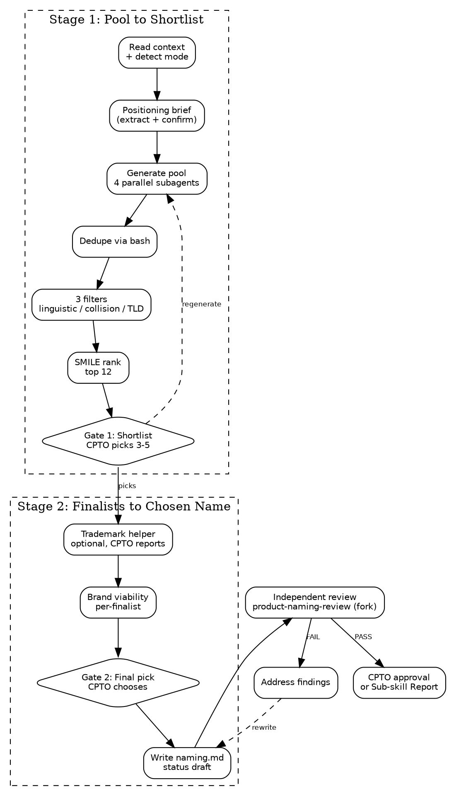

# Product Naming Skills Implementation Plan

> **For agentic workers:** REQUIRED SUB-SKILL: Use superpowers:subagent-driven-development (recommended) or superpowers:executing-plans to implement this plan task-by-task. Steps use checkbox (`- [ ]`) syntax for tracking.

**Goal:** Implement `product-naming` (produce) and `product-naming-review` (validate) skills with three-tier tests, closing the Product Identity foundation.

**Architecture:** Two skill directories under `squad/skills/`, each with `SKILL.md`. The produce skill has a supporting `naming-playbook.md` for methodology depth. Tests follow the established three-tier pattern in `tests/`. The skill uses `Task` for parallel subagent dispatch (4 differentiated lenses), `WebFetch` for RDAP and HTTPS probes, `WebSearch` for brand collision checks, and a narrow `Bash` grant for the dedup pipeline.

**Tech Stack:** Markdown skills, bash test scripts, awk for dedup, Claude Code Task tool for parallel dispatch.

**Source spec:** `docs/superpowers/specs/2026-04-11-product-naming-design.md`

---

## File Structure

```
squad/skills/
├── product-naming/
│   ├── SKILL.md              # Main produce skill (~350 lines)
│   └── naming-playbook.md    # Methodology guide (~300 lines)
└── product-naming-review/
    └── SKILL.md              # Validate skill (~150 lines)

tests/
├── skill-knowledge/
│   └── test-product-naming.sh
├── skill-triggering/
│   ├── prompts/
│   │   ├── product-naming-explicit.txt
│   │   ├── product-naming-implicit.txt
│   │   └── product-naming-negative.txt
│   └── run-all.sh            # MODIFY: add product-naming entries
└── skill-execution/
    ├── test-product-naming-execution.sh
    └── fixtures/
        └── product-naming-brief.md
```

---

### Task 1: Create knowledge tests for `product-naming`

Write the knowledge tests first so they define "done" for the skill content. These run in ~30 seconds against `claude -p` with `--max-turns 5`, asking the agent questions about the skill's process and verifying it answers correctly.

**Files:**
- Create: `tests/skill-knowledge/test-product-naming.sh`

- [ ] **Step 1: Create the test script**

```bash
#!/usr/bin/env bash
# Test: product-naming skill knowledge
# Verifies that Claude loaded the skill and understands its process
set -euo pipefail

SCRIPT_DIR="$(cd "$(dirname "$0")" && pwd)"
source "$SCRIPT_DIR/../test-helpers.sh"

echo "=== Test: product-naming skill knowledge ==="
echo ""

# Test 1: Hard gate on approved brief
echo "Test 1: Hard gate on approved brief..."

output=$(run_claude_knowledge "In the product-naming skill, what happens if no approved product brief exists? Can the skill run without one?" 60)

assert_contains "$output" "stop\|cannot\|hard.gate\|requires\|need.*brief\|brief.*required" "Refuses to run without brief" || exit 1
assert_contains "$output" "product-brief\|squad:product-brief" "Points to product-brief skill" || exit 1

echo ""

# Test 2: Knows the candidate generation method
echo "Test 2: Parallel subagent generation..."

output=$(run_claude_knowledge "In the product-naming skill, how are candidate names generated? Is it a single LLM call, or something else?" 60)

assert_contains "$output" "parallel\|4 subagent\|four subagent\|four lens\|4 lens\|dispatch" "Mentions parallel dispatch" || exit 1
assert_contains "$output" "lens\|differentiated\|isolated context" "Mentions differentiated lenses or contexts" || exit 1

echo ""

# Test 3: Knows the three automated filters
echo "Test 3: Three automated filters..."

output=$(run_claude_knowledge "In the product-naming skill, what are the three automated filters applied to the candidate pool?" 60)

assert_contains "$output" "linguistic\|phonetic\|SCRATCH" "Mentions linguistic/SCRATCH filter" || exit 1
assert_contains "$output" "brand collision\|collision search\|WebSearch\|web search" "Mentions brand collision filter" || exit 1
assert_contains "$output" "TLD\|domain\|RDAP\|.com" "Mentions primary TLD probe filter" || exit 1

echo ""

# Test 4: Trademark check is optional
echo "Test 4: Trademark check is optional..."

output=$(run_claude_knowledge "In the product-naming skill, is the trademark check mandatory? What does the skill do for trademark validation?" 60)

assert_contains "$output" "optional\|not mandatory\|skip\|may.*skip" "Mentions trademark is optional" || exit 1
assert_contains "$output" "USPTO\|WIPO\|EUIPO\|registry\|registries" "Mentions trademark registries" || exit 1
assert_contains "$output" "human\|user\|CPTO\|manual" "Mentions human-run not automated" || exit 1

echo ""

# Test 5: Artifact location
echo "Test 5: Artifact path..."

output=$(run_claude_knowledge "In the product-naming skill, where is the final naming artifact saved?" 60)

assert_contains "$output" "identity/naming" "Mentions identity/naming path" || exit 1
assert_contains "$output" "user_config.product_home\|product_home" "Uses product_home env var" || exit 1

echo ""

# Test 6: Two CPTO gates
echo "Test 6: Two CPTO gates in process..."

output=$(run_claude_knowledge "In the product-naming skill, how many times does the CPTO get involved during the process before final approval? What are the gates?" 60)

assert_contains "$output" "two\|2\|shortlist\|finalist" "Mentions multiple gates" || exit 1
assert_contains "$output" "shortlist\|pick" "Mentions shortlist pick" || exit 1
assert_contains "$output" "final\|winner\|chosen" "Mentions final pick" || exit 1

echo ""

echo "=== All product-naming knowledge tests passed ==="
```

- [ ] **Step 2: Make the test script executable**

```bash
chmod +x tests/skill-knowledge/test-product-naming.sh
```

- [ ] **Step 3: Run the test to verify it fails (skill doesn't exist yet)**

Run: `./tests/skill-knowledge/test-product-naming.sh`
Expected: FAIL — Claude has no product-naming skill loaded, cannot answer questions about it. The first assertion in Test 1 should fail because the output won't contain refuse/stop/hard-gate language about a skill that doesn't exist.

- [ ] **Step 4: Commit**

```bash
git add tests/skill-knowledge/test-product-naming.sh
git commit -m "test(squad): add product-naming knowledge tests

Six knowledge tests covering hard gate, parallel generation,
three filters, trademark optionality, artifact path, and gate
count. Tests fail until the skill exists."
```

---

### Task 2: Create `product-naming/SKILL.md`

Create the main produce skill. This is the largest single file in the plan — ~350 lines following the shipped pattern (frontmatter, hard gate, numbered checklist, DOT digraph, step detail, chains-to, common rationalizations).

**Files:**
- Create: `squad/skills/product-naming/SKILL.md`

- [ ] **Step 1: Create the SKILL.md file**

```markdown
---
name: product-naming
description: Produce or revise the product naming artifact — the chosen product name plus its supporting system (philosophy, usage rules, forbidden variants, validation record). Use when a product brief is approved and no name exists yet, when rebranding an existing product, or when invoked as a dependency by squad:design-system.
allowed-tools: Task WebSearch WebFetch Bash(sh /tmp/naming-dedup.sh)
---

# Product Naming

You are a Designer for a small team. Your job is to produce a chosen
product name plus its supporting system: naming philosophy, approved
short forms, forbidden variants, capitalization and pronunciation
rules, and the validation record (automated filters and the optional
human-run trademark state).

Product Naming is a **durable artifact** — it outlives sprints,
branches, and sessions. It gets revised on rebrands, not per feature.
It is the sole artifact of the **Product Identity** foundation, one
of four equal-rank durable foundations alongside Product, Architecture,
and Design System.

<HARD-GATE>
Do NOT start without an approved product brief. Naming without a
defined problem produces marketing fluff.

If no approved brief exists at `${user_config.product_home}/product/brief.md`:

- **Standalone mode** — stop and tell the user to run
  `squad:product-brief` first.
- **Orchestrated mode** (invoked by squad:design-system) — emit a
  Sub-skill Report with status BLOCKED and reason "no approved
  product brief". Do NOT address the user directly; the orchestrator
  owns the user-facing channel.
</HARD-GATE>

## Checklist

You MUST create a task for each item and complete them in order:

1. **Read existing context** — check approved brief, existing naming artifact, invocation mode (greenfield / rebrand / orchestrated)
2. **Positioning brief** — extract from product brief and confirm with CPTO
3. **Generate candidate pool** — dispatch 4 parallel subagents with differentiated lenses, dedupe to ~200 candidates
4. **Automated filter pass** — apply 3 filters in cheapest-first order
5. **SMILE/SCRATCH ranking** — rank survivors, take top 12
6. **Present shortlist (CPTO Gate 1)** — CPTO picks 3–5 finalists
7. **Trademark search handoff** — optional helper, CPTO reports back
8. **Brand viability writeup** — per-finalist note
9. **Present finalists (CPTO Gate 2)** — Claude leans with dimensional grounding; CPTO picks winner
10. **Write naming.md** — full validation record, status "draft"
11. **Independent review** — invoke `squad:product-naming-review` (fresh context fork)
12. **Address findings** — fix any FAIL items
13. **Request CPTO approval** — flip status to "approved" (standalone) or emit Sub-skill Report (orchestrated)

## Process



## Step Details

### 1. Read existing context

Check filesystem state to detect invocation mode and gather inputs:

- **Brief check.** `${user_config.product_home}/product/brief.md` must
  exist with `Status: approved`. If missing or not approved, hard-gate
  failure (see HARD-GATE block above).
- **Existing naming check.** If
  `${user_config.product_home}/identity/naming.md` exists, this is a
  **rebrand**. Read it as context.
- **Mode detection.** Set the invocation mode based on context:
  - `greenfield` — brief approved, no existing naming artifact
  - `rebrand` — brief approved, existing naming artifact
  - `orchestrated` — invoked by `squad:design-system` (the orchestrator
    will provide context indicating this; default is standalone)

Remember the mode for the rest of the run — Steps 2 and 13 fork on it.

If `${user_config.product_home}` is not set, ask the user to configure it:

> "Where should product artifacts live? Set `product_home` in the squad
> plugin config, or tell me a path."

### 2. Positioning brief

Extract five inputs from the approved brief and present as a table for
CPTO confirmation. Do NOT generate the positioning from scratch — the
brief is already approved; this step is extraction plus confirmation.

| Input | Source in brief | Constrains |
|---|---|---|
| Target users | JTBD job stories | Linguistic register, target languages, reading level |
| Category | Solution Boundary IS | Brand collision search category |
| Tone | Derived from problem framing and user descriptions | Register: playful / technical / stoic / warm / clinical |
| Appetite / maturity | Appetite section | Bias toward functional (short-horizon) vs invented/evocative (long-horizon) |
| Must-avoid | IS NOT + explicit CPTO constraints | Words, metaphors, competitors to steer clear of |

For any input the brief doesn't support cleanly (typically tone and
must-avoid), ask the CPTO **one open-ended question per gap** — never
a menu. The user knows their problem better than you.

**Rebrand mode addition.** Ask one extra open-ended question:

> "What's changing about the name, and why?"

Use the answer as a must-avoid constraint (don't regenerate candidates
that repeat the problem the rebrand is solving).

### 3. Generate candidate pool

Two sub-steps: dispatch then dedupe.

**3a — Parallel subagent dispatch.** Use the `Task` tool to dispatch
4 subagents in a single message (the platform runs them concurrently
when called in one assistant turn). This follows the pattern documented
in `superpowers:dispatching-parallel-agents`.

Each subagent receives the confirmed positioning brief plus one
distinct generative lens. Each subagent targets ~60 names. Total raw
output ~240 before dedupe.

| Lens | Role | Prior source |
|---|---|---|
| 1 | Functional / descriptive | Literal to the category |
| 2 | Evocative / metaphorical | One adjacent domain selected at the start of step 3a |
| 3 | Invented / coined | Morpheme play, Latin/Greek/Romance roots, phonetic fit |
| 4 | Experiential / verb-forward | What the user does or feels, not what the product is |

**Lens 2 domain selection.** Pick the adjacent domain by index
`(day-of-month % len(domain_list))` from the system date. The domain
list lives in `naming-playbook.md`. Deterministic and rerun-stable for
the day. If the CPTO triggers regeneration (Gate 1), rotate to the
next index instead of repicking. Record the chosen domain in the
validation record.

Each subagent must write its output to `/tmp/naming-pool-lens<N>.txt`
in the format `Name|<N>` per line. Lens 2's prompt places the
adjacent-domain anchor **before** the positioning brief in the prompt
text — the subagent immerses in the domain's associative field first,
then reads the brief and generates names that bridge the two.

See [naming-playbook.md](naming-playbook.md) for the domain list, lens
prompt templates, and full subagent instructions.

**3b — Dedupe pipeline.** Write the dedup script to `/tmp/naming-dedup.sh`:

```bash
#!/bin/sh
cat /tmp/naming-pool-lens*.txt | \
  awk -F'|' '
    {
      gsub(/\r/, "", $0)
      gsub(/^[ \t]+|[ \t]+$/, "", $1)
      gsub(/^[ \t]+|[ \t]+$/, "", $2)
      if ($1 == "" || $2 == "") next
      key = tolower($1)
      if (!(key in seen)) {
        seen[key] = 1
        display[key] = $1
        lens_set[key, $2] = 1
        lens_order[key] = $2
      } else if (!((key, $2) in lens_set)) {
        lens_set[key, $2] = 1
        lens_order[key] = lens_order[key] "," $2
      }
    }
    END {
      for (key in seen) print display[key] "|" lens_order[key]
    }
  ' | sort -f > /tmp/naming-pool-deduped.txt
```

Then invoke `sh /tmp/naming-dedup.sh` (the sole `Bash` grant). Read
`/tmp/naming-pool-deduped.txt` for the next step. Output format:
`DisplayName|lens1,lens3` — each surviving candidate carries its
source-lens attribution. Cross-lens hits are preserved.

### 4. Automated filter pass

Three filters in cheapest-first order. Each candidate is tagged
`eliminated` or `kept` with the reason recorded internally.

**Filter 1 — Linguistic / phonetic viability (Claude reasoning, no
tool calls).** For each candidate, evaluate against the target
languages from positioning. Eliminate any candidate that fails a hard
SCRATCH criterion (Spelling-challenged, Hard-to-pronounce,
Curse-of-knowledge, Tame). First because free and highest discriminative.

**Filter 2 — Well-known brand collision (1 WebSearch per Filter-1
survivor).** Single focused query: `"<name>" <category>` (where
category comes from the positioning brief). If page-one results
include a recognizable brand or product in the category or an adjacent
category, eliminate. Bar is "recognizable", not "exists somewhere."

**Filter 3 — Primary TLD active-site probe (1 RDAP + 1 HTTPS per
Filter-2 survivor).** For each survivor:

- WebFetch `https://rdap.verisign.com/com/v1/domain/<name>` — Verisign
  RDAP for `.com`, returns structured JSON
- WebFetch `https://<name>.com` — HTTPS probe

Classify:
- **Available** (RDAP 404) → kept, strong positive
- **Parked / for-sale** (registered, HTTPS returns parking markers like
  "for sale", "afternic", "sedo", GoDaddy parking) → kept, noted as buyable
- **Active site** (registered, HTTPS returns a real site not matching
  parking patterns) → eliminated, recorded with site title if detectable

When ambiguous, default to `kept, verify manually` — loose filter
safer than strict.

### 5. SMILE/SCRATCH ranking

For each Filter-3 survivor, score against the SMILE rubric:

- **Suggestive** (evokes brand) — 0–2
- **Meaningful** (resonates with target users) — 0–2
- **Imagery** (visualizable) — 0–2
- **Legs** (extensible to a brand theme) — 0–2
- **Emotional** (moves people) — 0–2

Total 0–10. SCRATCH hits already eliminated in Filter 1.

**Cross-lens bonus.** Candidates that appeared in 2+ lenses during
generation get a +1 tiebreaker bump (not enough to override a single-
lens strong candidate, but breaks ties in favor of names that felt
inevitable from multiple associative angles).

Take the **top 12** by adjusted SMILE total. If fewer than 12 survive,
take all survivors and flag "pool was tight — consider rerun with
broadened positioning."

### 6. Present shortlist (CPTO Gate 1)

Write a shortlist table to the conversation:

```markdown
| Name | Category | Lens(es) | SMILE | Positioning fit | Filter notes |
|---|---|---|---|---|---|
| ... | evocative | 2,4 | 8/10 | strong | .com available; no collision |
```

CPTO options:
- **Pick** 3–5 specific candidates by name
- **Regenerate** one or more category slots with a tweaked positioning
  direction (rerun steps 3–5 with adjusted weights and rotated lens-2
  domain)
- **Chat about this** — open-ended escape hatch

No cap on regeneration count.

### 7. Trademark search handoff (optional helper)

Present the three registry URLs to the CPTO as a short helper block:

```
USPTO:   https://tmsearch.uspto.gov
WIPO:    https://branddb.wipo.int
EUIPO:   https://euipo.europa.eu/eSearch
```

Prompt:

> "If you want to check trademark availability for the finalists,
> these are the three public registries. This is the only legal
> hard-stop check, but it's optional — you can skip it entirely or
> check any subset. For each finalist, report back as:
> clear / conflict / ambiguous / skipped."

Do NOT attempt to WebFetch these URLs — they're JS SPAs behind bot
protection. Pre-filled query strings don't work either. Hand the URLs
to the CPTO and accept whatever they report.

Any finalist marked `conflict` in any jurisdiction drops from the
advancing set. All other states (`clear`, `ambiguous`, `skipped`)
advance with state recorded honestly.

If all finalists hit `conflict`, loop back to Gate 1 — ask the CPTO
whether to reopen the shortlist, regenerate the pool, or escalate.
Never silently fall through.

### 8. Brand viability writeup

For each advancing finalist, write a short note to the conversation:

```markdown
### [Name] — [category]

**Positioning fit:** [1 sentence]
**SMILE strengths:** [strongest dimensions]
**SMILE weaknesses:** [any scoring <1, honest]
**Linguistic notes:** [pronunciation, syllable count, stress]
**Primary web presence:** [.com status from Filter 3]
**Trademark result:** [verbatim per jurisdiction]
**Known risks:** [phonetic overlap, buyable domain cost, etc.]
```

### 9. Present finalists (CPTO Gate 2)

Present the advancing finalists with their brand viability notes and
add a grounded lean:

> "Here are the finalists for the final pick. I'd lean toward
> **[Name B]** — highest SMILE score, direct positioning fit, .com
> available, trademark clear in all three jurisdictions you checked.
> **[Name C]** is the alternative worth serious consideration —
> stronger emotional pull, but a phonetic risk for English speakers.
> Which one do you want to ship?"

Your lean MUST be grounded in measurable dimensions (SMILE, positioning
fit, TLD state, trademark result, linguistic risk). Name which
dimensions drove the lean so the CPTO can challenge the framing.

CPTO options:
- Pick the leaned name
- Pick a different finalist
- Reject all (offer: reopen shortlist, rerun generation, halt)
- Chat about this

### 10. Write naming.md

Before writing, generate draft "Approved short forms / nicknames" and
"Forbidden variants" lists from the chosen name's phonetic neighbors,
common-misspelling patterns, and forbidden stylization rules. Present
to CPTO for confirmation/edit/removal — **one open-ended question per
list**, never a menu.

Save to `${user_config.product_home}/identity/naming.md`:

```markdown
# Product Naming: [Name]

Status: draft
Date: YYYY-MM-DD
Approved by: pending
Brief: product/brief.md

## Chosen name

**[Name]**

**Category:** [functional / invented / experiential / evocative]
**Pronunciation:** [phonetic guide]
**Stylization:** [capitalization rule]

## Philosophy

[Why this name — what it expresses, how it connects to the brief's
positioning, what the CPTO is staking on it. 1–3 paragraphs.]

## Usage rules

### Approved short forms and nicknames
- ...

### Forbidden variants
- ... (misspellings, forbidden stylizations, former names if rebrand)

### How it appears in sentences
[Capitalization, article usage, possessive form, plural form]

### What this product is NOT called
- ...

### Context-specific usage
- **Marketing:** ...
- **Product UI:** ...
- **Docs:** ...
- **Code identifiers:** ... (npm scope, module name — derived)

## Validation record

### Filters (automated)
| Filter | Result | Notes |
|---|---|---|
| Linguistic / phonetic (SCRATCH) | PASS | [brief note] |
| Brand collision search | PASS | [search query, page-one summary] |
| Primary TLD probe | [available / buyable / active] | [details] |

### Trademark (human-run, optional)
| Jurisdiction | Result | Notes |
|---|---|---|
| USPTO | clear / conflict / ambiguous / skipped | [verbatim CPTO detail] |
| WIPO | ... | ... |
| EUIPO | ... | ... |

### Generation context
- **Pool size:** [actual, post-dedupe]
- **Lens 2 adjacent domain:** [domain seed for this run]
- **Cross-lens hit:** [yes/no]
- **Reruns:** [N — number of generation reruns triggered]
```

### 11. Independent review

Invoke `squad:product-naming-review`. It runs in a **fresh context
fork** so it reviews the artifact with no knowledge of how it was
produced. Wait for findings.

### 12. Address findings

If **PASS**, proceed directly to CPTO approval.

If **PASS WITH NOTES**, read the suggestions. Fix what you agree with.
You may proceed — these are non-blocking.

If **FAIL**, work through each finding:
- **Clear fix** — fix it, note what you changed
- **Multiple paths** — present options to the human, always including
  "Let's discuss this further"
- **Disagree** — state your reasoning and ask the human to weigh in

After all findings are addressed, re-run steps 10-11.

### 13. Request CPTO approval (or emit Sub-skill Report)

**Standalone modes** — present the artifact to the CPTO:

> "Product naming written to
> `${user_config.product_home}/identity/naming.md`. Please review
> and let me know if you want changes before we proceed."

On approval, flip `Status: approved`, set date and approver. Product
Identity is one of four durable foundations. After approval, declare
the next skill via the Chains To section.

**Orchestrated mode** — emit a Sub-skill Report instead. The artifact
remains at `Status: draft`. **Never set `Status: approved` in
orchestrated mode** — Product Identity foundation approval flows
through the `design-system` orchestrator, which surfaces the artifact
to the CPTO.

```markdown
## Sub-skill Report

- **Status:** DONE | DONE_WITH_CONCERNS | NEEDS_CONTEXT | BLOCKED
- **Artifact:** ${user_config.product_home}/identity/naming.md
- **Summary:** [1–3 sentences: chosen name, why it survived, any caveats]
- **Notes / Question / Reason:** [per status]
- **Working state:** clean | partial: [list]
```

Status mapping:
- **DONE** — artifact written, review passed, all filters cleared
- **DONE_WITH_CONCERNS** — artifact written but with caveats (all
  trademark jurisdictions skipped, .com unavailable, pool was tight)
- **NEEDS_CONTEXT** — sub-skill halted on a CPTO question it cannot
  answer alone
- **BLOCKED** — hard gate failed, or all finalists hit trademark
  conflict and no recovery path

## Chains To

After CPTO approves the naming artifact in standalone mode:

- If `${user_config.product_home}/design/system.md` does not exist or
  is not approved, declare `squad:design-system` as the next skill —
  Product Identity is one of four equal-rank foundations, Design
  System is another, and a working inner cycle requires both.
- If Design System is already approved, no chain — the four durable
  foundations are complete and the next step is the outer cycle
  (`squad:product-backlog`, planned).

In orchestrated mode, no chain — control returns to the orchestrator
via the Sub-skill Report.

## Common Rationalizations

| Excuse | Reality |
|--------|---------|
| "I can pick a name without an approved brief" | Naming without a defined problem produces marketing fluff. The hard gate exists for a reason. |
| "200 candidates is overkill, 30 is enough" | Single-context generation locks on the first register. The wide pool exists to escape the autoregressive trap, not to be exhaustive. |
| "Skip the parallel dispatch, just generate everything in one call" | Same trap. The 4 lenses are isolated contexts on purpose — they break the prefix correlation that single-call generation cannot escape. |
| "Trademark check is optional, so I'll skip it for the user" | The CPTO decides whether to skip, not the agent. Present the helper, accept whatever the CPTO reports. |
| "Social and package handles are easy to check, let me add them" | They were considered and cut. Social SPAs return 200 for both taken and free handles (zero signal), and well-known brand collisions show up in the WebSearch filter regardless of which platform they live on. |
| "Let me recommend the winning name strongly" | At Gate 2, lean with measurable dimensions named explicitly. Naming is taste-driven; the CPTO owns the final pick. |
```

- [ ] **Step 2: Verify the file was created**

Run: `ls -la squad/skills/product-naming/SKILL.md`
Expected: file exists, ~350-400 lines.

- [ ] **Step 3: Verify line count is under the 500-line cap**

Run: `wc -l squad/skills/product-naming/SKILL.md`
Expected: line count < 500.

- [ ] **Step 4: Run the knowledge tests against the new skill**

Run: `./tests/skill-knowledge/test-product-naming.sh`
Expected: All 6 tests pass. If a test fails, the skill content needs adjustment to answer that question — fix the SKILL.md, re-run.

- [ ] **Step 5: Commit**

```bash
git add squad/skills/product-naming/SKILL.md
git commit -m "feat(squad): add product-naming SKILL.md

Produce skill for the Product Identity foundation. 13-step
checklist with 4 parallel subagent dispatch (differentiated
lenses), 3 automated filters, SMILE/SCRATCH ranking, two CPTO
gates, optional trademark handoff. Knowledge tests passing."
```

---

### Task 3: Create `product-naming/naming-playbook.md`

The supporting methodology guide referenced from SKILL.md. Contains the lens prompt templates, the adjacent domain list, the SMILE/SCRATCH rubric in detail, and methodology source citations.

**Files:**
- Create: `squad/skills/product-naming/naming-playbook.md`

- [ ] **Step 1: Create the playbook file**

```markdown
# Naming Playbook

Methodology depth for the `product-naming` skill. Loaded on demand
from SKILL.md when entering Step 3 (generation) or Step 5 (ranking).

## Sources

This skill is inspired by three publicly available naming frameworks
and one proprietary practice; it does not reproduce any of them
literally:

- **Igor Naming Guide** (Jurisich & Manning, Igor International, 2022).
  Free PDF: https://www.igorinternational.com/process/i/Igor%20Naming%20Guide%202022A.pdf
  Source of the 4-category taxonomy.
- **SMILE / SCRATCH** from *Hello, My Name Is Awesome*
  (Alexandra Watkins, Berrett-Koehler, 2018). Acronyms widely
  summarized in public sources. Source of the evaluation rubric.
- **Rob Meyerson's 7-step process** (howbrandsarebuilt.com, 2022).
  Free blog post. Source of the operational stage vocabulary.
- **Lexicon Branding** (David Placek). Proprietary; cited only for
  the parallel-team-with-decoy-briefs philosophy that motivates the
  4-lens parallel subagent generation.

## Igor 4-category taxonomy

Real names fall into one of four categories. Functional names are the
most common and the weakest; evocative names are rarer and the
strongest, but also the hardest to land.

- **Functional** — descriptive, founder, acronym. Literal connection
  to what the product does. *Examples: Microsoft, Pizza Hut, IBM,
  Salesforce.* Easy to approve, hard to defend in trademark, weak
  brand legs.
- **Invented** — coined or obscure non-English. No prior associations.
  *Examples: Google, Kodak, Häagen-Dazs, Pentium.* Maximum
  trademark strength, requires marketing to load with meaning.
- **Experiential** — literal but imaginative connection to a real
  experience. *Examples: Netscape, Palm Pilot, Bumble.* Bridges
  functional and evocative.
- **Evocative** — evokes positioning without describing function.
  *Examples: Apple, Virgin, Amazon, Patagonia.* Strongest brand legs,
  hardest to land, requires confident positioning.

The skill generates across all four categories to escape single-mode
correlation, not because each is equally appropriate for every brief.
The positioning brief weights the generation toward whichever
categories fit the appetite and tone (functional for short-horizon
MVPs and technical audiences; evocative/invented for long-horizon
consumer plays).

## SMILE rubric (evaluation)

Score each candidate 0–2 per dimension. Total 0–10.

- **Suggestive** (0–2) — Does the name evoke the brand, category, or
  experience? "Suggestive" is the sweet spot between literal
  (functional) and abstract (invented).
- **Meaningful** (0–2) — Does it resonate with the target users (not
  just the founder)? Does it tap a metaphor or association the
  audience will recognize?
- **Imagery** (0–2) — Can someone hearing it picture something? Strong
  imagery makes a name memorable.
- **Legs** (0–2) — Can it extend into a brand theme — taglines, sub-
  brands, visual language? Names that lock you into one association
  fail when the product line grows.
- **Emotional** (0–2) — Does it move people? Emotional resonance is
  what separates brands from products.

## SCRATCH rubric (elimination)

Any hit on these is an elimination signal. SCRATCH runs in Filter 1
(linguistic / phonetic viability) before any tool calls.

- **Spelling-challenged** — hard to spell from hearing it spoken
- **Copycat** — too close to existing brands in the category
- **Restrictive** — locks the brand into one product or geography
- **Annoying / forced** — sounds desperate, marketing-cliché, or
  awkwardly engineered
- **Tame** — generic, forgettable, indistinguishable
- **Curse-of-knowledge** — only makes sense to insiders
- **Hard to pronounce** — friction in sharing word-of-mouth

## Lens 2 adjacent domain list

The skill picks one of these per run by index `(day-of-month %
len(domain_list))`. Rerun rotation increments the index.

1. nature (rivers, forests, mountains, weather, seasons)
2. craft (woodworking, smithing, weaving, pottery)
3. mythology (Greek, Norse, Celtic, Yoruba, Hindu)
4. food (cooking techniques, ingredients, kitchen tools)
5. geology (minerals, formations, processes)
6. music (instruments, intervals, dynamics, rhythm)
7. architecture (forms, materials, structural elements)
8. weaving (knots, patterns, fibers, looms)

The domain list is fixed but not sacred — extend it during a future
revision if the catalog feels exhausted.

## Lens prompt templates

Each subagent receives one template. The skill substitutes the
positioning brief (target users, category, tone, appetite, must-avoid)
into the relevant slots.

### Lens 1 — Functional / descriptive

```
You are generating product name candidates in the FUNCTIONAL category:
descriptive names, founder names, acronyms, and compound words that
literally describe what the product does or who built it.

Target ~60 candidates. Write one name per line in the format `Name|1`
to /tmp/naming-pool-lens1.txt.

Positioning brief:
[POSITIONING_BRIEF]

Generate names that are easy to understand, descriptive of the core
function, and clearly aligned with the category. Don't worry about
trademark — the next stage filters that. Range from boring-literal
to clever-compound. Include some founder-style options if the brief
mentions a single founder.
```

### Lens 2 — Evocative / metaphorical (decoy-anchored)

```
You will generate product name candidates anchored in the domain of
[ADJACENT_DOMAIN]. Before reading the brief, immerse yourself in this
domain: think about its vocabulary, its tools, its rhythms, its
metaphors. Make a mental list of 20 words from this domain.

Now read the positioning brief and generate ~60 candidate names that
bridge [ADJACENT_DOMAIN] to the product. Names should evoke positioning
without being literal — use metaphor, indirect connection, or single-
word resonance. Write one name per line in the format `Name|2` to
/tmp/naming-pool-lens2.txt.

Positioning brief:
[POSITIONING_BRIEF]
```

### Lens 3 — Invented / coined

```
You are generating product name candidates in the INVENTED category:
coined words, morpheme play, Latin/Greek/Romance roots, and
phonetically pleasing constructions that don't exist as English words.

Target ~60 candidates. Write one name per line in the format `Name|3`
to /tmp/naming-pool-lens3.txt.

Positioning brief:
[POSITIONING_BRIEF]

Generate names that sound real but are not real English words. Combine
roots that gesture at meaning without naming it. Aim for phonetic
fitness — names should be easy to say and have rhythm. Avoid pure
nonsense (xqzltl is not a name); aim for plausible-but-novel.
```

### Lens 4 — Experiential / verb-forward

```
You are generating product name candidates in the EXPERIENTIAL
category: verb-forward names, action words, names that describe what
the user DOES or FEELS rather than what the product IS.

Target ~60 candidates. Write one name per line in the format `Name|4`
to /tmp/naming-pool-lens4.txt.

Positioning brief:
[POSITIONING_BRIEF]

Generate names that capture user experience or action: imperative
verbs, gerunds, sensory words, words for the moment of use. The user
is the protagonist; the product is the prop. Avoid functional
descriptions of the product itself.
```

## Filter 3 implementation notes

For each Filter-2 survivor, run two WebFetch calls:

1. **RDAP query** — `https://rdap.verisign.com/com/v1/domain/<name>`
   - 404 → available
   - 200 → registered, parse the JSON for status flags
2. **HTTPS probe** — `https://<name>.com`
   - Connection refused / DNS failure → available (no DNS record)
   - Returns HTML → check for parking patterns

**Parking patterns to detect** (case-insensitive substring match):

- `for sale`
- `domain is for sale`
- `buy this domain`
- `afternic`
- `sedo`
- `dan.com`
- `godaddy auctions`
- `bodis.com`
- `parkingcrew`

If the page returns HTML and contains none of these patterns and looks
like a real site (has navigation, paragraphs, brand identity), classify
as `active site` and eliminate. When ambiguous, classify as
`kept, verify manually`.

## When pools are tight

If fewer than 12 candidates survive the filter pass, surface this in
the Gate 1 presentation as a warning:

> "Pool was tight — only N candidates survived. This usually means
> the positioning is over-constrained. Want to broaden it and rerun,
> or proceed with the surviving N?"
```

- [ ] **Step 2: Verify the file was created**

Run: `wc -l squad/skills/product-naming/naming-playbook.md`
Expected: ~250-350 lines.

- [ ] **Step 3: Commit**

```bash
git add squad/skills/product-naming/naming-playbook.md
git commit -m "feat(squad): add product-naming naming-playbook.md

Methodology depth: Igor 4-category taxonomy, SMILE/SCRATCH
rubric, lens prompt templates, adjacent domain list, parking
pattern detection rules. Cites Igor, Watkins, Meyerson,
Lexicon as inspiration sources."
```

---

### Task 4: Create `product-naming-review/SKILL.md`

The validate skill. Runs in `context: fork` for fresh-context independent review. Three review passes: structural completeness, validation-record honesty, philosophy-to-evidence alignment.

**Files:**
- Create: `squad/skills/product-naming-review/SKILL.md`

- [ ] **Step 1: Create the directory and SKILL.md file**

```bash
mkdir -p squad/skills/product-naming-review
```

Then create the file with this content:

```markdown
---
name: product-naming-review
description: Independent review of the product naming artifact. Validates structural completeness, honesty of the validation record, and internal consistency. Does NOT second-guess the CPTO's taste decisions. Invoked by product-naming after the artifact is drafted.
context: fork
---

# Product Naming Review

You are an independent reviewer for the product naming artifact. You
run in a **fresh context** — you do not see how the artifact was
produced. Your job is to validate the artifact structurally, not to
second-guess the CPTO's taste decisions.

The producer-validator separation matters: a name's quality is partly
taste, and taste is the CPTO's call. Your job is to ensure the
artifact records what was actually done, all required sections are
populated, and there are no internal contradictions.

## What you DO check

- Required sections present and non-empty
- Validation record is honest (skipped is recorded as skipped, not
  silently relabeled as clear)
- No internal contradictions (chosen name not in forbidden variants,
  approved short forms don't conflict with forbidden variants)
- Philosophy connects to the brief's positioning

## What you do NOT check

- Whether the chosen name is "good" — that's the CPTO's call
- Whether you would have picked a different finalist — that's the
  CPTO's call
- Whether the SMILE scores are "right" — they were Claude's evaluation,
  the CPTO already saw them at Gate 1
- Whether the trademark is actually clear — the CPTO ran (or chose to
  skip) the checks; you only verify the artifact records what they
  reported

## Three review passes

You MUST create a task for each pass and complete them in order.

### Pass 1: Structural completeness

Read `${user_config.product_home}/identity/naming.md`. Check that:

1. **Header fields present:** Status, Date, Approved by, Brief reference
2. **Chosen name section:** name, category (one of functional /
   invented / experiential / evocative), pronunciation, stylization
3. **Philosophy section:** non-empty, at least one paragraph
4. **Usage rules:** all 5 subsections populated:
   - Approved short forms and nicknames
   - Forbidden variants
   - How it appears in sentences
   - What this product is NOT called
   - Context-specific usage
5. **Validation record:** all 3 automated filters populated with a
   result and notes
6. **Trademark table:** all 3 jurisdictions present (USPTO, WIPO,
   EUIPO) with a result (including `skipped`)
7. **Generation context:** pool size, lens 2 adjacent domain,
   cross-lens hit, reruns

If any required section is missing or empty, record as a structural
finding.

### Pass 2: Validation record honesty

1. **No silent relabeling.** If the trademark check was skipped for
   any jurisdiction, the artifact must say `skipped`, not `clear`.
2. **Filter results match claims.** If the artifact says "Primary TLD
   probe: available", the notes column should not contradict it.
3. **Chosen name not in forbidden variants.** The chosen name (any
   capitalization) must not appear in the forbidden variants list.
4. **No conflict between short forms and forbidden variants.** No
   approved short form should appear in the forbidden variants list.
5. **Stylization rule consistent.** Context-specific usage examples
   must follow the stylization rule (e.g., if the rule says
   "Trabajador, never TRABAJADOR", no example uses TRABAJADOR).
6. **Active TLD handled.** If `Primary TLD probe` shows `active`, the
   philosophy or usage rules must note the alternate TLD strategy or
   explain why the chosen name still works.

### Pass 3: Philosophy-to-evidence alignment

1. **Philosophy claims are evidence-grounded.** If the philosophy
   says "evokes craftsmanship", the chosen name should plausibly do
   so given its category and SMILE strengths recorded in earlier
   sections.
2. **Philosophy does not contradict the brief's positioning.** The
   brief is at `${user_config.product_home}/product/brief.md`. Read it.
   The naming philosophy should be consistent with the brief's tone,
   target users, and category — not pull in the opposite direction.

## Verdict

After all three passes, write a verdict to the conversation:

- **PASS** — all three passes clean
- **PASS WITH NOTES** — minor issues the producer should consider
  but not blocking (e.g., philosophy section is short but not empty)
- **FAIL** — one or more material issues (e.g., validation record is
  dishonest, required section empty, chosen name contradicts forbidden
  variants list)

For each finding, include:
- **Pass:** which pass the finding came from (1, 2, or 3)
- **Severity:** CRITICAL / MAJOR / MINOR
- **Where:** section name and quoted excerpt if possible
- **Why:** what the rule is and how this violates it

End your verdict with a one-line summary suitable for the producer
to quote back to the CPTO if needed.
```

- [ ] **Step 2: Verify the file was created**

Run: `wc -l squad/skills/product-naming-review/SKILL.md`
Expected: ~120-180 lines.

- [ ] **Step 3: Commit**

```bash
git add squad/skills/product-naming-review/SKILL.md
git commit -m "feat(squad): add product-naming-review SKILL.md

Validate skill for the product naming artifact. context: fork
for fresh-context review. Three passes: structural completeness,
validation-record honesty, philosophy-to-evidence alignment.
Does not second-guess CPTO taste decisions."
```

---

### Task 5: Create triggering test prompts

Three prompts: explicit (should trigger product-naming), implicit (should also trigger), negative (should NOT trigger — design system territory).

**Files:**
- Create: `tests/skill-triggering/prompts/product-naming-explicit.txt`
- Create: `tests/skill-triggering/prompts/product-naming-implicit.txt`
- Create: `tests/skill-triggering/prompts/product-naming-negative.txt`

- [ ] **Step 1: Create the explicit prompt**

```text
Help me name my product. I have an approved product brief at product/brief.md but no chosen name yet. Use the product-naming skill.
```

- [ ] **Step 2: Create the implicit prompt**

```text
I need to pick a name for this thing before launch. The brief is approved and we're stuck on what to call it.
```

- [ ] **Step 3: Create the negative prompt**

```text
What font and color palette should we use for our product's logo and brand identity? I want to think about the visual direction.
```

This should trigger something in design-system territory, not product-naming. Naming is about the word; logo design is about the visual.

- [ ] **Step 4: Verify all three files exist**

Run: `ls tests/skill-triggering/prompts/product-naming-*.txt`
Expected: three files listed.

- [ ] **Step 5: Commit**

```bash
git add tests/skill-triggering/prompts/product-naming-explicit.txt \
        tests/skill-triggering/prompts/product-naming-implicit.txt \
        tests/skill-triggering/prompts/product-naming-negative.txt
git commit -m "test(squad): add product-naming triggering prompts

Three prompts: explicit (skill name mentioned), implicit (naming
context, brief approved), negative (visual design — should not
trigger product-naming)."
```

---

### Task 6: Update `tests/skill-triggering/run-all.sh`

Add product-naming entries to the TESTS array.

**Files:**
- Modify: `tests/skill-triggering/run-all.sh:10-17`

- [ ] **Step 1: Read the current TESTS array**

Run: `sed -n '10,17p' tests/skill-triggering/run-all.sh`
Expected output:
```
TESTS=(
    "product-brief product-brief-explicit.txt"
    "product-brief product-brief-implicit.txt"
    "product-brief-review product-brief-negative.txt"
    "architecture-record architecture-record-explicit.txt"
    "architecture-record architecture-record-implicit.txt"
    "architecture-record-review architecture-record-negative.txt"
)
```

- [ ] **Step 2: Add product-naming entries**

Use Edit to add three lines before the closing `)`:

```
    "architecture-record-review architecture-record-negative.txt"
    "product-naming product-naming-explicit.txt"
    "product-naming product-naming-implicit.txt"
    "product-naming-review product-naming-negative.txt"
)
```

Note: the negative prompt is paired with `product-naming-review` because it should NOT trigger product-naming. The test framework checks that the *expected* skill is the one that triggered — the negative case verifies that the wrong skill (review) is what triggers when we present a non-naming prompt, which proves naming did not.

Wait — re-read the existing pattern. Looking at the existing entries:

```
"product-brief-review product-brief-negative.txt"
```

This says: when the negative prompt is given, the expected triggering skill is `product-brief-review`. That seems backwards — a "negative" prompt for product-brief should NOT trigger product-brief, period. Verify the pattern by reading `tests/skill-triggering/run-test.sh` to understand what the script asserts.

- [ ] **Step 3: Verify the negative-test convention by reading run-test.sh**

Run: `head -30 tests/skill-triggering/run-test.sh`

Expected: the script takes a "expected skill" argument and checks the transcript for that skill being triggered. If the convention is "negative test asserts a different skill triggered", keep the pattern. If the convention is "negative test asserts the target skill did NOT trigger", adjust accordingly.

If the convention diverges, fix the entry to match how the test harness actually works. The shipped pattern for product-brief and architecture-record is the source of truth — replicate it exactly for product-naming.

- [ ] **Step 4: Verify the file change**

Run: `sed -n '10,21p' tests/skill-triggering/run-all.sh`
Expected: TESTS array now contains the original 6 entries plus 3 new product-naming entries (matching whatever convention the existing tests use).

- [ ] **Step 5: Commit**

```bash
git add tests/skill-triggering/run-all.sh
git commit -m "test(squad): register product-naming triggering tests

Add product-naming explicit, implicit, and negative prompts
to the TESTS array. Negative case follows the same pattern as
product-brief and architecture-record."
```

---

### Task 7: Create execution test fixture

The execution test needs an approved product brief to run against. Create a synthetic fixture for a small product where naming is genuinely needed.

**Files:**
- Create: `tests/skill-execution/fixtures/product-naming-brief.md`

- [ ] **Step 1: Create the fixture brief**

```markdown
# Product Brief: [unnamed]

Status: approved
Date: 2026-04-01
Approved by: Test CPTO

## Problem

**How might we help solo consultants and freelancers track time across many small client projects without making time tracking feel like a second job?**

Solo consultants juggle 5-15 small client projects per month. Time tracking is essential for billing, but every existing tool (Toggl, Harvest, Clockify) is built for teams and demands too much overhead — projects, tags, descriptions, reviews. By the time the consultant logs the work, they've forgotten what they did. So they reconstruct from memory at the end of the week, billing fewer hours than they worked.

## Users

**Primary user: Solo consultant or freelancer**

1. "When I switch from one client task to another, I want to log the switch in 2 seconds, so I don't lose flow and don't forget what I just did."

2. "When I sit down at the end of the week, I want to see all my time accurately captured, so I can bill what I actually worked instead of guessing low."

3. "When I send an invoice, I want the time entries to make sense to the client, so they don't push back asking what I was doing."

## Solution Boundary

### This product IS
- A keyboard-driven time tracker for solo workers
- A way to log a client switch in under 2 seconds
- A weekly summary view that turns into invoice line items
- Single-user only — no team features, no collaboration

### This product IS NOT
- A team time tracking tool (Toggl/Harvest cover that)
- A project management tool
- A billing/invoicing system (it exports; another tool sends)
- A pomodoro timer or focus app

## Success Criteria

1. A solo consultant can log a client switch in under 3 seconds, measured from key-down to confirmation, by week 2 of using the product.
2. Weekly tracked time is within 10% of actual worked time, measured against self-reported worked hours, by week 4.
3. 70% of beta users still use the product daily 30 days after install.
4. Invoice export is accepted by a real client without follow-up questions in 90% of test cases.

## Appetite & Constraints

**Appetite:** 6 weeks for the first usable version (Shape Up cycle). The keyboard-first switch logging is the cycle anchor; everything else is scope-cuttable.

**Constraints:**
- Single-user, local-first (no server-side state required for core flow)
- Works on macOS first; Linux and Windows nice-to-have but not blocking
- Plain-text export (no proprietary file format)
- No analytics, no telemetry, no account required

**No-gos:**
- Team features
- Cloud sync as a primary requirement (offline-first)
- Pomodoro/focus enforcement
- Anything that interrupts the user's flow
```

- [ ] **Step 2: Verify the file exists**

Run: `wc -l tests/skill-execution/fixtures/product-naming-brief.md`
Expected: ~50-70 lines.

- [ ] **Step 3: Commit**

```bash
git add tests/skill-execution/fixtures/product-naming-brief.md
git commit -m "test(squad): add product-naming execution fixture

Approved product brief for a solo-consultant time tracker. The
brief is intentionally name-less so the execution test can
exercise the full product-naming workflow against it."
```

---

### Task 8: Create execution test script

Run the full product-naming workflow against the fixture brief and verify the artifact is produced correctly. This is a SLOW test (5-15 minutes) — only run with `--tier execution`.

**Files:**
- Create: `tests/skill-execution/test-product-naming-execution.sh`

- [ ] **Step 1: Create the execution test script**

```bash
#!/usr/bin/env bash
# Test: product-naming full execution
# Runs the complete product-naming workflow against a temp project
# with an approved brief, and verifies the output artifact.
#
# This is a SLOW test (5-15 minutes). Run with: --tier execution
set -euo pipefail

SCRIPT_DIR="$(cd "$(dirname "$0")" && pwd)"
source "$SCRIPT_DIR/../test-helpers.sh"

echo "=== Test: product-naming full execution ==="
echo ""

# Create temp project with product_home and approved brief
PROJECT_DIR=$(create_test_project)
PRODUCT_HOME="$PROJECT_DIR"
BRIEF_PATH="$PRODUCT_HOME/product/brief.md"
NAMING_PATH="$PRODUCT_HOME/identity/naming.md"

# Set up the approved brief fixture
mkdir -p "$PRODUCT_HOME/product"
mkdir -p "$PRODUCT_HOME/identity"
cp "$SCRIPT_DIR/fixtures/product-naming-brief.md" "$BRIEF_PATH"

echo "Project dir: $PROJECT_DIR"
echo "Brief: $BRIEF_PATH"
echo "Expected artifact: $NAMING_PATH"
echo ""

# Build a rich prompt with enough context for non-interactive execution
PROMPT="Use the product-naming skill to choose a name for this product.

The approved product brief is at: $BRIEF_PATH
Product home is: $PRODUCT_HOME

Run the full naming process. For any open-ended question about
positioning, use these defaults:
- Tone: practical, lightly playful, founder-direct
- Must-avoid: anything that sounds like a corporate productivity SaaS

For the trademark check at step 7, mark all jurisdictions as 'skipped'
for all finalists — this test does not actually run trademark searches.

For the final pick at Gate 2, accept Claude's leaned recommendation.

When asking for CPTO approval at step 13, just write AWAITING CPTO
APPROVAL and stop."

# Run the skill
TIMESTAMP=$(date +%s)
LOG_FILE="/tmp/squad-tests/${TIMESTAMP}/execution/product-naming/claude-output.json"
mkdir -p "$(dirname "$LOG_FILE")"

echo "Running product-naming skill (this may take several minutes)..."
echo ""

cd "$PROJECT_DIR"
run_claude_json "$PROMPT" "$LOG_FILE" 900 50

echo ""
echo "=== Checking Results ==="
echo ""

# Test 1: Artifact was created
echo "Test 1: Artifact exists..."
if [ -f "$NAMING_PATH" ]; then
    echo "  [PASS] Naming artifact created at $NAMING_PATH"
else
    echo "  [FAIL] Naming artifact not found at $NAMING_PATH"
    echo "  Files in project:"
    find "$PROJECT_DIR" -type f | sed 's/^/    /'
    cleanup_test_project "$PROJECT_DIR"
    exit 1
fi

# Read the artifact for content checks
NAMING_CONTENT=$(cat "$NAMING_PATH")

# Test 2: Has required header fields
echo ""
echo "Test 2: Required header fields..."
assert_contains "$NAMING_CONTENT" "Status:" "Has Status field" || exit 1
assert_contains "$NAMING_CONTENT" "Date:" "Has Date field" || exit 1
assert_contains "$NAMING_CONTENT" "Brief:" "Has Brief reference" || exit 1

# Test 3: Status is draft (skill should not auto-approve)
echo ""
echo "Test 3: Status is draft, not approved..."
assert_contains "$NAMING_CONTENT" "Status: draft" "Status remains draft" || exit 1

# Test 4: Has chosen name section
echo ""
echo "Test 4: Chosen name section..."
assert_contains "$NAMING_CONTENT" "## Chosen name" "Has chosen name section" || exit 1
assert_contains "$NAMING_CONTENT" "Category:" "Has category field" || exit 1
assert_contains "$NAMING_CONTENT" "Pronunciation:" "Has pronunciation field" || exit 1
assert_contains "$NAMING_CONTENT" "Stylization:" "Has stylization field" || exit 1

# Test 5: Has philosophy section
echo ""
echo "Test 5: Philosophy section..."
assert_contains "$NAMING_CONTENT" "## Philosophy" "Has philosophy section" || exit 1

# Test 6: Has all 5 usage rules subsections
echo ""
echo "Test 6: Usage rules subsections..."
assert_contains "$NAMING_CONTENT" "Approved short forms\|short forms" "Has approved short forms" || exit 1
assert_contains "$NAMING_CONTENT" "Forbidden variants" "Has forbidden variants" || exit 1
assert_contains "$NAMING_CONTENT" "How it appears in sentences\|in sentences" "Has sentence usage" || exit 1
assert_contains "$NAMING_CONTENT" "NOT called" "Has not-called section" || exit 1
assert_contains "$NAMING_CONTENT" "Context-specific\|Marketing:\|Product UI:" "Has context-specific usage" || exit 1

# Test 7: Has validation record with all 3 filters
echo ""
echo "Test 7: Validation record — automated filters..."
assert_contains "$NAMING_CONTENT" "Linguistic\|phonetic\|SCRATCH" "Filter 1 recorded" || exit 1
assert_contains "$NAMING_CONTENT" "Brand collision\|collision" "Filter 2 recorded" || exit 1
assert_contains "$NAMING_CONTENT" "TLD\|domain" "Filter 3 recorded" || exit 1

# Test 8: Has trademark table with 3 jurisdictions
echo ""
echo "Test 8: Trademark table..."
assert_contains "$NAMING_CONTENT" "USPTO" "USPTO row present" || exit 1
assert_contains "$NAMING_CONTENT" "WIPO" "WIPO row present" || exit 1
assert_contains "$NAMING_CONTENT" "EUIPO" "EUIPO row present" || exit 1
assert_contains "$NAMING_CONTENT" "skipped" "Skipped state recorded honestly" || exit 1

# Test 9: Has generation context
echo ""
echo "Test 9: Generation context..."
assert_contains "$NAMING_CONTENT" "Pool size\|pool size" "Pool size recorded" || exit 1
assert_contains "$NAMING_CONTENT" "Lens 2\|lens 2\|adjacent domain" "Lens 2 domain recorded" || exit 1

# Test 10: Review skill was invoked
echo ""
echo "Test 10: Review invocation..."
assert_skill_triggered "$LOG_FILE" "product-naming-review" "Review skill was invoked" || true

# Test 11: CPTO approval was requested
echo ""
echo "Test 11: CPTO approval requested..."
if grep -qi "AWAITING CPTO APPROVAL\|CPTO\|approval" "$LOG_FILE"; then
    echo "  [PASS] CPTO approval requested"
else
    echo "  [FAIL] No CPTO approval request found in transcript"
fi

echo ""
echo "=== Execution test complete ==="
echo ""
echo "Naming artifact: $NAMING_PATH"
echo "Session log: $LOG_FILE"

# Cleanup
cleanup_test_project "$PROJECT_DIR"
```

- [ ] **Step 2: Make the script executable**

```bash
chmod +x tests/skill-execution/test-product-naming-execution.sh
```

- [ ] **Step 3: Commit (do not run yet — execution test is slow)**

```bash
git add tests/skill-execution/test-product-naming-execution.sh
git commit -m "test(squad): add product-naming execution test

Eleven assertions covering artifact existence, required header
fields, draft status, chosen name section, philosophy section,
all 5 usage rules subsections, 3 automated filters, trademark
table with 3 jurisdictions, generation context, review skill
invocation, and CPTO approval request. Slow test — runs only
with --tier execution."
```

---

### Task 9: Run knowledge + triggering tests (fast tier)

Verify the fast tier passes end-to-end before attempting the slow execution test.

- [ ] **Step 1: Run knowledge tests in isolation**

Run: `./tests/skill-knowledge/test-product-naming.sh`
Expected: All 6 knowledge tests pass.

If any test fails, the SKILL.md content needs adjustment to answer
that specific question. Read the assertion that failed, find the
corresponding section in SKILL.md, clarify the language, re-run.

- [ ] **Step 2: Run triggering tests for product-naming**

Run: `./tests/skill-triggering/run-test.sh product-naming tests/skill-triggering/prompts/product-naming-explicit.txt 3`
Expected: PASS — the product-naming skill triggers on the explicit prompt.

Run: `./tests/skill-triggering/run-test.sh product-naming tests/skill-triggering/prompts/product-naming-implicit.txt 3`
Expected: PASS — the product-naming skill triggers on the implicit prompt.

If either fails, the skill `description` field in the frontmatter may
need clarification — it's the field Claude reads to decide which
skill to invoke. Adjust the description, re-run.

- [ ] **Step 3: Run all triggering tests via run-all.sh**

Run: `./tests/skill-triggering/run-all.sh`
Expected: All 9 entries pass (the original 6 + 3 new product-naming
entries).

- [ ] **Step 4: Run the full fast tier**

Run: `./tests/run-tests.sh`
Expected: knowledge + triggering tests for all skills pass.

- [ ] **Step 5: If all green, no commit needed; if any test required a fix, commit the fix**

```bash
git add squad/skills/product-naming/SKILL.md
git commit -m "fix(squad): tighten product-naming skill content for test pass"
```

---

### Task 10: Run execution test (slow tier)

Run the full execution test against the fixture brief. This takes 5-15 minutes and burns API budget — run only after the fast tier is green.

- [ ] **Step 1: Run the execution test**

Run: `./tests/run-tests.sh --tier execution --test tests/skill-execution/test-product-naming-execution.sh`
Expected: All 11 assertions pass. Artifact written to a temp project with all required sections, validation record honest, status `draft`, review skill invoked, CPTO approval requested.

- [ ] **Step 2: Inspect the produced artifact for sanity**

The test cleans up the temp project. Before cleanup, the test prints the artifact path and the session log path. If the test passes, you can re-run with verbose mode to see the full transcript:

Run: `./tests/run-tests.sh --tier execution --test tests/skill-execution/test-product-naming-execution.sh --verbose`

Look for:
- The chosen name (just for sanity — does it look like a real candidate name?)
- The lens 2 adjacent domain that was used
- The validation record contents
- Whether all 4 parallel subagents were dispatched in step 3a (look for `Task` tool invocations in the transcript)

- [ ] **Step 3: If the execution test fails on a specific assertion, diagnose and fix**

Common failure modes:
- **Artifact not written.** Skill stopped early. Check the transcript for hard-gate failures or for the skill never reaching step 10.
- **Status not `draft`.** Skill auto-approved without waiting. Check step 13 — it should write `Status: draft` and only flip on CPTO approval.
- **Missing validation record sections.** Step 10 template is incomplete or skill skipped a filter step.
- **Trademark table missing rows.** Skill didn't follow the 3-jurisdiction structure. Step 7 needs all three present even when skipped.

Fix the SKILL.md, re-run from Step 1.

- [ ] **Step 4: Commit any execution-test-driven fixes**

```bash
git add squad/skills/product-naming/SKILL.md
git commit -m "fix(squad): align product-naming with execution test"
```

---

### Task 11: Skill dependency self-test

Verify the skill's `allowed-tools` declaration is honored and that the dependencies (Task tool, dedup script) actually execute as the skill expects.

- [ ] **Step 1: Inspect the dependency test pattern**

Run: `cat tests/skill-knowledge/test-skill-dependencies.sh`

Read how the existing skill-dependencies test extracts commands from SKILL.md and verifies them. The pattern: extract the bash command from the skill, run it as a sandbox test, verify exit code.

- [ ] **Step 2: Add a product-naming dependency check**

If the existing test-skill-dependencies.sh has a pattern for adding new skill checks, follow it. Add a check that:
- Verifies the dedup script syntax is valid (`sh -n /tmp/test-naming-dedup.sh`)
- Verifies awk is available
- Verifies the Task tool grant in `allowed-tools` is well-formed

If no existing pattern fits, skip this task — the execution test from Task 10 already exercises the dependencies in a real run.

- [ ] **Step 3: If a check was added, run it**

Run: `./tests/skill-knowledge/test-skill-dependencies.sh`
Expected: PASS

- [ ] **Step 4: Commit if applicable**

```bash
git add tests/skill-knowledge/test-skill-dependencies.sh
git commit -m "test(squad): add product-naming dependency self-test"
```

---

### Task 12: Final integration check

Verify the whole skill pair works as a unit, the line counts are within target, and nothing leaked into the wrong file.

- [ ] **Step 1: Verify line counts are within target**

Run:
```bash
wc -l squad/skills/product-naming/SKILL.md \
      squad/skills/product-naming/naming-playbook.md \
      squad/skills/product-naming-review/SKILL.md
```

Expected:
- `product-naming/SKILL.md` < 500 lines (target ~350-400)
- `product-naming/naming-playbook.md` < 400 lines (target ~250-350)
- `product-naming-review/SKILL.md` < 200 lines (target ~120-180)

If any file is over budget, identify what can move to the playbook
or be cut entirely. Do NOT just delete content — find the right home.

- [ ] **Step 2: Verify the produce skill references the playbook**

Run: `grep -n "naming-playbook.md" squad/skills/product-naming/SKILL.md`
Expected: at least one markdown link `[naming-playbook.md](naming-playbook.md)` for on-demand loading.

- [ ] **Step 3: Verify the produce skill invokes the review skill**

Run: `grep -n "product-naming-review" squad/skills/product-naming/SKILL.md`
Expected: at least one mention in step 11 ("invoke `squad:product-naming-review`").

- [ ] **Step 4: Verify the review skill has `context: fork` in frontmatter**

Run: `head -10 squad/skills/product-naming-review/SKILL.md`
Expected: `context: fork` in the YAML frontmatter.

- [ ] **Step 5: Verify the produce skill has Task in allowed-tools**

Run: `grep "allowed-tools" squad/skills/product-naming/SKILL.md`
Expected: `allowed-tools: Task WebSearch WebFetch Bash(sh /tmp/naming-dedup.sh)` (the `Task` grant must be present, otherwise step 3a parallel dispatch will fail at runtime).

- [ ] **Step 6: Verify all knowledge tests still pass**

Run: `./tests/skill-knowledge/test-product-naming.sh`
Expected: All 6 tests pass.

- [ ] **Step 7: Verify all triggering tests still pass**

Run: `./tests/skill-triggering/run-all.sh`
Expected: All entries pass.

- [ ] **Step 8: Final commit**

Only commit if anything was adjusted in this task. Otherwise, the skill pair is complete.

```bash
git status
# If files were changed:
git add <changed files>
git commit -m "chore(squad): final integration polish for product-naming pair"
```

---

## Self-Review Checklist

Run through this after completing all tasks. Fix anything that fails inline.

### Spec coverage

- [ ] Hard gate on approved brief — covered by Task 2 SKILL.md content + Task 1 knowledge test 1
- [ ] Three invocation modes (greenfield / rebrand / orchestrated) — covered by Task 2 step 1 detail
- [ ] Positioning brief extraction with table — covered by Task 2 step 2 detail
- [ ] 4 parallel subagents with differentiated lenses — covered by Task 2 step 3a + Task 3 lens prompt templates
- [ ] Lens 2 adjacent domain selection — covered by Task 3 domain list + Task 2 lens 2 description
- [ ] Bash dedup pipeline with cross-lens tagging — covered by Task 2 step 3b
- [ ] Three filters cheapest-first — covered by Task 2 step 4
- [ ] SMILE/SCRATCH ranking with cross-lens bonus — covered by Task 2 step 5 + Task 3 SMILE/SCRATCH detail
- [ ] Shortlist of 12 — covered by Task 2 step 5 + Task 1 knowledge test 6
- [ ] CPTO Gate 1 with regenerate option — covered by Task 2 step 6
- [ ] Trademark optional helper, no nagging — covered by Task 2 step 7 + Task 1 knowledge test 4
- [ ] Brand viability writeup template — covered by Task 2 step 8
- [ ] CPTO Gate 2 with grounded lean — covered by Task 2 step 9
- [ ] Forbidden variants from Claude + CPTO confirmation — covered by Task 2 step 10 preamble
- [ ] naming.md artifact schema — covered by Task 2 step 10 template + Task 8 execution test assertions
- [ ] Independent review invocation — covered by Task 2 step 11 + Task 4 review skill
- [ ] Status flip on approval (standalone) vs Sub-skill Report (orchestrated) — covered by Task 2 step 13
- [ ] Sub-skill report contract — covered by Task 2 step 13
- [ ] Chains To section — covered by Task 2 SKILL.md final section
- [ ] Common Rationalizations table — covered by Task 2 SKILL.md final section
- [ ] Three-tier test plan — covered by Tasks 1, 5-6, 7-8
- [ ] product-naming-review with three review passes — covered by Task 4

### Placeholder scan

Search the plan for forbidden patterns:
- "TBD" — none
- "TODO" — none
- "implement later" — none
- "fill in details" — none
- "add appropriate error handling" — none
- "similar to Task N" — none (each task is self-contained)
- code blocks for code steps — present everywhere

### Type / name consistency

- File paths: `squad/skills/product-naming/...`, `squad/skills/product-naming-review/...` — consistent
- Artifact path: `${user_config.product_home}/identity/naming.md` — consistent across all references
- Frontmatter: `allowed-tools: Task WebSearch WebFetch Bash(sh /tmp/naming-dedup.sh)` — consistent in spec, plan, and skill content
- Sub-skill statuses: `DONE / DONE_WITH_CONCERNS / NEEDS_CONTEXT / BLOCKED` — used identically in spec, plan, SKILL.md
- Igor categories: `functional / invented / experiential / evocative` — used identically across spec, plan, playbook, SKILL.md

---

## Execution Handoff

Plan complete and saved to `docs/superpowers/plans/2026-04-11-product-naming.md`.

Two execution options:

**1. Subagent-Driven (recommended)** — dispatch a fresh subagent per task, review between tasks, fast iteration. Uses `superpowers:subagent-driven-development`.

**2. Inline Execution** — execute tasks in this session using `superpowers:executing-plans`, batch execution with checkpoints.

Which approach?
