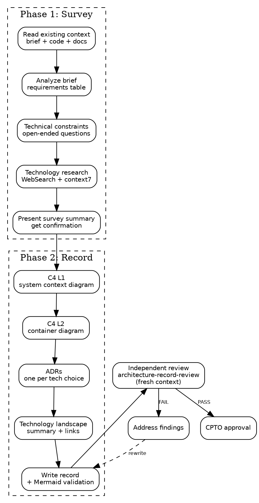

# Design: Architecture Record Skills

Date: 2026-04-09
Status: draft

## Summary

Two skills following the proven produce/validate pattern:

- **`architecture-record`** (Produce) — Architect role. Creates the
  architecture record: component map (C4 L1+L2) and initial ADRs.
  Includes active web research for technology landscape.
- **`architecture-record-review`** (Validate, fork context) — QA/Reviewer
  role. Three-pass independent review of the architecture record against
  structural completeness, architectural fitness, and brief alignment.

## Context

The product brief defines *what problem to solve*. The architecture
record defines *what the system looks like* — components, boundaries,
key technology decisions. Without architecture, a product backlog is
just a wish list — no real dependencies, sizes, or sequencing.

This is the second skill pair in the squad framework, after
`product-brief` / `product-brief-review`.

## Skill: architecture-record

### Directory Structure

```
skills/architecture-record/
├── SKILL.md              # Main skill (~250 lines)
├── survey-guide.md       # Phase 1: brief analysis + technology research
└── record-guide.md       # Phase 2: C4 format, ADR template, output structure
```

Supporting files are loaded on-demand via markdown links in SKILL.md.
Claude reads them when entering the relevant phase, not upfront. This
keeps the main skill under 500 lines while providing detailed methodology.

### Frontmatter

```yaml
---
name: architecture-record
description: >
  Create or update the architecture record — component map (C4 L1+L2) and
  architectural decision records (ADRs). Use when starting technical design
  after an approved product brief, or when architecture needs revision.
allowed-tools: WebSearch WebFetch Bash(npx mermaid-validator *)
---
```

### Process: Two Phases, 13-Step Checklist

**Phase 1 — Survey (understand the problem space and technology landscape)**

1. **Read existing context** — check for brief at
   `${user_config.product_home}/product/brief.md`, existing architecture
   record, and any project code/docs. If brief doesn't exist or isn't
   approved, stop — architecture requires an approved brief.

2. **Analyze the brief** — extract: success criteria, solution boundary
   (IS/IS NOT), constraints, appetite. These bound the architecture.
   Summarize in a brief-requirements table for traceability.

3. **Technical constraints conversation** — ask the user open-ended
   questions (one at a time) about:
   - Existing systems to integrate with
   - Team expertise and technology preferences
   - Deployment environment (cloud, self-hosted, local)
   - Hard constraints (budget, licensing, compliance)

4. **Technology landscape research** — use WebSearch to research:
   - Best practices for the problem domain
   - Suitable APIs, services, and libraries
   - Open source projects that could reduce scope
   - Summarize findings with links. If context7 MCP is available,
     use it for well-known library documentation (more efficient than
     WebSearch for this). context7 is optional — WebSearch is sufficient.

5. **Present survey summary** — show the user:
   - Brief requirements mapped to technical needs
   - Technology options with trade-offs
   - Recommended technology choices with reasoning
   - Get confirmation before proceeding to Phase 2.

   See [survey-guide.md](survey-guide.md) for detailed methodology.

**Phase 2 — Record (produce the architecture artifact)**

6. **Component map (C4 L1)** — system context diagram in Mermaid:
   the system as a box, external actors, external systems. See Mermaid
   Rules below.

7. **Component map (C4 L2)** — container diagram in Mermaid: containers
   within the system, responsibilities, connections. If >10 containers,
   decompose into overview + detail diagrams. See Mermaid Rules below.

8. **Architecture Decision Records** — one ADR per non-trivial
   technology choice. Nygard format: Title, Status (proposed), Context,
   Decision, Consequences. ADRs are immutable once accepted — superseded,
   not edited.

9. **Technology landscape section** — summarize research from step 4:
   what was considered, what was chosen, why. Include links to
   documentation for key technologies.

10. **Write record** — save to
    `${user_config.product_home}/architecture/record.md`. Then validate
    Mermaid diagrams:
    ```bash
    npx mermaid-validator validate-md ${user_config.product_home}/architecture/record.md --fail-fast
    ```
    If validation fails, fix diagram syntax and re-validate. Do not
    proceed with invalid diagrams.

    See [record-guide.md](record-guide.md) for C4 format and ADR template.

11. **Independent review** — invoke `squad:architecture-record-review`
    (runs in fresh context). Wait for review and read findings.

12. **Address findings** — same pattern as product-brief:
    - **Clear fix** (one obvious path) — fix it, note what changed
    - **Multiple paths** — present options to human, always include
      "Let's discuss this further"
    - **Disagree** — state reasoning and ask human to weigh in
    After all findings addressed, re-run steps 10-11 if any rewrites.

13. **Request CPTO approval** — present record for human review.
    - **Approved** → update status to "approved", proceed to
      `squad:product-backlog`
    - **Changes requested** → go back to relevant step, re-run
      write → review → address → present cycle

### Process Flow



### Mermaid Diagram Rules

These rules prevent Claude's common failure mode of generating
over-complex Mermaid that breaks syntax:

1. **Short labels** — node labels max 3-4 words. Full descriptions go
   in a companion table below the diagram.
2. **No styling** — no color, no CSS classes, no `style` directives.
   Plain default rendering. If it needs color to be readable, it's too
   complex.
3. **No nested subgraphs** — one level of `subgraph` max (the system
   boundary).
4. **Decomposition trigger** — if L2 diagram exceeds 10 containers,
   split into one overview diagram plus separate detail diagrams per
   logical group. The skill proposes the split to the user.
5. **Deterministic validation** — after writing any artifact containing
   Mermaid, run `npx mermaid-validator validate-md <file> --fail-fast`.
   Fix and re-validate until clean.

### Artifact Output

**Path:** `${user_config.product_home}/architecture/record.md`

**Structure:**

```markdown
# Architecture Record: [Product Name]

Status: draft | approved
Date: YYYY-MM-DD
Approved by: [name or "pending"]
Brief: [relative path to product brief]

## System Context (C4 L1)

` ``mermaid
flowchart TD
    ...
` ``

| Actor/System | Description | Interaction |
|---|---|---|
| ... | ... | ... |

## Containers (C4 L2)

` ``mermaid
flowchart TD
    ...
` ``

| Container | Responsibility | Technology | Rationale |
|---|---|---|---|
| ... | ... | ... | ... |

## Architecture Decision Records

### ADR-001: [Title]

**Status:** proposed | accepted | superseded by ADR-NNN
**Context:** [why this decision is needed]
**Decision:** [what we decided]
**Consequences:** [what follows, good and bad]

### ADR-002: ...

## Technology Landscape

[Summary of research: what was considered, what was chosen, why.
Links to documentation for key technologies.]
```

### Chains To

- After CPTO approval → `squad:product-backlog`
- If architecture needs revision later → re-invoke this skill
  (reads existing record, proposes changes as new ADRs)

---

## Skill: architecture-record-review

### Directory Structure

```
skills/architecture-record-review/
├── SKILL.md              # Review skill (~150 lines)
└── review-checklist.md   # Detailed checklist with fitness criteria
```

### Frontmatter

```yaml
---
name: architecture-record-review
description: >
  Review an architecture record for structural completeness, architectural
  fitness, and alignment with the product brief. Runs in fresh context
  for independent assessment.
context: fork
allowed-tools: Bash(npx mermaid-validator *)
---
```

### Process: 3 Steps, 3 Review Passes

1. **Read the artifacts** — read architecture record at
   `${user_config.product_home}/architecture/record.md` and product
   brief at `${user_config.product_home}/product/brief.md`. If either
   artifact is missing, report FAIL immediately.

2. **Run the three review passes** — score each item PASS/FAIL. See
   [review-checklist.md](review-checklist.md) for detailed criteria.

3. **Report findings** — structured, actionable, no rewrites.

### Review Passes

**Pass 1 — Structural completeness (11 checks)**

| # | Check |
|---|-------|
| S1 | C4 L1 diagram exists and is valid Mermaid (run `npx mermaid-validator`) |
| S2 | C4 L1 shows system boundary and at least 1 external actor |
| S3 | C4 L2 diagram exists and is valid Mermaid |
| S4 | C4 L2 shows containers with responsibilities (3-4 word labels) |
| S5 | C4 L2 respects complexity limit (≤10 containers, or decomposed) |
| S6 | Companion tables exist for both diagrams |
| S7 | At least 1 ADR per non-trivial technology choice |
| S8 | ADRs follow Nygard format (Title, Status, Context, Decision, Consequences) |
| S9 | No orphan components (every component has ≥1 connection) |
| S10 | Technology Landscape section exists with research links |
| S11 | Diagram labels ≤4 words, no styling directives, no nested subgraphs |

**Pass 2 — Architectural fitness (6 checks)**

| # | Check |
|---|-------|
| F1 | Separation of concerns — each container has one clear responsibility |
| F2 | API boundary clarity — interfaces between containers are defined, not assumed |
| F3 | Data flow coherence — can trace data from input to output through the system |
| F4 | Technology fit — chosen technologies match brief constraints (appetite, team, deployment) |
| F5 | Proportionality — architecture complexity matches appetite (2-week MVP ≠ microservices) |
| F6 | Simplicity — no containers that could be eliminated or merged without losing capability |

**Pass 3 — Brief alignment (5 checks)**

| # | Check |
|---|-------|
| B1 | Every success criterion in the brief is achievable by the proposed architecture |
| B2 | Every "IS NOT" boundary in the brief is respected (no components solving excluded problems) |
| B3 | Constraints from the brief are reflected in ADRs or technology choices |
| B4 | No gold-plating — every container serves at least one brief requirement |
| B5 | Missing components — no brief requirement left without a supporting container |

### Output Format

```markdown
## Architecture Record Review

**Date:** YYYY-MM-DD
**Artifact:** ${user_config.product_home}/architecture/record.md
**Brief:** ${user_config.product_home}/product/brief.md

### Summary
[1-2 sentences: overall assessment]

### Results

**Pass 1 — Structural Completeness**

| # | Check | Result | Finding |
|---|-------|--------|---------|
| S1 | C4 L1 valid Mermaid | PASS/FAIL | [detail if FAIL] |
| ... | ... | ... | ... |

**Pass 2 — Architectural Fitness**

| # | Check | Result | Finding |
|---|-------|--------|---------|
| F1 | Separation of concerns | PASS/FAIL | [detail if FAIL] |
| ... | ... | ... | ... |

**Pass 3 — Brief Alignment**

| # | Check | Result | Finding |
|---|-------|--------|---------|
| B1 | Success criteria achievable | PASS/FAIL | [detail if FAIL] |
| ... | ... | ... | ... |

### Verdict

- **PASS** — record ready for CPTO approval
- **PASS WITH NOTES** — minor issues, author decides
- **FAIL** — critical issues must be fixed

### Critical Issues (if FAIL)
1. [what is wrong, cite specific text, explain why it matters]

### Suggestions (if PASS WITH NOTES)
1. [what could be better, but is not blocking]
```

### Rules

- Do NOT rewrite the architecture record
- Report findings only
- Every FAIL must cite specific text from the record AND explain why
  it matters
- No vague findings ("architecture seems complex") — instead cite the
  specific component and what's wrong
- Report FAIL if either artifact is not found

---

## Design Decisions

**Why two phases in the produce skill:**
Architecture requires understanding both the problem (brief) and the
technical landscape. The survey phase gathers this understanding; the
record phase synthesizes it. A single-phase approach would either skip
research or mix discovery with documentation.

**Why web search is part of the skill:**
The architect should actively research what technologies, APIs, libraries,
and open source projects exist — not just ask the user. This reduces
scope by finding existing solutions and grounds technology choices in
current reality, not Claude's training data.

**Why Mermaid with strict rules:**
C4 is inherently visual. Text descriptions of component relationships
become unreadable past 5-6 components. Mermaid renders natively in
GitHub and most markdown viewers. Strict rules (short labels, no styling,
no nested subgraphs, decomposition at 10 containers) prevent Claude's
common failure mode of generating over-complex diagrams that break syntax.
Deterministic validation via `mermaid-validator` catches errors before
the artifact is committed.

**Why three review passes:**
Pass 1 (structural) catches formatting and completeness issues
mechanically. Pass 2 (fitness) evaluates architectural quality — this
is where gstack's fitness function concept applies. Pass 3 (brief
alignment) ensures the architecture actually serves the product, not
the architect's preferences. Separating passes prevents mixing mechanical
checks with judgment calls.

**Why architecture before backlog:**
A backlog shaped without architecture is a wish list. The PO can
decompose the problem but can't meaningfully size, sequence, or
identify dependencies without knowing the technical structure.

## Test Plan

Following the three-tier test framework:

**Tier 1 — Knowledge tests:**
- Does the skill understand its two-phase process?
- Does it know Mermaid rules (label length, no styling, decomposition)?
- Does it know ADR format (Nygard: Title, Status, Context, Decision, Consequences)?
- Does it know the review has three passes?

**Tier 2 — Triggering tests:**
- Explicit: "Use the architecture-record skill to design the system"
- Implicit: "We need to figure out the technical architecture for this product"
- Negative: "Review this architecture" → should trigger review skill

**Tier 3 — Execution tests:**
- Provide approved brief as fixture, run skill with rich context
- Verify artifact exists at expected path
- Verify Mermaid diagrams pass `mermaid-validator`
- Verify required sections (C4 L1, C4 L2, at least 1 ADR, Technology Landscape)
- Verify no implementation details leaked (no code, no file paths, no class names)
- Verify review skill was invoked
- Verify CPTO approval was requested

## Prerequisites

- `mermaid-validator` available via npx (no global install needed)
- Approved product brief at `${user_config.product_home}/product/brief.md`
- `product_home` configured in squad plugin settings
