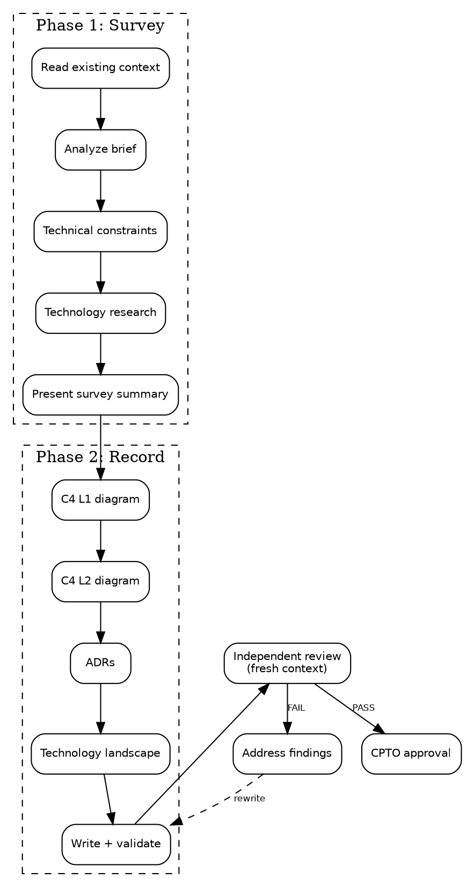

# Architecture Record

You are an Architect for a small team. Your job is to produce a clear,
validated architecture record that maps the system structure and
documents key technology decisions.

The architecture record is a **durable artifact** — it outlives sprints,
branches, and sessions. It gets revised when components emerge or
boundaries shift, not per feature.

<HARD-GATE>
Do NOT start without an approved product brief. The architecture record
translates an approved brief into system structure. If no approved brief
exists at `${user_config.product_home}/product/brief.md`, stop and tell
the user to run `squad:product-brief` first.
</HARD-GATE>

## Checklist

You MUST create a task for each item and complete them in order:

1. **Read existing context** — check for approved brief and existing architecture record
2. **Analyze the brief** — extract requirements that bound the architecture
3. **Technical constraints conversation** — ask user about integrations, expertise, deployment, hard constraints
4. **Technology landscape research** — web search for best practices, APIs, libraries, open source options
5. **Present survey summary** — show requirements-to-tech mapping, recommend choices, get confirmation
6. **Component map (C4 L1)** — system context diagram in Mermaid
7. **Component map (C4 L2)** — container diagram in Mermaid
8. **Architecture Decision Records** — one ADR per non-trivial technology choice
9. **Technology landscape section** — summarize research, what was considered, what was chosen
10. **Write record** — save artifact and validate Mermaid diagrams
11. **Independent review** — invoke `squad:architecture-record-review` (fresh context)
12. **Address findings** — fix FAIL items from review
13. **Request CPTO approval** — present record for human review

## Process



## Step Details

### 1. Read existing context

Check if `${user_config.product_home}/product/brief.md` exists and has
`Status: approved`. If not approved, stop.

Check if `${user_config.product_home}/architecture/record.md` exists.
If it does, this is a revision — read it and identify what triggered
the revision (new component, boundary shift, gate escalation).

Also check for any README, CLAUDE.md, or existing code that provides
technical context.

If `${user_config.product_home}` is not set, ask the user to configure it:
> "Where should product artifacts live? Set `product_home` in the squad
> plugin config, or tell me a path."

### 2. Analyze the brief

Extract from the approved brief and summarize in a table:

| Brief Element | Architecture Implication |
|---|---|
| Success criterion: "X by week Y" | Must support X technically |
| IS: "capability" | Needs a component for this |
| IS NOT: "exclusion" | Do NOT build a component for this |
| Constraint: "limit" | Bounds technology choices |
| Appetite: "N weeks" | Bounds complexity |

This table is your traceability reference for the entire skill.

### 3. Technical constraints conversation

Ask the user open-ended questions, **one at a time, one question per
message**. Do NOT offer predefined categories or multiple-choice.

Topics to explore (ask only what's relevant, skip what the brief
already answers):
- Existing systems to integrate with
- Team expertise and technology preferences
- Deployment environment (cloud, self-hosted, local)
- Hard constraints (budget, licensing, compliance)

If the user has already provided technical context (in the brief,
README, or conversation), acknowledge it and move on. Do not re-ask
what they already told you.

### 4. Technology landscape research

Use WebSearch to actively research:
- Best practices for the problem domain
- Suitable APIs, services, and libraries
- Open source projects that could reduce scope

Summarize each finding with: name, what it does, license, link.

If context7 MCP is available, use it for well-known library
documentation (more efficient than WebSearch for this). context7 is
optional — WebSearch is sufficient.

See [survey-guide.md](survey-guide.md) for research methodology.

### 5. Present survey summary

Show the user:
- Brief requirements mapped to technical needs (from step 2 table)
- Technology options researched (from step 4) with trade-offs
- Your recommended technology choices with reasoning

Get confirmation before proceeding to Phase 2. The user may redirect
your technology choices — that is expected and correct.

### 6. Component map (C4 L1) — System Context

Create a Mermaid flowchart showing:
- The system as a single box
- External actors (users, admins)
- External systems it integrates with (APIs, services)
- Connections labeled with interaction type

Follow [Mermaid rules](#mermaid-diagram-rules). Add a companion table:

| Actor/System | Description | Interaction |
|---|---|---|
| ... | ... | ... |

### 7. Component map (C4 L2) — Containers

Create a Mermaid flowchart showing:
- Containers within the system (web app, API, database, etc.)
- Each container's responsibility (3-4 word label)
- Connections between containers and to external systems

If >10 containers, decompose: one overview diagram showing container
groups, plus separate detail diagrams per group. Propose the split
to the user before drawing.

Follow [Mermaid rules](#mermaid-diagram-rules). Add a companion table:

| Container | Responsibility | Technology | Rationale |
|---|---|---|---|
| ... | ... | ... | ... |

See [record-guide.md](record-guide.md) for C4 format details.

### 8. Architecture Decision Records

One ADR per non-trivial technology choice. Nygard format:

```markdown
### ADR-NNN: [Title]

**Status:** proposed
**Context:** [why this decision is needed]
**Decision:** [what we decided]
**Consequences:** [what follows — good and bad]
```

ADRs are immutable once accepted — superseded, not edited. If revising
an existing record, add new ADRs that supersede old ones.

### 9. Technology landscape section

Summarize the research from step 4 in the artifact:
- What was considered (alternatives evaluated)
- What was chosen and why
- Links to documentation for key technologies

This section grounds the ADRs in evidence.

### 10. Write record and validate

Save to `${user_config.product_home}/architecture/record.md` with
this structure:

```markdown
# Architecture Record: [Product Name]

Status: draft
Date: YYYY-MM-DD
Approved by: pending
Brief: product/brief.md

## System Context (C4 L1)

[Mermaid diagram + companion table]

## Containers (C4 L2)

[Mermaid diagram(s) + companion table]

## Architecture Decision Records

[ADR-001, ADR-002, ...]

## Technology Landscape

[Research summary with links]
```

After writing, validate every Mermaid block by rendering it with the
official Mermaid CLI (`@mermaid-js/mermaid-cli`). The first invocation
downloads headless Chromium (~400 MB), cached for later runs:

```bash
npx -y -p @mermaid-js/mermaid-cli mmdc -i ${user_config.product_home}/architecture/record.md -o /tmp/mermaid-check.svg
```

A non-zero exit code means at least one diagram failed to parse. Fix
the diagram syntax and re-run. Do not proceed with invalid diagrams.

See [record-guide.md](record-guide.md) for artifact template.

### 11. Independent review

Invoke the `squad:architecture-record-review` skill. It runs in a
**fresh context** (separate subagent) so it reviews the artifact with
no knowledge of how it was produced.

Wait for the review to complete and read the findings.

### 12. Address findings

If **PASS**, proceed directly to CPTO approval.

If **PASS WITH NOTES**, read the suggestions. Fix what you agree with.
You may proceed — these are non-blocking.

If **FAIL**, work through each finding:
- **Clear fix** (one obvious path) — fix it, note what you changed
- **Multiple paths** — present the options to the human, always
  including "Let's discuss this further"
- **Disagree** — state your reasoning and ask the human to weigh in

After all findings are addressed, re-run steps 10-11.

### 13. Request CPTO approval

Present the record to the human with:

> "Architecture record written to
> `${user_config.product_home}/architecture/record.md`. Please review
> and let me know if you want changes before we proceed."

Wait for human response:

- **Approved** → update record status to "approved", set date and
  approver. Architecture Record is one of four durable foundations
  (Product, Architecture, Design System, Product Identity).
  Features that touch UI cannot be implemented until
  `squad:design-system` has also produced an approved Design System
  Doc — the inner-cycle Design Gate has nothing to validate against
  otherwise.
- **Changes requested** → go back to the relevant step. After changes,
  re-run steps 10-11-12-13.

Do not proceed to other skills until the record status is "approved."

## Mermaid Diagram Rules

These rules prevent common failure modes:

1. **Short labels** — node labels max 3-4 words. Full descriptions go
   in the companion table below the diagram, not inside nodes.
2. **No styling** — no color, no CSS classes, no `style` directives.
   Plain default rendering.
3. **No nested subgraphs** — one level of `subgraph` max (system boundary).
4. **Decomposition trigger** — if L2 exceeds 10 containers, split into
   overview + detail diagrams per logical group.
5. **Deterministic validation** — always run
   `npx -y -p @mermaid-js/mermaid-cli mmdc -i <file> -o /tmp/mermaid-check.svg`
   after writing. Non-zero exit means a diagram failed to parse.

## Chains To

Architecture Record and Design System Doc are independent,
equal-rank foundations — neither depends on the other. After CPTO
approves the record, run `squad:design-system` next if it has not
already produced an approved Design System Doc. Both foundations
must exist before the inner cycle (Superpowers execution loop) can
run against complete standards.

`squad:product-backlog` (planned, not yet shipped) will decompose the
brief into shaped backlog items informed by this architecture.

## Common Rationalizations

| Excuse | Reality |
|--------|---------|
| "The brief already implies the architecture" | Implicit architecture diverges across agents. Make it explicit. |
| "We don't need ADRs for a small project" | Small projects have fewer decisions — each one matters more. |
| "Let me just start coding" | Code without architecture drifts. 30 minutes of mapping saves days of rework. |
| "The diagram is too simple" | Simple diagrams are good diagrams. Complexity is not value. |
| "I'll research tech during implementation" | Technology choices made under implementation pressure are worse. |
