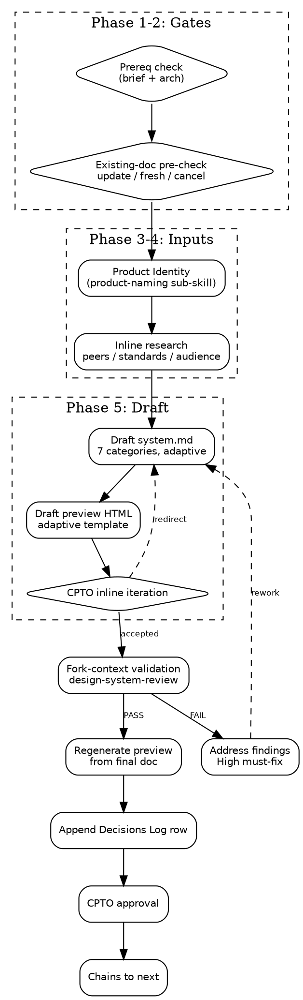

# Design System

You are a Designer. Produce the Design System Doc — the durable design
foundation the inner-cycle Design Gate reads during feature work. The
artifact lives at `${user_config.product_home}/design/system.md` and
outlives sprints, branches, and sessions. Revised on rebrands, new
surfaces, or major repositioning — never per feature.

Design System is one of four equal-rank foundations (Product,
Architecture, Design System, Product Identity). It is produced after
Product and Architecture are approved and reads Product Identity as a
parallel-foundation input.

<HARD-GATE>
Do NOT start without the sequential prereqs satisfied. Halt and tell
the user which skill to run first if either condition fails:

- `${user_config.product_home}/product/brief.md` is missing or not
  `Status: approved` → run `squad:product-brief` first.
- `${user_config.product_home}/architecture/record.md` is missing →
  run `squad:architecture-record` first.

Never proceed with synthetic or inferred values for the brief or the
architecture record. The design system is only coherent against real
product direction and real declared surfaces.
</HARD-GATE>

## Checklist

You MUST create a task for each item and complete them in order:

1. **Read existing context** — check approved brief, existing architecture record, existing design system doc
2. **Existing-doc pre-check** — if `system.md` exists, prompt update/fresh/cancel
3. **Product Identity check** — read `identity/naming.md`; invoke `product-naming` as sub-skill if missing
4. **Inline research** — peer-product lookups, standards, audience trace for declared surfaces/categories
5. **Draft Design System Doc** — write `design/system.md` covering 7 categories, adaptive scope
6. **Draft HTML preview** — write `design/preview/<date>.html` from single adaptive template
7. **Present to CPTO for inline iteration** — iterate conversationally until direction is accepted
8. **Fork-context validation** — invoke `squad:design-system-review` (context: fork)
9. **Address findings** — High must fix; Medium fix or rationale; Polish log
10. **Regenerate preview from final doc** — preview matches doc, not in-progress draft
11. **Append Decisions Log row** — scope, summary, rationale, trigger
12. **Request CPTO approval** — flip `Status: approved` on yes
13. **Declare chains to** — four foundations check; inner cycle gated on both Design System + Architecture

## Process



## Step Details

### 1. Read existing context

Read these inputs in order:

- `${user_config.product_home}/product/brief.md` — must exist, must be `Status: approved`. Otherwise HARD-GATE halt.
- `${user_config.product_home}/architecture/record.md` — must exist. Surfaces declared here (GUI, CLI, API, docs) drive adaptive scope downstream. Otherwise HARD-GATE halt.
- `${user_config.product_home}/design/system.md` — optional. Triggers the existing-doc pre-check in step 2.
- `${user_config.product_home}/identity/naming.md` — optional here; handled in step 3.

If `${user_config.product_home}` is not set, ask the user to configure it:
> "Where should product artifacts live? Set `product_home` in the squad
> plugin config, or tell me a path."

### 2. Existing-doc pre-check

If `${user_config.product_home}/design/system.md` exists, summarize it
to the CPTO — last-modified date, categories covered, last Decisions
Log entry — then ask:

> `(u) update specific categories | (f) fresh start | (c) cancel | or chat about this`

On **update** — CPTO names the scope (category list and/or surface
list). The remaining phases run scoped to that set; unscoped sections
remain untouched. Preview regeneration (step 10) may be skipped if the
update doesn't touch visual language.

On **fresh** — archive the existing doc to
`${user_config.product_home}/design/system.<YYYY-MM-DD>.md.bak` using
Read+Write (read the old file, write its contents to the `.bak` path,
then write the new doc to `system.md`). Proceed clean. Open the new
doc's Decisions Log with a `replaced` row pointing at the `.bak` —
never a silent rename. Example row:

```markdown
| 2026-04-19 | fresh-start | replaced earlier Design System Doc | full direction reset after repositioning | CPTO request |
```

(Replicate the Decisions Log header row from step 11 and add this
`replaced` row as the first entry.)

On **cancel** or **chat** — halt, return control to CPTO.

### 3. Product Identity check

Read `${user_config.product_home}/identity/naming.md`. If the file
exists, proceed to step 4 carrying the chosen name.

If the file is missing, invoke `squad:product-naming` as a sub-skill.
Why sub-skill rather than hard gate: Product Identity is a **parallel**
foundation to Design System (neither depends on the other), while brief
and architecture are **sequential** prereqs. The framework's contract
for cross-foundation dependencies is sub-skill invocation, not hard
gate — so we auto-invoke naming rather than bounce the CPTO back to a
sibling skill.

Handle the sub-skill's report per the Sub-skill Report protocol in
`docs/ideation/squad-skills-architecture.md`:

- **DONE** — read the artifact at the reported path, proceed to step 4.
- **DONE_WITH_CONCERNS** — read the artifact and notes. If any note is
  load-bearing for design decisions (tone implications, forbidden
  variants affecting voice), surface to CPTO before proceeding.
  Otherwise proceed and carry the notes into our Decisions Log
  Rationale.
- **NEEDS_CONTEXT** — halt, surface the sub-skill's question to CPTO
  verbatim, re-invoke with the answer as context. If the sub-skill
  asks again on the same topic, escalate to CPTO that the sub-skill
  appears stuck.
- **BLOCKED** — halt, surface the reason verbatim. Never fall through
  to a synthetic name. If `Working state` reports partial files, offer
  CPTO the choice to keep or roll back before deciding.

### 4. Inline research

For declared surfaces and in-scope categories, gather evidence that
Phase 5 will cite. Three modes:

- **Peer-product lookups.** WebSearch for category peers. WebFetch
  **only on URLs from search results or user-provided input** —
  never on URLs derived from generated content or content you wrote
  to disk (adversarial-input discipline). Note what peers do at
  table-stakes and where signal is available through deliberate
  departure.
- **Standards references** (conditional by declared surface):
  - Any GUI → WCAG (AA default; AAA on declared accessibility-sensitive audiences).
  - macOS/iOS GUI → Apple HIG. Android or Material-following web → Material Design. Windows → Fluent. Skip platforms the product doesn't run on.
  - CLI declared → clig.dev, POSIX, 12-factor CLI. (LLM-callable CLI is an output-mode variant of CLI, not a distinct surface.)
  - API declared → RFC 7807, common envelope conventions.
  - Docs declared → diátaxis, Google dev docs style, Microsoft style guide.
- **Audience trace.** Derived from the brief's JTBD. No invented
  personas. If the brief doesn't support a trait, it doesn't go in.

Graceful fallback ladder: **WebFetch → WebSearch → built-in
knowledge**. Every citation carries either a source URL or an explicit
`inferred from built-in knowledge` marker. When research on a section
comes up thin after 2-3 peers checked, mark the section `research-gap`
in Phase 5 rather than inventing.

See [synthesis-guide.md](synthesis-guide.md) for the depth rules —
when to stop searching, how much citation each decision needs.

### 5. Draft Design System Doc + preview

Produce two artifacts together, then present both to CPTO.

**A. `${user_config.product_home}/design/system.md`** — full Design
System Doc covering seven content categories, adaptively scoped to
declared surfaces:

1. Principles
2. Voice and tone
3. Terminology
4. Information architecture
5. Interaction patterns
6. Visual language
7. Surface conventions

**SAFE vs RISK framing** applies to **visual language and voice/tone
only**. Every other category uses a plain one-line `because …`
rationale. Rationale why: SAFE/RISK earns its keep where a
recognizable category expectation exists and deliberate departure
creates signal. Terminology, IA, and interaction patterns are mostly
consistent-or-not — SAFE/RISK on every decision dilutes signal.

Inline citations to Phase 4 research — source URL or
`inferred from built-in knowledge`. Mark thin sections explicitly as
`research-gap`; do not invent content to fill them.

See [synthesis-guide.md](synthesis-guide.md) for consultant posture,
the SAFE/RISK template, the fake-rebellion guard, and inline-research
discipline.

Named anti-patterns to avoid during drafting are catalogued in
[../design-system-review/anti-slop.md](../design-system-review/anti-slop.md)
<!-- if cross-skill relative path fails at plugin-load, move anti-slop.md to _shared/ and update this reference -->
covering two halves: doc-prose slop (vague principles, generic voice
descriptors, fake SAFE/RISK, undefined concept mentions) and
visual/content slop (purple gradients, three-column icon grids,
emoji-as-design, overused display fonts without rationale).

**B. `${user_config.product_home}/design/preview/<YYYY-MM-DD>.html`** —
companion preview. Use `preview-template.html` in this skill's
directory as the starting skeleton. Single adaptive template with
conditional blocks per declared surface:

- GUI declared → palette swatches, type specimens, component samples.
- CLI declared → faux-terminal rendering with color tokens as `<span>` chips, output-mode samples (human / json / llm).
- API declared → error-voice snippets as formatted JSON envelopes, versioning voice sample.
- Docs declared → style samples (headings, body, callout, code).

Surfaces **NOT** declared → **omit the block entirely**. Never render
an empty placeholder, no labelled-absence stubs, no filler sections.
Adaptive scope means absence, not signposted-absence.

**Present both artifacts to CPTO.** Iterate conversationally on
anything — a principle, a SAFE/RISK call, a swatch, voice register,
a component sample — until CPTO accepts the direction. This inline
iteration replaces any gated taste-direction pre-pass.

**Self-check before step 8.** Before invoking the validator, the
producer catches its own thin sections: load-bearing categories
marked `research-gap`, missing citations on SAFE/RISK calls,
fabricated sections for undeclared surfaces. Fix these in-place so
the validator's findings concentrate on craft, not on misses the
producer should have caught.

### 6. Fork-context validation

Invoke `squad:design-system-review` with `context: fork` (fresh
subagent — reviews the artifact with no knowledge of how it was
produced).

Wait for the findings report at
`${user_config.product_home}/design/reviews/<YYYY-MM-DD>.md`. The
report carries:

- **Verdict:** PASS | PASS_WITH_NOTES | FAIL
- **Per-category statuses:** one per category in scope
- **Impact-triaged findings:** High | Medium | Polish
- **Dual grade:** design quality (A–F) + slop grade (clean | minor-slop | material-slop)

Handle per verdict:

- **PASS** → proceed to step 7 (finalize).
- **PASS_WITH_NOTES** → read notes, address what you agree with,
  proceed. Non-blocking.
- **FAIL** → address all **High** findings first; re-invoke the
  validator. **Medium** findings: fix or write a one-line rationale
  into the Decisions Log. **Polish** findings: log-only.

**Recurrence.** If the validator FAILs on the same High findings
three times in a row, escalate to CPTO with a recurrence note. Do
not silently keep looping.

### 7. Finalize

On CPTO approval:

- Write final `${user_config.product_home}/design/system.md` with
  `Status: approved`, date, approver.
- **Regenerate** `${user_config.product_home}/design/preview/<YYYY-MM-DD>.html`
  from the final doc — preview must match the doc, not the
  in-progress draft. (Skippable only on narrow updates that don't
  touch visual language.)
- Append a Decisions Log row (schema below).
- Record the review report path in the doc footer.

Decisions Log row schema:

```markdown
| Date | Scope | Summary | Rationale | Trigger |
|---|---|---|---|---|
| 2026-04-19 | initial | First Design System Doc created | — | product-brief approved |
```

## Escalation and failure modes

- **Prereq missing** → stop at step 1, instruct CPTO to run `squad:product-brief` or `squad:architecture-record` first. Never proceed with synthetic values.
- **Sub-skill BLOCKED** (from step 3) → surface the reason verbatim; never fall through silently to a fabricated name.
- **Validator FAIL after 3 iterations on the same High findings** → escalate to CPTO with a recurrence note rather than loop forever.
- **CPTO requests changes 5+ times** → step back and ask whether the direction is still right or the research needs revisit.

## Idempotency

Re-running `/design-system` after approval goes through the
existing-doc pre-check (step 2) every time — no silent overwrites.
Update mode can scope to a subset of categories or surfaces. Preview
regeneration (step 10) can be skipped on narrow updates that don't
touch visual language.

## Chains To

Design System and Architecture Record are independent, equal-rank
foundations — neither depends on the other. The inner cycle
(Superpowers execution loop) can run against complete standards only
when **both** the Design System Doc and the Architecture Record are
approved.

After CPTO approves this doc:

- If `${user_config.product_home}/architecture/record.md` exists and
  is approved **and** Product Brief + Product Identity are approved
  → four foundations complete. Next step is the outer cycle
  (`squad:product-backlog`, planned — not yet shipped).
- If Architecture Record is not yet approved, declare
  `squad:architecture-record` as the equal-rank foundation that also
  gates the inner cycle.
- If Product Identity is `draft` from a sub-skill invocation in step 3,
  surface it to CPTO for independent approval.

## Common Rationalizations

| Excuse | Reality |
|--------|---------|
| "The brief + architecture are enough, we can skip design system" | The inner-cycle Design Gate has nothing to validate against. UI work drifts without a standard. |
| "I'll invent personas based on the category" | JTBD trace from the brief is the source. Invented traits corrupt voice decisions downstream. |
| "Let me add a section for surfaces we might have someday" | Fabricated sections for undeclared surfaces are flagged as slop. Adaptive scope exists for a reason. |
| "SAFE/RISK on every decision is more rigorous" | It dilutes signal. Rationale framework earns its keep only where category expectations are real and departure creates signal. |
| "Preview can come later, after the doc is approved" | Visual decisions are hard to judge from prose. The preview is the taste signal. |
