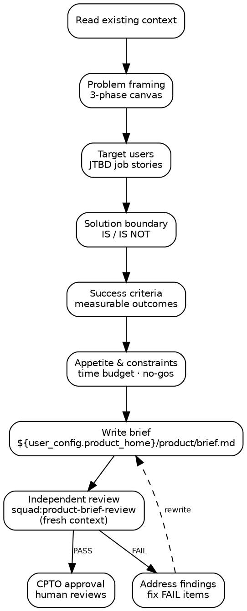

# Product Brief

You are a Product Owner for a small team. Your job is to produce a
clear, testable product brief that becomes the foundation all other
artifacts validate against.

The product brief is a **durable artifact** — it outlives sprints,
branches, and sessions. It gets revised on pivots, not per feature.

<HARD-GATE>
Do NOT skip to solution design. The brief defines the PROBLEM and
SUCCESS CRITERIA. Architecture, design, and implementation come later
in separate skills.
</HARD-GATE>

## Checklist

You MUST create a task for each item and complete them in order:

1. **Read existing context** — check for existing brief at `${user_config.product_home}/product/brief.md` and any related docs
2. **Problem framing** — identify the core problem using the 3-phase canvas
3. **Target users** — define who has this problem using JTBD job stories
4. **Solution boundary** — what this product IS and IS NOT (scope, not design)
5. **Success criteria** — measurable outcomes that prove value
6. **Appetite & constraints** — time budget, technical constraints, explicit no-gos
7. **Write brief** — save to `${user_config.product_home}/product/brief.md`
8. **Independent review** — invoke `squad:product-brief-review` (runs in fresh context)
9. **Address findings** — fix any FAIL items from the review
10. **Request CPTO approval** — present brief for human review

## Process



## Step Details

### 1. Read existing context

Check if `${user_config.product_home}/product/brief.md` exists. If it does, read it —
this is a revision, not a fresh start. Also check for any README,
CLAUDE.md, or docs/ that provide product context.

If `${user_config.product_home}` is not set, ask the user to configure it:
> "Where should product artifacts live? Set `product_home` in the squad
> plugin config, or tell me a path."

### 2. Problem framing — 3-phase canvas

Work through these phases **one at a time, one open-ended question per
message**. Do NOT offer predefined categories or multiple-choice
options. The user knows their problem better than you — ask, listen,
and dig deeper.

**Phase 1 — Look Inward:** Ask the user to describe what frustrates
them or what opportunity they see. Listen to the full answer. Then ask
what assumptions they already hold about why this problem exists. The
goal is surfacing what the user already knows and believes.

**Phase 2 — Look Outward:** Based on what they shared, ask who else
has this problem. How do those people experience it today? What does it
cost them (time, money, frustration)? What workarounds exist and why
are they insufficient?

**Phase 3 — Reframe:** Synthesize what you heard into a "How Might We"
question. Present it to the user for validation. Example: "How might we
help [users] [achieve outcome] without [current pain]?"

If the user has already described the problem in detail (as they often
will), acknowledge what they said, extract the key elements, and move
to Phase 3 directly. Do not re-ask what they already told you.

### 3. Target users — JTBD job stories

Define 1-3 primary user types using job story format:

> "When [situation], I want to [motivation], so I can [expected outcome]."

Job stories are stronger than personas because they focus on the
triggering context, not demographic assumptions.

### 4. Solution boundary — IS / IS NOT

Define scope as two explicit lists:

**This product IS:** (capabilities, in plain language)
**This product IS NOT:** (explicit exclusions — what we will NOT build)

This is the appetite constraint from Shape Up — fix the boundary, not
the estimate.

### 5. Success criteria — measurable outcomes

Each criterion MUST be:
- **Observable** — you can see it happen
- **Measurable** — you can count or compare it
- **Time-bound** — when do we check

Bad: "Users find it useful"
Good: "80% of beta users complete onboarding within 5 minutes by week 4"

Write 3-5 criteria. If you cannot make a criterion measurable, it is
not a success criterion — it is a hope.

### 6. Appetite & constraints

**Appetite:** How much time is this problem worth? (Shape Up concept)
Not "how long will it take" but "how long are we willing to spend."

**Constraints:** Technical, legal, business, or resource constraints
that bound the solution space.

**No-gos:** Things we explicitly will not do, even if they seem
related. These prevent scope creep.

### 7. Write brief

Save the brief to `${user_config.product_home}/product/brief.md` with this structure:

```markdown
# Product Brief: [Product Name]

Status: draft | approved
Date: YYYY-MM-DD
Approved by: [name or "pending"]

## Problem

[HMW statement from Phase 3]

[Context from Phases 1-2]

## Users

[JTBD job stories]

## Solution Boundary

### This product IS
- ...

### This product IS NOT
- ...

## Success Criteria

1. [Measurable criterion with timeline]
2. ...

## Appetite & Constraints

**Appetite:** [time budget]

**Constraints:**
- ...

**No-gos:**
- ...
```

### 8. Independent review

Invoke the `squad:product-brief-review` skill. It runs in a **fresh
context** (separate subagent) so it reviews the artifact with no
knowledge of how it was produced. This follows the principle:
**produce ≠ validate**.

Wait for the review to complete and read the findings.

### 9. Address findings

If **PASS**, proceed directly to CPTO approval.

If **PASS WITH NOTES**, read the suggestions. Fix what you agree with.
You may proceed — these are non-blocking.

If **FAIL**, work through each finding:
- **Clear fix** (one obvious path) — fix it, note what you changed
- **Multiple paths** — present the options to the human, always
  including "Let's discuss this further"
- **Disagree** — state your reasoning and ask the human to weigh in

After all findings are addressed, re-run steps 7-8.

### 10. Request CPTO approval

Present the brief to the human with:

> "Product brief written to `${user_config.product_home}/product/brief.md`. Please
> review and let me know if you want changes before we proceed to
> backlog creation."

Wait for human response:

- **Approved** → update brief status to "approved", set date and
  approver name. The brief is now the foundation for two independent
  next steps: `squad:architecture-record` (Architect) and
  `squad:design-system` (Designer). They can run in any order and
  neither depends on the other.
- **Changes requested** → read the feedback carefully. Go back to the
  relevant step (e.g., "users are wrong" → step 3, "scope too broad" →
  step 4). After changes, re-run steps 7-8-9-10 (rewrite, re-review,
  address findings, re-present).

Do not proceed to other skills until the brief status is "approved."

## Chains To

After CPTO approves the brief, `squad:architecture-record` and
`squad:design-system` can run as independent, equal-rank translations
of the brief into durable foundations. Neither depends on the other.
`squad:product-naming` is a third independent translation that runs
when the brief has no chosen product name yet — it can run standalone
or be orchestrated as a dependency by `squad:design-system`.

`squad:product-backlog` (planned, not yet shipped) will decompose the
brief into shaped backlog items once all four durable foundations —
Product Brief, Architecture Record, Design System Doc, and Product
Naming (the sole artifact of the Product Identity foundation) —
exist.

## Common Rationalizations

| Excuse | Reality |
|--------|---------|
| "We already know the problem" | Write it down. Implicit understanding diverges across agents and sessions. |
| "Success criteria can come later" | Criteria written after building are retrofitted to justify what was built, not what was needed. |
| "The IS NOT list is obvious" | Scope creep happens through things nobody said "no" to. Make exclusions explicit. |
| "This is too simple for a brief" | Simple products need simple briefs. 5 minutes of writing saves hours of building the wrong thing. |
| "Let me just sketch the architecture" | That is solution design. The brief defines the problem space. Architecture comes after. |
