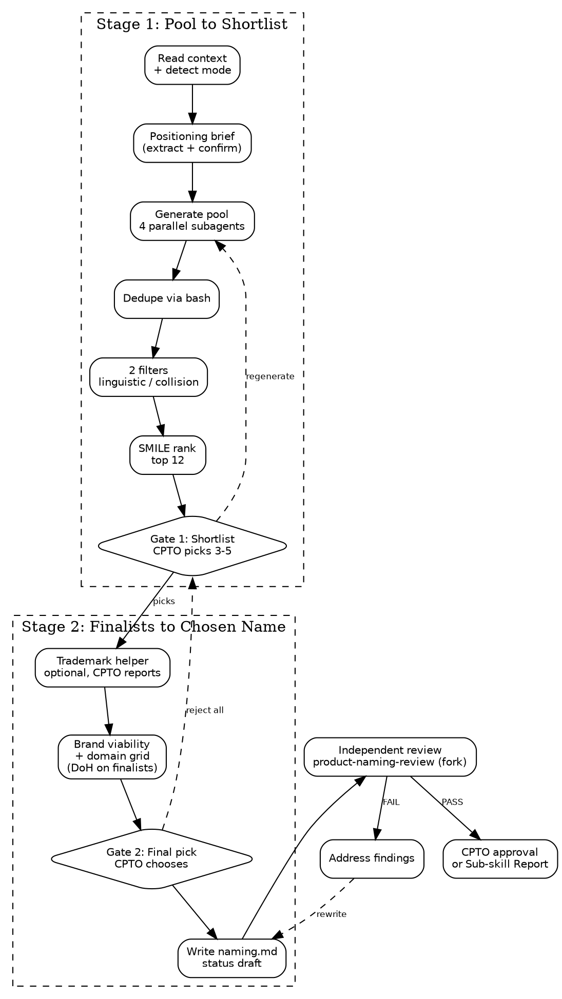

# Product Naming

You are a Designer. Produce the chosen name plus its supporting
system: philosophy, short forms, forbidden variants, capitalization
and pronunciation rules, validation record (automated filters +
optional human-run trademark state).

**Durable artifact** — outlives sprints, branches, sessions. Revised
on rebrands, not per feature. Sole artifact of the **Product Identity**
foundation (one of four equal-rank foundations: Product, Architecture,
Design System, Product Identity).

<HARD-GATE>
Do NOT start without an approved product brief. Naming without a
defined problem produces marketing fluff.

If `${user_config.product_home}/product/brief.md` is missing or not approved:

- **Standalone** — stop, tell user to run `squad:product-brief` first.
- **Orchestrated** (by squad:design-system) — emit Sub-skill Report,
  status BLOCKED, reason "no approved product brief". Don't address
  the user; the orchestrator owns the channel.
</HARD-GATE>

## Checklist

You MUST create a task for each item and complete them in order:

1. **Read existing context** — check approved brief, existing naming artifact, invocation mode (greenfield / rebrand / orchestrated)
2. **Positioning brief** — extract from product brief and confirm with CPTO
3. **Generate candidate pool** — dispatch 4 parallel subagents with differentiated lenses, dedupe to a working pool
4. **Automated filter pass** — apply 2 filters in cheapest-first order
5. **SMILE/SCRATCH ranking** — rank survivors, take top 12
6. **Present shortlist (CPTO Gate 1)** — CPTO picks 3–5 finalists
7. **Trademark search handoff** — optional helper, CPTO reports back
8. **Brand viability writeup + domain availability** — per-finalist note + domain grid (DoH on finalists)
9. **Present finalists (CPTO Gate 2)** — Claude leans with dimensional grounding; CPTO picks winner
10. **Write naming.md** — full validation record, status "draft"
11. **Independent review** — invoke `squad:product-naming-review` (fresh context fork)
12. **Address findings** — fix any FAIL items
13. **Request CPTO approval** — flip status to "approved" (standalone) or emit Sub-skill Report (orchestrated)

## Process



## Step Details

### 1. Read existing context

Detect invocation mode and gather inputs:

- **Brief check.** `${user_config.product_home}/product/brief.md` must
  exist with `Status: approved`. If missing → hard-gate failure.
- **Existing naming check.** If `${user_config.product_home}/identity/naming.md`
  exists, this is a **rebrand** — read it as context.
- **Mode.** `greenfield` (no prior naming), `rebrand` (prior naming),
  or `orchestrated` (invoked by `squad:design-system` — orchestrator
  signals this; default is standalone).

Remember the mode — Step 2 adds a rebrand question, Step 13 switches
standalone vs orchestrated output.

If `${user_config.product_home}` is not set, ask: "Where should product
artifacts live? Set `product_home` in the squad plugin config, or tell
me a path."

### 2. Positioning brief

Extract five inputs from the approved brief, present as a table for
CPTO confirmation. Don't generate from scratch — extract-plus-confirm.

| Input | Source in brief | Constrains |
|---|---|---|
| Target users | JTBD job stories | Linguistic register, target languages, reading level |
| Category | Solution Boundary IS | Brand collision search category |
| Tone | Problem framing + user descriptions | Register: playful / technical / stoic / warm / clinical |
| Appetite / maturity | Appetite section | Bias toward functional (short-horizon) vs invented/evocative (long-horizon) |
| Must-avoid | IS NOT + explicit CPTO constraints | Words, metaphors, competitors to steer clear of |

For inputs the brief doesn't support cleanly (typically tone and
must-avoid), ask CPTO **one open-ended question per gap** — never a
menu. User knows their problem better than you.

**Rebrand mode.** Also ask: "What's changing about the name, and why?"
Use the answer as a must-avoid constraint.

### 3. Generate candidate pool

Two sub-steps: dispatch then dedupe.

**3a — Parallel dispatch.** Use `Task` to dispatch 4 subagents in a
single message (platform runs them concurrently). Pattern:
`superpowers:dispatching-parallel-agents`. Each subagent gets the
positioning brief + one generative lens; each targets ~60 names
(~240 raw total).

| Lens | Role | Prior source |
|---|---|---|
| 1 | Functional / descriptive | Literal to the category |
| 2 | Evocative / metaphorical | One adjacent domain picked at step 3a |
| 3 | Invented / coined | Morpheme play, Latin/Greek/Romance roots |
| 4 | Experiential / verb-forward | What the user does or feels |

**Lens 2 domain.** Pick by index `(day-of-month % len(domain_list))`
from system date — deterministic, rerun-stable for the day. On
regeneration, rotate to the next index, don't repick. Record the
chosen domain in the validation record.

Each subagent writes `/tmp/naming-pool-lens<N>.txt`, format `Name|<N>`
per line. Lens 2's prompt puts the domain anchor **before** the brief:
immerse in the domain first, then read the brief, then bridge the two.

See [naming-playbook.md](naming-playbook.md) for the domain list, lens
prompt templates, and full subagent instructions.

**3b — Dedupe pipeline.** Use Write to create `/tmp/naming-dedup.sh`:

```bash
#!/bin/sh
cat /tmp/naming-pool-lens*.txt | \
  awk -F'|' '
    {
      gsub(/\r/, "", $0)
      gsub(/^[ \t]+|[ \t]+$/, "", $1)
      gsub(/^[ \t]+|[ \t]+$/, "", $2)
      if ($1 == "" || $2 == "") next
      key = tolower($1)
      if (!(key in seen)) {
        seen[key] = 1
        display[key] = $1
        lens_set[key, $2] = 1
        lens_order[key] = $2
      } else if (!((key, $2) in lens_set)) {
        lens_set[key, $2] = 1
        lens_order[key] = lens_order[key] "," $2
      }
    }
    END {
      for (key in seen) print display[key] "|" lens_order[key]
    }
  ' | sort -f > /tmp/naming-pool-deduped.txt
```

Then `sh /tmp/naming-dedup.sh` (the one Bash invocation). Read
`/tmp/naming-pool-deduped.txt`. Format: `DisplayName|lens1,lens3` —
each survivor carries source-lens attribution; cross-lens hits preserved.

### 4. Automated filter pass

Two filters, cheapest-first. Each candidate tagged `eliminated` or
`kept` with reason recorded internally. (Filter 3 — domain probe —
moved to Step 8 in the 2026-04-13 cost-simplification pass and now
runs post-Gate-1 on finalists only.)

**Filter 1 — Linguistic / phonetic (Claude reasoning, no tool calls).**
Evaluate each candidate against target languages from positioning.
Eliminate any that fails a hard SCRATCH criterion
(Spelling-challenged, Hard-to-pronounce, Curse-of-knowledge, Tame).
First because free and highest-discriminative.

**Filter 2 — Well-known brand collision (1 WebSearch per Filter-1
survivor).** Query: `"<name>" <category>`. Read the **result
distribution pattern**, not individual hits:

- **Concentrated on one brand's domains in the same category** (e.g.,
  most first-page hits on `*.examplebrand.com` with an in-category
  product — the "Garmin time tracker" pattern) → **eliminate**.
  Record: dominant brand, domain, one-line evidence.
- **Scattered across unrelated domains** (no single brand dominates
  the target category) → **pass**.
- **Mixed: mostly scattered, with one or two adjacent-category hits**
  (e.g., a same-name product in an adjacent but non-competing space) →
  **pass**, note the adjacent hit in the validation record for CPTO
  awareness.

Pass bar: **no explicit conflict on product name + category.** Do not
eliminate on brand-shaped hits outside the product's category.

### 5. SMILE/SCRATCH ranking

For each Filter-2 survivor, score against the SMILE rubric:

- **Suggestive** (evokes brand) — 0–2
- **Meaningful** (resonates with target users) — 0–2
- **Imagery** (visualizable) — 0–2
- **Legs** (extensible to a brand theme) — 0–2
- **Emotional** (moves people) — 0–2

Total 0–10. SCRATCH hits already eliminated in Filter 1.

**Cross-lens bonus.** Candidates from 2+ lenses get +1 as tiebreaker —
breaks ties, doesn't override single-lens strong candidates.

Take **top 12** by adjusted total. If fewer than 12 survive, take all
and flag "pool tight — consider rerun with broadened positioning".

### 6. Present shortlist (CPTO Gate 1)

Write a shortlist table to the conversation:

```markdown
| Name | Category | Lens(es) | SMILE | Positioning fit | Filter notes |
|---|---|---|---|---|---|
| ... | evocative | 2,4 | 8/10 | strong | no collision (scattered) |
```

CPTO options:
- **Pick** 3–5 specific candidates by name
- **Regenerate** one or more category slots with tweaked positioning
  (rerun steps 3–5 with adjusted weights and rotated lens-2 domain)
- **Chat about this** — open-ended escape hatch

No cap on regeneration count.

### 7. Trademark search handoff (optional helper)

Show the three registry URLs to the CPTO:

```
USPTO:   https://tmsearch.uspto.gov
WIPO:    https://branddb.wipo.int
EUIPO:   https://euipo.europa.eu/eSearch
```

Prompt: "These are the three public registries. Trademark is the only
legal hard-stop check, but it's optional — skip entirely or check any
subset. Report back per finalist: clear / conflict / ambiguous / skipped."

Do not attempt to fetch or script against these URLs — they are JS
SPAs behind bot protection, pre-filled queries don't work, and there
is no programmatic path that handles them. Hand URLs to CPTO, accept
whatever they report.

Any finalist `conflict` in any jurisdiction drops from the advancing
set. `clear`, `ambiguous`, `skipped` advance with state recorded
honestly. If all finalists hit `conflict`, loop back to Gate 1 — CPTO
chooses: reopen shortlist, regenerate pool, or escalate. Never silently
fall through.

### 8. Brand viability writeup + domain availability

Three sub-steps: per-finalist domain check, grid presentation, per-finalist note.

**8a — Domain availability (DoH).** For each advancing finalist, run a
DNS-over-HTTPS NS lookup across the fixed TLD set
`.com, .io, .ai, .app, .co, .dev, .so`:

```bash
curl -s 'https://dns.google/resolve?name=<finalist>.<tld>&type=NS'
```

Concrete example (`acme` finalist, `.com` TLD):

```bash
curl -s 'https://dns.google/resolve?name=acme.com&type=NS'
```

One call per (finalist, tld) pair. For 3–5 finalists × 7 TLDs, that's
21–35 curl invocations total.

Parse the JSON response's `Status` field:
- `Status: 3` (NXDOMAIN) → **available** (record ✓)
- `Status: 0` with `Answer` array of NS records → **registered** (record ✗)
- `Status: 0` without `Answer` → **ambiguous** (record ?) — rare

See [naming-playbook.md](naming-playbook.md) → "Domain availability
implementation notes" for rationale (why DoH, why no HTTPS probe).

**8b — Domain availability grid.** Show the grid to CPTO before Gate 2
so cross-finalist tradeoffs are visible in one glance:

```markdown
## Domain availability

| Finalist | .com | .io | .ai | .app | .co | .dev | .so |
|---|---|---|---|---|---|---|---|
| Acme    | ✗ | ✓ | ✓ | ✗ | ✓ | ✓ | ? |
| Beacon  | ... |
```

**8c — Per-finalist brand viability note.** For each advancing finalist,
write a short note to the conversation:

```markdown
### [Name] — [category]

**Positioning fit:** [1 sentence]
**SMILE strengths:** [strongest dimensions]
**SMILE weaknesses:** [any scoring <1, honest]
**Linguistic notes:** [pronunciation, syllable count, stress]
**Brand collision:** [verdict pattern from Filter 2 — scattered /
adjacent-hit noted / eliminated]
**Domain paths:** [summary of available TLDs — e.g., ".com taken, .io/.ai/.dev available"]
**Trademark result:** [verbatim per jurisdiction from Step 7]
**Known risks:** [phonetic overlap, trademark-ambiguous, thin TLD set, etc.]
```

### 9. Present finalists (CPTO Gate 2)

Present advancing finalists with brand viability notes, add a grounded lean:

> "Here are the finalists for the final pick. I'd lean toward
> **[Name B]** — highest SMILE score, direct positioning fit, .com
> available, trademark clear in all three jurisdictions you checked.
> **[Name C]** is the alternative worth serious consideration —
> stronger emotional pull, but a phonetic risk for English speakers.
> Which one do you want to ship?"

Your lean MUST be grounded in measurable dimensions (SMILE, positioning
fit, TLD state, trademark result, linguistic risk). Name which
dimensions drove the lean so the CPTO can challenge the framing.

CPTO options:
- Pick the leaned name
- Pick a different finalist
- Reject all (offer: reopen shortlist, rerun generation, halt)
- Chat about this

### 10. Write naming.md

Before writing, generate draft "Approved short forms / nicknames" and
"Forbidden variants" lists from the chosen name's phonetic neighbors,
common-misspelling patterns, and forbidden stylization rules. Present
to CPTO for confirmation/edit/removal — **one open-ended question per
list**, never a menu.

Save to `${user_config.product_home}/identity/naming.md`:

```markdown
# Product Naming: [Name]

Status: draft
Date: YYYY-MM-DD
Approved by: pending
Brief: product/brief.md

## Chosen name

**[Name]**

**Category:** [functional / invented / experiential / evocative]
**Pronunciation:** [phonetic guide]
**Stylization:** [capitalization rule]

## Philosophy

[Why this name — what it expresses, how it connects to the brief's
positioning, what the CPTO is staking on it. 1–3 paragraphs.]

## Usage rules

### Approved short forms and nicknames
- ...

### Forbidden variants
- ... (misspellings, forbidden stylizations, former names if rebrand)

### How it appears in sentences
[Capitalization, article usage, possessive form, plural form]

### What this product is NOT called
- ...

### Context-specific usage
- **Marketing:** ...
- **Product UI:** ...
- **Docs:** ...
- **Code identifiers:** ... (npm scope, module name — derived)

## Validation record

### Filters (automated)
| Filter | Result | Notes |
|---|---|---|
| Linguistic / phonetic (SCRATCH) | PASS | [brief note] |
| Brand collision search | PASS | [verdict pattern: scattered / concentrated + query used] |

### Domain availability (finalists × TLDs)
| Finalist | .com | .io | .ai | .app | .co | .dev | .so |
|---|---|---|---|---|---|---|---|
| [Name1] | ✓ | ✗ | ... |

### Trademark (human-run, optional)
| Jurisdiction | Result | Notes |
|---|---|---|
| USPTO | clear / conflict / ambiguous / skipped | [verbatim CPTO detail] |
| WIPO | ... | ... |
| EUIPO | ... | ... |

### Generation context
- **Pool size:** [actual, post-dedupe]
- **Lens 2 adjacent domain:** [domain seed for this run]
- **Cross-lens hit:** [yes/no]
- **Reruns:** [N — generation reruns triggered]
```

### 11. Independent review

Invoke `squad:product-naming-review`. It runs in a **fresh context
fork** so it reviews with no knowledge of how it was produced. Wait
for findings.

### 12. Address findings

**PASS** → proceed to CPTO approval.

**PASS WITH NOTES** → read suggestions, fix what you agree with,
proceed. Non-blocking.

**FAIL** → work through each finding:
- **Clear fix** — fix it, note what you changed
- **Multiple paths** — present options to the human, always including
  "Let's discuss this further"
- **Disagree** — state your reasoning, ask the human to weigh in

After all findings are addressed, re-run steps 10–11.

### 13. Request CPTO approval (or emit Sub-skill Report)

**Standalone mode** — present to CPTO:

> "Product naming written to `${user_config.product_home}/identity/naming.md`.
> Please review and let me know if you want changes before we proceed."

On approval, flip `Status: approved`, set date and approver. On changes
requested, revisit the relevant step (typically Gate 2 or step 10),
re-run 10–11–12–13. After approval, declare the next skill via Chains To.

**Orchestrated mode** — emit Sub-skill Report; artifact stays `draft`.
**Never set `Status: approved` in orchestrated mode** — Product Identity
foundation approval flows through the `design-system` orchestrator,
which surfaces the artifact to the CPTO.

```markdown
## Sub-skill Report

- **Status:** DONE | DONE_WITH_CONCERNS | NEEDS_CONTEXT | BLOCKED
- **Artifact:** ${user_config.product_home}/identity/naming.md
- **Summary:** [1–3 sentences: chosen name, why it survived, any caveats]
- **Notes / Question / Reason:** [per status]
- **Working state:** clean | partial: [list]
```

Status mapping:
- **DONE** — artifact written, review passed, all filters cleared
- **DONE_WITH_CONCERNS** — artifact written with caveats (all trademark
  jurisdictions skipped, .com unavailable, pool was tight)
- **NEEDS_CONTEXT** — halted on a CPTO question it cannot answer alone
- **BLOCKED** — hard gate failed, or all finalists hit trademark
  conflict and no recovery path

## Chains To

In standalone mode, after CPTO approval:

- If `${user_config.product_home}/design/system.md` is missing or not
  approved, declare `squad:design-system` — Product Identity and Design
  System are both equal-rank foundations; inner cycle needs both.
- If Design System is approved, no chain — four foundations complete,
  next step is the outer cycle (`squad:product-backlog`, planned).

In orchestrated mode, no chain — control returns via Sub-skill Report.

## Common Rationalizations

| Excuse | Reality |
|--------|---------|
| "I can pick a name without an approved brief" | Naming without a defined problem produces marketing fluff. The hard gate exists for a reason. |
| "200 candidates is overkill, 30 is enough" | Single-context generation locks on the first register. The wide pool exists to escape the autoregressive trap, not to be exhaustive. |
| "Skip the parallel dispatch, just generate everything in one call" | Same trap. The 4 lenses are isolated contexts on purpose — they break the prefix correlation that single-call generation cannot escape. |
| "Trademark check is optional, so I'll skip it for the user" | The CPTO decides whether to skip, not the agent. Present the helper, accept whatever the CPTO reports. |
| "Social and package handles are easy to check, let me add them" | They were considered and cut. Social SPAs return 200 for both taken and free handles (zero signal), and well-known brand collisions show up in the WebSearch filter regardless of which platform they live on. |
| "Let me recommend the winning name strongly" | At Gate 2, lean with measurable dimensions named explicitly. Naming is taste-driven; the CPTO owns the final pick. |
