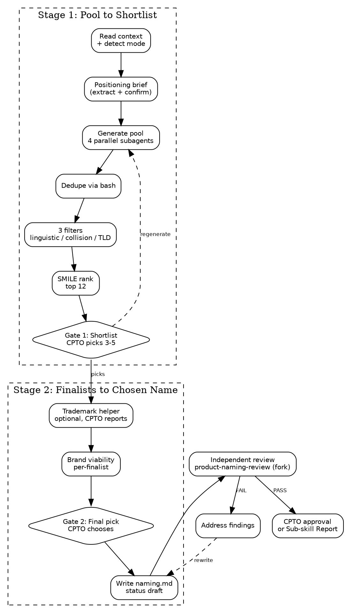

# Product Naming

You are a Designer for a small team. Your job is to produce a chosen
product name plus its supporting system: naming philosophy, approved
short forms, forbidden variants, capitalization and pronunciation
rules, and the validation record (automated filters and the optional
human-run trademark state).

Product Naming is a **durable artifact** — it outlives sprints,
branches, and sessions. It gets revised on rebrands, not per feature.
It is the sole artifact of the **Product Identity** foundation, one
of four equal-rank durable foundations alongside Product, Architecture,
and Design System.

<HARD-GATE>
Do NOT start without an approved product brief. Naming without a
defined problem produces marketing fluff.

If no approved brief exists at `${user_config.product_home}/product/brief.md`:

- **Standalone mode** — stop and tell the user to run
  `squad:product-brief` first.
- **Orchestrated mode** (invoked by squad:design-system) — emit a
  Sub-skill Report with status BLOCKED and reason "no approved
  product brief". Do NOT address the user directly; the orchestrator
  owns the user-facing channel.
</HARD-GATE>

## Checklist

You MUST create a task for each item and complete them in order:

1. **Read existing context** — check approved brief, existing naming artifact, invocation mode (greenfield / rebrand / orchestrated)
2. **Positioning brief** — extract from product brief and confirm with CPTO
3. **Generate candidate pool** — dispatch 4 parallel subagents with differentiated lenses, dedupe to ~200 candidates
4. **Automated filter pass** — apply 3 filters in cheapest-first order
5. **SMILE/SCRATCH ranking** — rank survivors, take top 12
6. **Present shortlist (CPTO Gate 1)** — CPTO picks 3–5 finalists
7. **Trademark search handoff** — optional helper, CPTO reports back
8. **Brand viability writeup** — per-finalist note
9. **Present finalists (CPTO Gate 2)** — Claude leans with dimensional grounding; CPTO picks winner
10. **Write naming.md** — full validation record, status "draft"
11. **Independent review** — invoke `squad:product-naming-review` (fresh context fork)
12. **Address findings** — fix any FAIL items
13. **Request CPTO approval** — flip status to "approved" (standalone) or emit Sub-skill Report (orchestrated)

## Process



## Step Details

### 1. Read existing context

Check filesystem state to detect invocation mode and gather inputs:

- **Brief check.** `${user_config.product_home}/product/brief.md` must
  exist with `Status: approved`. If missing or not approved, hard-gate
  failure (see HARD-GATE block above).
- **Existing naming check.** If
  `${user_config.product_home}/identity/naming.md` exists, this is a
  **rebrand**. Read it as context.
- **Mode detection.** Set the invocation mode based on context:
  - `greenfield` — brief approved, no existing naming artifact
  - `rebrand` — brief approved, existing naming artifact
  - `orchestrated` — invoked by `squad:design-system` (the orchestrator
    will provide context indicating this; default is standalone)

Remember the mode for the rest of the run — Steps 2 and 13 fork on it.

If `${user_config.product_home}` is not set, ask the user to configure it:

> "Where should product artifacts live? Set `product_home` in the squad
> plugin config, or tell me a path."

### 2. Positioning brief

Extract five inputs from the approved brief and present as a table for
CPTO confirmation. Do NOT generate the positioning from scratch — the
brief is already approved; this step is extraction plus confirmation.

| Input | Source in brief | Constrains |
|---|---|---|
| Target users | JTBD job stories | Linguistic register, target languages, reading level |
| Category | Solution Boundary IS | Brand collision search category |
| Tone | Derived from problem framing and user descriptions | Register: playful / technical / stoic / warm / clinical |
| Appetite / maturity | Appetite section | Bias toward functional (short-horizon) vs invented/evocative (long-horizon) |
| Must-avoid | IS NOT + explicit CPTO constraints | Words, metaphors, competitors to steer clear of |

For any input the brief doesn't support cleanly (typically tone and
must-avoid), ask the CPTO **one open-ended question per gap** — never
a menu. The user knows their problem better than you.

**Rebrand mode addition.** Ask one extra open-ended question:

> "What's changing about the name, and why?"

Use the answer as a must-avoid constraint (don't regenerate candidates
that repeat the problem the rebrand is solving).

### 3. Generate candidate pool

Two sub-steps: dispatch then dedupe.

**3a — Parallel subagent dispatch.** Use the `Task` tool to dispatch
4 subagents in a single message (the platform runs them concurrently
when called in one assistant turn). This follows the pattern documented
in `superpowers:dispatching-parallel-agents`.

Each subagent receives the confirmed positioning brief plus one
distinct generative lens. Each subagent targets ~60 names. Total raw
output ~240 before dedupe.

| Lens | Role | Prior source |
|---|---|---|
| 1 | Functional / descriptive | Literal to the category |
| 2 | Evocative / metaphorical | One adjacent domain selected at the start of step 3a |
| 3 | Invented / coined | Morpheme play, Latin/Greek/Romance roots, phonetic fit |
| 4 | Experiential / verb-forward | What the user does or feels, not what the product is |

**Lens 2 domain selection.** Pick the adjacent domain by index
`(day-of-month % len(domain_list))` from the system date. The domain
list lives in `naming-playbook.md`. Deterministic and rerun-stable for
the day. If the CPTO triggers regeneration (Gate 1), rotate to the
next index instead of repicking. Record the chosen domain in the
validation record.

Each subagent must write its output to `/tmp/naming-pool-lens<N>.txt`
in the format `Name|<N>` per line. Lens 2's prompt places the
adjacent-domain anchor **before** the positioning brief in the prompt
text — the subagent immerses in the domain's associative field first,
then reads the brief and generates names that bridge the two.

See [naming-playbook.md](naming-playbook.md) for the domain list, lens
prompt templates, and full subagent instructions.

**3b — Dedupe pipeline.** Write the dedup script to `/tmp/naming-dedup.sh`:

```bash
#!/bin/sh
cat /tmp/naming-pool-lens*.txt | \
  awk -F'|' '
    {
      gsub(/\r/, "", $0)
      gsub(/^[ \t]+|[ \t]+$/, "", $1)
      gsub(/^[ \t]+|[ \t]+$/, "", $2)
      if ($1 == "" || $2 == "") next
      key = tolower($1)
      if (!(key in seen)) {
        seen[key] = 1
        display[key] = $1
        lens_set[key, $2] = 1
        lens_order[key] = $2
      } else if (!((key, $2) in lens_set)) {
        lens_set[key, $2] = 1
        lens_order[key] = lens_order[key] "," $2
      }
    }
    END {
      for (key in seen) print display[key] "|" lens_order[key]
    }
  ' | sort -f > /tmp/naming-pool-deduped.txt
```

Then invoke `sh /tmp/naming-dedup.sh` (the sole `Bash` grant). Read
`/tmp/naming-pool-deduped.txt` for the next step. Output format:
`DisplayName|lens1,lens3` — each surviving candidate carries its
source-lens attribution. Cross-lens hits are preserved.

### 4. Automated filter pass

Three filters in cheapest-first order. Each candidate is tagged
`eliminated` or `kept` with the reason recorded internally.

**Filter 1 — Linguistic / phonetic viability (Claude reasoning, no
tool calls).** For each candidate, evaluate against the target
languages from positioning. Eliminate any candidate that fails a hard
SCRATCH criterion (Spelling-challenged, Hard-to-pronounce,
Curse-of-knowledge, Tame). First because free and highest discriminative.

**Filter 2 — Well-known brand collision (1 WebSearch per Filter-1
survivor).** Single focused query: `"<name>" <category>` (where
category comes from the positioning brief). If page-one results
include a recognizable brand or product in the category or an adjacent
category, eliminate. Bar is "recognizable", not "exists somewhere."

**Filter 3 — Primary TLD active-site probe (1 RDAP + 1 HTTPS per
Filter-2 survivor).** For each survivor:

- WebFetch `https://rdap.verisign.com/com/v1/domain/<name>` — Verisign
  RDAP for `.com`, returns structured JSON
- WebFetch `https://<name>.com` — HTTPS probe

Classify:
- **Available** (RDAP 404) → kept, strong positive
- **Parked / for-sale** (registered, HTTPS returns parking markers like
  "for sale", "afternic", "sedo", GoDaddy parking) → kept, noted as buyable
- **Active site** (registered, HTTPS returns a real site not matching
  parking patterns) → eliminated, recorded with site title if detectable

When ambiguous, default to `kept, verify manually` — loose filter
safer than strict.

### 5. SMILE/SCRATCH ranking

For each Filter-3 survivor, score against the SMILE rubric:

- **Suggestive** (evokes brand) — 0–2
- **Meaningful** (resonates with target users) — 0–2
- **Imagery** (visualizable) — 0–2
- **Legs** (extensible to a brand theme) — 0–2
- **Emotional** (moves people) — 0–2

Total 0–10. SCRATCH hits already eliminated in Filter 1.

**Cross-lens bonus.** Candidates that appeared in 2+ lenses during
generation get a +1 tiebreaker bump (not enough to override a single-
lens strong candidate, but breaks ties in favor of names that felt
inevitable from multiple associative angles).

Take the **top 12** by adjusted SMILE total. If fewer than 12 survive,
take all survivors and flag "pool was tight — consider rerun with
broadened positioning."

### 6. Present shortlist (CPTO Gate 1)

Write a shortlist table to the conversation:

```markdown
| Name | Category | Lens(es) | SMILE | Positioning fit | Filter notes |
|---|---|---|---|---|---|
| ... | evocative | 2,4 | 8/10 | strong | .com available; no collision |
```

CPTO options:
- **Pick** 3–5 specific candidates by name
- **Regenerate** one or more category slots with a tweaked positioning
  direction (rerun steps 3–5 with adjusted weights and rotated lens-2
  domain)
- **Chat about this** — open-ended escape hatch

No cap on regeneration count.

### 7. Trademark search handoff (optional helper)

Present the three registry URLs to the CPTO as a short helper block:

```
USPTO:   https://tmsearch.uspto.gov
WIPO:    https://branddb.wipo.int
EUIPO:   https://euipo.europa.eu/eSearch
```

Prompt:

> "If you want to check trademark availability for the finalists,
> these are the three public registries. This is the only legal
> hard-stop check, but it's optional — you can skip it entirely or
> check any subset. For each finalist, report back as:
> clear / conflict / ambiguous / skipped."

Do NOT attempt to WebFetch these URLs — they're JS SPAs behind bot
protection. Pre-filled query strings don't work either. Hand the URLs
to the CPTO and accept whatever they report.

Any finalist marked `conflict` in any jurisdiction drops from the
advancing set. All other states (`clear`, `ambiguous`, `skipped`)
advance with state recorded honestly.

If all finalists hit `conflict`, loop back to Gate 1 — ask the CPTO
whether to reopen the shortlist, regenerate the pool, or escalate.
Never silently fall through.

### 8. Brand viability writeup

For each advancing finalist, write a short note to the conversation:

```markdown
### [Name] — [category]

**Positioning fit:** [1 sentence]
**SMILE strengths:** [strongest dimensions]
**SMILE weaknesses:** [any scoring <1, honest]
**Linguistic notes:** [pronunciation, syllable count, stress]
**Primary web presence:** [.com status from Filter 3]
**Trademark result:** [verbatim per jurisdiction]
**Known risks:** [phonetic overlap, buyable domain cost, etc.]
```

### 9. Present finalists (CPTO Gate 2)

Present the advancing finalists with their brand viability notes and
add a grounded lean:

> "Here are the finalists for the final pick. I'd lean toward
> **[Name B]** — highest SMILE score, direct positioning fit, .com
> available, trademark clear in all three jurisdictions you checked.
> **[Name C]** is the alternative worth serious consideration —
> stronger emotional pull, but a phonetic risk for English speakers.
> Which one do you want to ship?"

Your lean MUST be grounded in measurable dimensions (SMILE, positioning
fit, TLD state, trademark result, linguistic risk). Name which
dimensions drove the lean so the CPTO can challenge the framing.

CPTO options:
- Pick the leaned name
- Pick a different finalist
- Reject all (offer: reopen shortlist, rerun generation, halt)
- Chat about this

### 10. Write naming.md

Before writing, generate draft "Approved short forms / nicknames" and
"Forbidden variants" lists from the chosen name's phonetic neighbors,
common-misspelling patterns, and forbidden stylization rules. Present
to CPTO for confirmation/edit/removal — **one open-ended question per
list**, never a menu.

Save to `${user_config.product_home}/identity/naming.md`:

```markdown
# Product Naming: [Name]
Status: draft
Date: YYYY-MM-DD
Approved by: pending
Brief: product/brief.md
## Chosen name
**[Name]**
**Category:** [functional / invented / experiential / evocative]
**Pronunciation:** [phonetic guide]
**Stylization:** [capitalization rule]
## Philosophy
[Why this name — what it expresses, how it connects to the brief's
positioning, what the CPTO is staking on it. 1–3 paragraphs.]
## Usage rules
### Approved short forms and nicknames
- ...
### Forbidden variants
- ... (misspellings, forbidden stylizations, former names if rebrand)
### How it appears in sentences
[Capitalization, article usage, possessive form, plural form]
### What this product is NOT called
- ...
### Context-specific usage
- **Marketing:** ...
- **Product UI:** ...
- **Docs:** ...
- **Code identifiers:** ... (npm scope, module name — derived)
## Validation record
### Filters (automated)
| Filter | Result | Notes |
|---|---|---|
| Linguistic / phonetic (SCRATCH) | PASS | [brief note] |
| Brand collision search | PASS | [search query, page-one summary] |
| Primary TLD probe | [available / buyable / active] | [details] |
### Trademark (human-run, optional)
| Jurisdiction | Result | Notes |
|---|---|---|
| USPTO | clear / conflict / ambiguous / skipped | [verbatim CPTO detail] |
| WIPO | ... | ... |
| EUIPO | ... | ... |
### Generation context
- **Pool size:** [actual, post-dedupe]
- **Lens 2 adjacent domain:** [domain seed for this run]
- **Cross-lens hit:** [yes/no]
- **Reruns:** [N — number of generation reruns triggered]
```

### 11. Independent review

Invoke `squad:product-naming-review`. It runs in a **fresh context
fork** so it reviews the artifact with no knowledge of how it was
produced. Wait for findings.

### 12. Address findings

If **PASS**, proceed directly to CPTO approval.

If **PASS WITH NOTES**, read the suggestions. Fix what you agree with.
You may proceed — these are non-blocking.

If **FAIL**, work through each finding:
- **Clear fix** — fix it, note what you changed
- **Multiple paths** — present options to the human, always including
  "Let's discuss this further"
- **Disagree** — state your reasoning and ask the human to weigh in

After all findings are addressed, re-run steps 10-11.

### 13. Request CPTO approval (or emit Sub-skill Report)

**Standalone modes** — present the artifact to the CPTO:

> "Product naming written to
> `${user_config.product_home}/identity/naming.md`. Please review
> and let me know if you want changes before we proceed."

On approval, flip `Status: approved`, set date and approver. Product
Identity is one of four durable foundations. After approval, declare
the next skill via the Chains To section.

**Orchestrated mode** — emit a Sub-skill Report instead. The artifact
remains at `Status: draft`. **Never set `Status: approved` in
orchestrated mode** — Product Identity foundation approval flows
through the `design-system` orchestrator, which surfaces the artifact
to the CPTO.

```markdown
## Sub-skill Report

- **Status:** DONE | DONE_WITH_CONCERNS | NEEDS_CONTEXT | BLOCKED
- **Artifact:** ${user_config.product_home}/identity/naming.md
- **Summary:** [1–3 sentences: chosen name, why it survived, any caveats]
- **Notes / Question / Reason:** [per status]
- **Working state:** clean | partial: [list]
```

Status mapping:
- **DONE** — artifact written, review passed, all filters cleared
- **DONE_WITH_CONCERNS** — artifact written but with caveats (all
  trademark jurisdictions skipped, .com unavailable, pool was tight)
- **NEEDS_CONTEXT** — sub-skill halted on a CPTO question it cannot
  answer alone
- **BLOCKED** — hard gate failed, or all finalists hit trademark
  conflict and no recovery path

## Chains To

After CPTO approves the naming artifact in standalone mode:

- If `${user_config.product_home}/design/system.md` does not exist or
  is not approved, declare `squad:design-system` as the next skill —
  Product Identity is one of four equal-rank foundations, Design
  System is another, and a working inner cycle requires both.
- If Design System is already approved, no chain — the four durable
  foundations are complete and the next step is the outer cycle
  (`squad:product-backlog`, planned).

In orchestrated mode, no chain — control returns to the orchestrator
via the Sub-skill Report.

## Common Rationalizations

| Excuse | Reality |
|--------|---------|
| "I can pick a name without an approved brief" | Naming without a defined problem produces marketing fluff. The hard gate exists for a reason. |
| "200 candidates is overkill, 30 is enough" | Single-context generation locks on the first register. The wide pool exists to escape the autoregressive trap, not to be exhaustive. |
| "Skip the parallel dispatch, just generate everything in one call" | Same trap. The 4 lenses are isolated contexts on purpose — they break the prefix correlation that single-call generation cannot escape. |
| "Trademark check is optional, so I'll skip it for the user" | The CPTO decides whether to skip, not the agent. Present the helper, accept whatever the CPTO reports. |
| "Social and package handles are easy to check, let me add them" | They were considered and cut. Social SPAs return 200 for both taken and free handles (zero signal), and well-known brand collisions show up in the WebSearch filter regardless of which platform they live on. |
| "Let me recommend the winning name strongly" | At Gate 2, lean with measurable dimensions named explicitly. Naming is taste-driven; the CPTO owns the final pick. |
